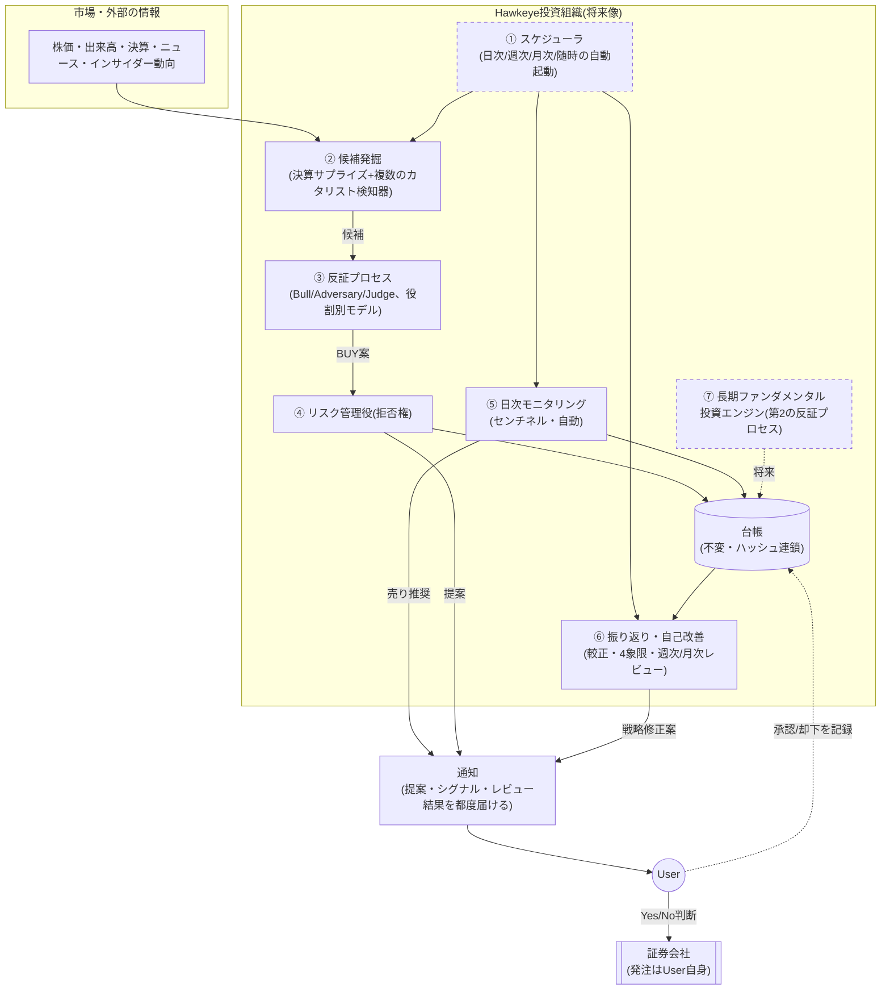
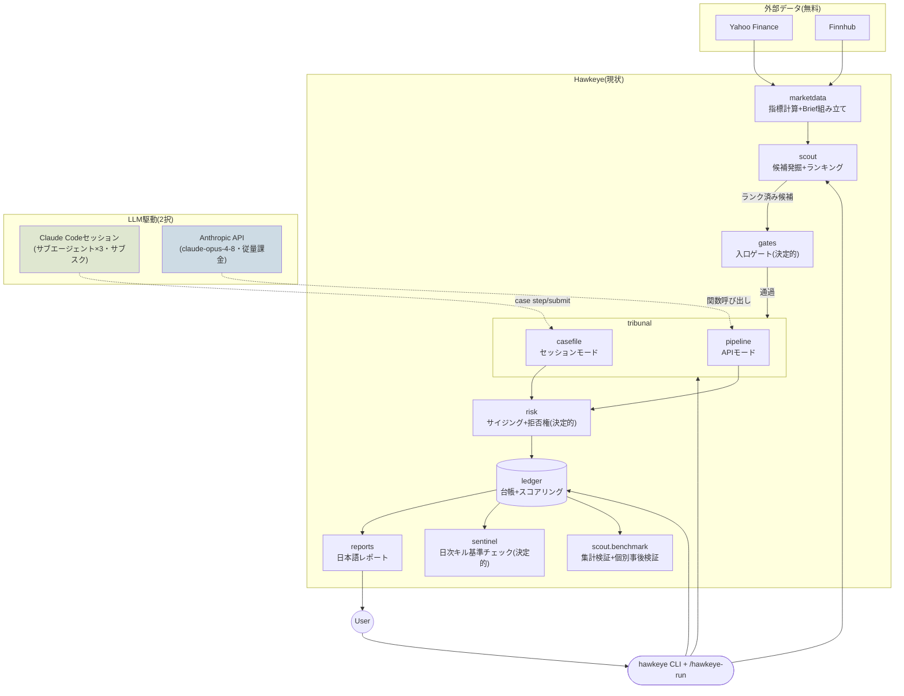
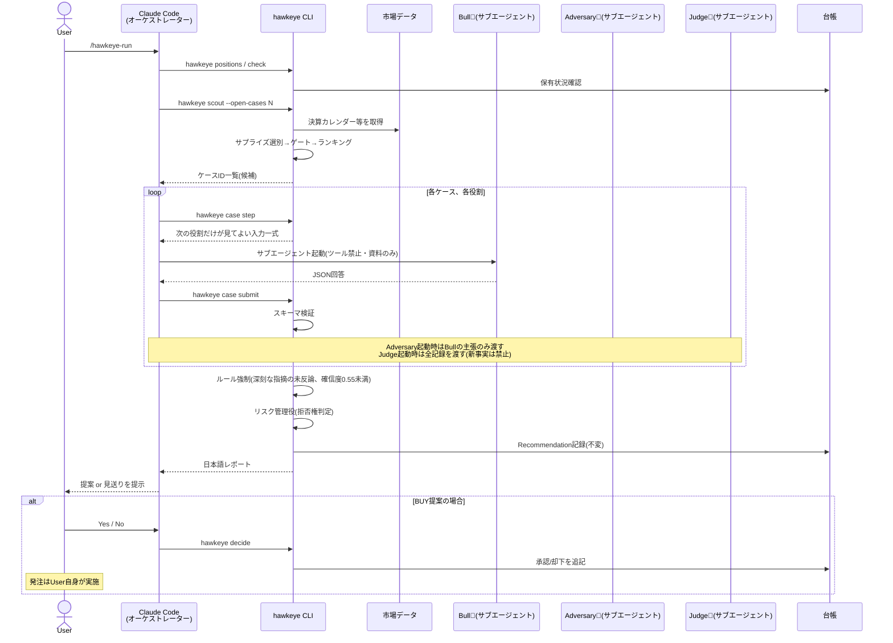
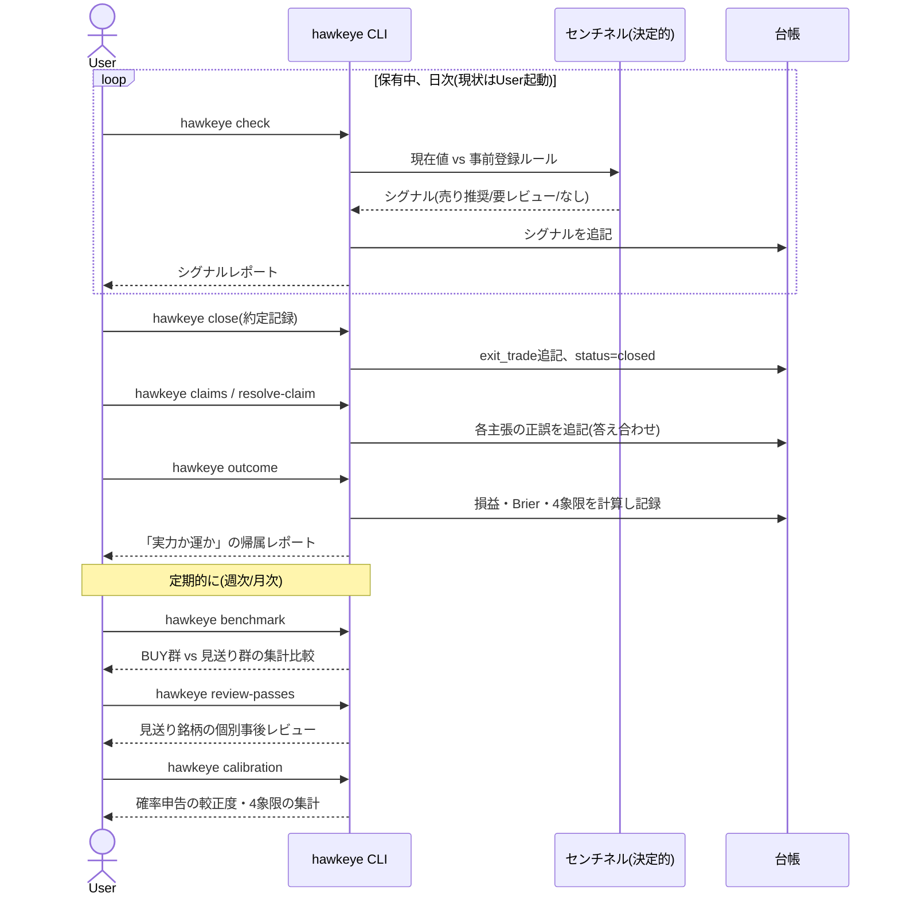

# Hawkeye 全体設計書 — To-Be / As-Is ギャップ分析

作成日: 2026-07-14
対象: プロジェクトオーナー向け(意思決定・監督用の全体像資料)

---

## 0. この文書の位置づけ

ここまでの開発は、要件を受け取るたびに機能を一つずつ積み上げる形で進めてきました。
その結果、個々の機能(スカウト、セッションモード、事後検証コマンドなど)は動くものの、
**「全体として何を目指し、いまどこまで来ていて、何が投資成績を上げる根拠なのか」**
を一枚にまとめて提示することを怠っていました。これは進め方の不備であり、まずその点を
明確にお詫びします。

本文書は、その空白を埋めるための唯一の参照点です。以後、新しい設計判断を行う際は、
実装より先にこの文書を更新して提示し、承認を得てから着手する運用に改めます
(詳細は末尾「9. 今後の進め方」)。

システム内部のドキュメント(`docs/ARCHITECTURE.md` など)は英語で書く方針ですが、
本文書は意思決定者であるあなた自身が読むためのものなので、日本語で書いています。
コードの詳細に立ち入る箇所では、まず「何のための処理か」を平易な日本語で説明し、
参照用に関数名・ファイル名を括弧で添えるという書き方を徹底しています。

---

## 1. 出発点:何を目指しているのか(要件の再確認)

最初にいただいた要件書の骨子を、自分の言葉で要約し直します。認識のズレがあれば
ここで指摘してください。

- **最終目標**: 年平均50%のリターンを出す投資システムを作ること。
- **中心仮説**: 人間特有の「保有している銘柄への思い入れ」「都合の良い理由付け」を
  機構的に排除し、投資アイデアに徹底的な反証を仕掛けるプロセスを回せば、人間の
  投資チームより質の高い判断ができるはずだ、という仮説。**この仮説が正しいかどうか
  を検証すること自体が、このプロジェクトの目的**である。
- **記録の価値**: たとえ50%に届かなくても、何を根拠にどう判断し、それが実力による
  ものか運によるものかを厳密に記録し積み上げること自体が資産である。
- **Userの理想的な関わり方**: 領域選定・アイデア出し・候補探し・銘柄推奨・損益検証・
  改善点抽出はAgent組織が行い、Userは**「実行するか否か」の最終判断だけ**を行う。
  実際の発注もUser自身が行い、システムは勝手に売買しない。
- **運用リズム(目指す姿)**: 日次(保有チェック+新規候補探索)、候補発見時(反証
  プロセスへ)、週次(損益・プロセスの調子の把握)、月次(全保有の確信度見直し)、
  随時(重要イベント発生時の即時再評価)。
- **現時点での実際の関わり方**: Userが銘柄を1つ指定して検証プロセスを手動で1回回す、
  という単位。将来的にはこの起動部分が自動化される。
- **2本柱の投資エンジン**: 保有数週間の短期・カタリスト駆動(現在Phase 0で構築中)と、
  保有数年の長期・ファンダメンタル駆動(未着手)。短期でサイクルを大量に回して
  システム・組織を鍛える。
- **前提条件**: 米国株、無料データソースのみ、疎結合なマイクロサービス的設計、
  内部ドキュメントは英語・User向けは日本語。

---

## 2. なぜこの設計で投資成績が上がるのか(原則の説明)

先に率直に言います。**「この設計をすれば年率50%を必ず達成できる」と断言すること
自体が、投資の世界では警戒すべきサインです。** 「確実に儲かる」と言い切る手法は、
詐欺かリスクの過小評価のどちらかであることがほとんどです。本当に信頼できる投資
システムが持つべきものは、確約ではなく次の3点セットです。

1. **エッジ(優位性)がどこから来るかの理屈**
2. **そのエッジを取りこぼさず、かつ壊さないための規律**
3. **その理屈が本当に機能しているかを継続的に測定するフィードバック機構**

Hawkeyeの設計原則は、この3点セットをコードとして実装することに集中しています。
以下、それぞれ説明します。

### 原則1: 判断者を分離し、人間特有の行動バイアスを構造的に排除する

人間の投資判断が劣化する典型的な原因は、頭の良し悪しではなく心理的な癖です。

- **保有バイアス(確証バイアス)**: 一度ポジションを持つと、無意識にそれを正当化する
  理由ばかり探してしまう。
- **サンクコスト・バイアス**: 含み損が出た資産に対し「もう少し待てば戻る」と判断を
  歪める。
- **後付けの正当化**: うまくいかなかったとき、「そもそもこういうつもりだった」と
  後から主張を書き換えてしまう。

Hawkeyeはこれを、**推進役(Bull)・反証役(Adversary)・裁定役(Judge)を完全に
独立させ、互いの情報を遮断する**ことで防ぎます(`hawkeye/tribunal/prompts.py` の
役割別プロンプト、`hawkeye/tribunal/casefile.py` の `write_package()` が
「次の役割が見てよい情報だけ」を機械的に切り出す仕組み)。反証役は自分がその後
そのポジションを持つ責任を一切負わないため、忖度なく殺しにいけます。そして
判断の記録は**追記専用でハッシュ連鎖された台帳**(`hawkeye/ledger/store.py`)に
残るため、後から「そういうつもりだった」という書き換えが技術的に不可能です。

### 原則2: 損小利大を「感情ゼロで」強制執行する

プロのトレーダーが口を揃えて言う原則は「損は小さく、利益は大きく」ですが、これを
実際に守り続けられる個人投資家はほとんどいません。損切りは痛みを伴い、利益確定は
「もっと伸びるかも」という欲に負けるからです。

Hawkeyeでは、エントリー前に損切りライン・利益目標・保有期限の上限を**必ず数値で
事前登録**させ(`Thesis.kill_criteria`)、日次チェック(`hawkeye/sentinel/monitor.py`)
がそれを機械的に照合します。感情の入る余地がありません。

### 原則3:「良い話」と「数学的に割に合う話」を分離する

説得力のある文章と、儲かる確率が高い取引は別物です。Hawkeyeでは、推進役(Bull)
自身が書いたシナリオ(弱気・中立・強気とその確率)から計算される**期待値が
基準を下回れば、どれだけ説得力のある文章でも機械的に却下**されます
(`hawkeye/risk/sizing.py` の `build_position_plan` が算出するリワード/リスク比・
期待値のハードルと拒否権)。「論破されなかったから買う」のではなく「損益分岐を
数字で超えたから買う」という順序を強制しています。

### 原則4: 銘柄選びに"好み"を持ち込まない

人間が銘柄を選ぶと、知っている会社・話題になっている会社に無意識に引き寄せられます
(利用可能性ヒューリスティック)。Hawkeyeの候補発掘(`hawkeye/scout/`)は、決算
サプライズという定量指標だけで全銘柄をふるいにかけるため、銘柄への"好み"が入り
込む余地がありません。

### 原則5(最も重要): 自己採点による複利的な学習ループ

ここがHawkeyeの本当の狙いです。ほとんどの個人投資家・小規模ファンドは、自分の
予測がどれだけ当たったかを厳密に記録・検証しません。儲かれば「自分の実力」、
損すれば「運が悪かった」と都合よく解釈してしまいます(自己奉仕バイアス)。

Hawkeyeは全ての予測(`Claim`)に確率と期限を事前登録させ、期限が来たら機械的に
正誤判定し、**申告した確率がどれだけ当たっていたか**をBrierスコアで採点します
(`hawkeye/ledger/scoring.py`)。さらに、勝ち負けを「仮説が正しかったか×儲かったか」
の4象限に分類し、**「仮説が外れたのに儲かった(運による勝ち)」を警報として扱い
ます**(祝わない、という設計)。

これにより、個々の判断の精度そのものよりも、**「間違いを検出し、修正できる仕組みを
持っていること」自体が優位性になります**。これは著名なクオンツファンドが実践して
いる哲学(シグナル単体の精度よりも、プロセスの自己修正能力が長期成績を決める)と
同じ発想です。

### 原則6: 誠実な期待値設計 — 50%はゴールであって前提ではない

`docs/INVESTMENT_DOCTRINE.md` に既に書いた通り、年率50%は月率換算で約+3.4%、
最大8ポジションで4週間保有だと仮定すると、ポジション・月あたり約+1.7%のネット
リターンが必要という、かなり高いハードルです。損小利大の数学(リワード/リスク比
2以上を「最低ライン」として強制)だけでこの水準に届く保証はありません。実際に
届くには、利益目標到達後も機械的に手放さず**利益を伸ばす判断ができること**
(現状、目標到達は「レビュー」シグナルであり自動売却ではありません — 再度仮説を
検証した上で保有継続も選べる設計)や、複数ポジションを並行運用することによる
複利効果が必要です。

だからこそ、**「達成できる」と断言するのではなく、Phase 0〜3という検証ゲートを
設け、実測データで「較正されたプラスの期待値プロセス」であることを確認してから
自動化・資金拡大に進む**、というのが唯一誠実なアプローチです(詳細は
`docs/ROADMAP.md` およびこの後の「4. As-Is」章)。50%未達でも較正されたプロセスは
継続投資に値し、逆に運による50%達成は継続投資に値しない——これがこのプロジェクト
の存在意義そのものです。

---

## 3. To-Be アーキテクチャ(最終形の絵姿)

要件書が描いていた最終形を、実装の言葉で具体化するとこうなります。

破線の枠(⑦長期投資エンジン、①完全自動スケジューラ)は、要件書が描く最終形の
うち**まだ着手していない部分**です。次章でどこまで実装済みかを整理します。

---

## 4. As-Is(現時点で実装できている範囲)

現在は上図の②〜⑥の**中核ロジックはすべて実装済み**ですが、①のスケジューラは
「Userが `/hawkeye-run` を手動で起動する」形に置き換わっており、通知は「都度User
から見にいく」プル型です。⑦長期投資エンジンは未着手です。

### 実装済みの機能一覧(モジュール単位)

| モジュール | 何をする処理か | 主なファイル |
|---|---|---|
| 契約(データモデル) | 全モジュール間で唯一やり取りされるデータ形式を定義。ここを介さない直接連携は存在しない | `hawkeye/contracts/models.py` |
| 市場データ取得 | 株価・出来高・時価総額・決算日・インサイダー動向・アナリスト格付けを無料ソースから取得し、指標(ATR・平均売買代金など)を計算 | `hawkeye/marketdata/` |
| 候補発掘(スカウト) | 決算サプライズを機械的にスキャンし、ゲートで絞り込み、反応の質でランキングする | `hawkeye/scout/scout.py`, `earnings.py` |
| 入口ゲート | 流動性・時価総額・カタリストの鮮度など、LLMを使わず機械的に足切りする一次審査 | `hawkeye/gates/entry_gates.py` |
| 反証プロセス(審理) | 推進役・反証役・裁定役の3エージェントによる検証。APIモードとセッションモードの2エンジンを用意 | `hawkeye/tribunal/` |
| リスク管理役 | ポジションサイズの計算と、経済的に割に合わない場合の拒否権発動 | `hawkeye/risk/sizing.py` |
| 台帳 | 追記専用・ハッシュ連鎖された記録。改ざん検知可能 | `hawkeye/ledger/store.py` |
| 較正・帰属分析 | 申告確率の的中率(Brierスコア)と、実力/運の4象限判定 | `hawkeye/ledger/scoring.py` |
| センチネル | 保有ポジションの日次キル基準チェック(決定的) | `hawkeye/sentinel/monitor.py` |
| レポート | User向け日本語レポートの生成(唯一のUser向け出力面) | `hawkeye/reports/render_ja.py` |
| 事後検証 | BUY/見送り群の集計比較(benchmark)と、個別銘柄の事後レビュー(review-passes) | `hawkeye/scout/benchmark.py` |
| CLI | 上記すべてをつなぐコマンド群 | `hawkeye/cli.py` |
| セッション駆動 | Claude Codeセッションが3エージェントをオーケストレーションする手順書 | `.claude/skills/hawkeye-run/SKILL.md` |

---

## 5. To-Be / As-Is ギャップ表

要件書が描く最終形と現状の差分を、領域ごとに整理します。**「未着手」は悪いことでは
なく、Phase 0(検証段階)ではまだ着手すべきでない項目**です(理由は各行に記載)。

| 領域 | To-Beでの姿(要件書) | As-Is(現状) | 差分・未着手事項 | 未着手である理由 / 対応フェーズ |
|---|---|---|---|---|
| 候補発掘 | 市場で起きた出来事から日次で自動的に候補を探す | 決算サプライズのみを機械スキャン。起動はUserが `/hawkeye-run` または `hawkeye scout` を実行 | インサイダー買い集中、ニュース速報など他のカタリスト検知器が未実装。決算閑散期は候補ゼロで正常停止 | 検知器を増やす前に、いまの検知器だけでBUY群がPASS群に勝てるか(Phase 0のキル基準)を確認すべきため。Phase 2 |
| 反証プロセス | — | 3役分離+ルール機械強制、実装済み。ただし3役とも同一モデル(Claude)が演じている | 役割別に異なるモデルを使う独立性強化が未着手 | 現行構成の弱点(判定の相関)が実データで観察されてから着手すべきため。Phase 2 |
| 日次モニタリング | 保有中の銘柄を毎日自動チェックし、シグナルがあれば通知 | ロジックは実装済み(`hawkeye check`)だが、**起動はUserが手動で行う**(プル型) | 無人の自動実行(cron等)には常時稼働する「頭脳」が必要=従量課金APIキーが必須になり、サブスク運用と両立しない | Phase 1。まず手動で価値を検証してから、課金してでも自動化する価値があるか判断 |
| 週次/月次レビュー | 損益・プロセスの調子の定期把握、月次の全保有再検討 | `benchmark`/`review-passes`/`calibration` は実装済みだが、**定期実行の自動化はなく、Userが都度コマンドを叩く必要がある** | 月次「保有バイアス抜きの再評価(ブラインド再検証)」は未実装 | Phase 1 |
| 通知 | シグナル・提案がUserに届く(プッシュ) | Userが `/hawkeye-run` を開いた時だけレポートが表示される(プル) | メール/Slack等へのプッシュ通知は未実装 | Phase 1(自動実行と同時に着手するのが自然) |
| 長期ファンダメンタル投資エンジン | 保有数年の長期投資判断の仕組み(第2の柱) | **まったくの未着手**(意図的) | 別のゲート・base rate・保有ルールを持つ第2の反証プロセスが必要 | 要件書の指示通り、短期エンジンの検証が済むまで着手しない。Phase 4 |
| 組織としての自己改善 | 判断や気づきを記録し、次回に活かす | 台帳への記録、`hawkeye calibration`、セッション引き継ぎログ(`CLAUDE.md`)は実装済み | 「較正結果に基づき自動でドクトリンを見直す」までは未実装(人間が見て手動で `hawkeye/config.py` を改訂) | 意図的。ルール変更は必ず人間の承認とコミット履歴を通すべきため、当面は現状維持が正しい設計 |
| バックテスト | (要件書に明記なし、実務上必要) | 未実装。現状は前向き(フォワード)検証のみ | 過去の決算カタリストを再生してゲート・判定を検証する仕組みがない | Phase 2 |
| 発注の自動化 | **要件書で明確に禁止**(Userが必ず実行) | 発注コードは一切存在しない(意図的) | なし(差分ゼロ) | 恒久的に対象外 |

---

## 6. データモデル(ER図)

Hawkeyeが扱うデータは大きく2系統あります。**①その場の判断を組み立てるための
「材料」**(候補銘柄の事実情報)と、**②判断が確定したあとに残る「記録」**
(推奨・裁定・その後の顛末)です。この2つを繋ぐのが `Recommendation`(推奨record)
という1つのオブジェクトです。

- `CandidateBrief` は「事実のみ」の資料で、意見や推奨を一切含みません
  (`hawkeye/contracts/models.py`)。株価などの定量スナップショット
  (`MarketSnapshot`)、カタリストの内容(`Catalyst`)、関連ニュース
  (`NewsItem`)、インサイダー売買動向(`InsiderActivity`)、アナリスト格付け
  推移(`AnalystTrend`)をまとめたものです。
- `GateReport` は入口ゲートの判定結果一式です。
- `Thesis`(推進役の主張)は、事前登録された「主張」(`Claim`)・「シナリオ」
  (`Scenario`)・「キル基準」(`KillCriterion`)を持ちます。
- `AttackReport`(反証役の指摘)は、複数の`Attack`(深刻度付きの攻撃)を持ちます。
- `Verdict`(裁定役の判定)は、深刻な指摘への応答(`AddressedAttack`)を持ちます。
- `PositionPlan`(リスク管理役の計画)は、BUY判定の場合のみ作成されます。
- これら全てを1つに束ねたものが `Recommendation` であり、これが台帳に**一度だけ
  書き込まれ、二度と書き換えられません**。
- `Outcome`(結果)は、ポジションをクローズし全ての主張を答え合わせした後に、
  `Recommendation` に紐づけて追加される評価結果です。
- セッションモード専用の `Case`(ファイルベースの一時状態)は、3役の回答が
  揃うまでの「作業中」の入れ物で、確定すると `Recommendation` に変換されます。

```mermaid
erDiagram
    RECOMMENDATION ||--|| CANDIDATE_BRIEF : "brief(事実資料)"
    RECOMMENDATION ||--|| GATE_REPORT : "gate_report(入口ゲート結果)"
    RECOMMENDATION |o--|| THESIS : "thesis(推進役の主張・ゲート通過時のみ)"
    RECOMMENDATION |o--|| ATTACK_REPORT : "attack_report(反証役の指摘)"
    RECOMMENDATION ||--|| VERDICT : "verdict(裁定役の判定)"
    RECOMMENDATION |o--|| POSITION_PLAN : "plan(BUY判定時のみ)"
    RECOMMENDATION ||--o| OUTCOME : "outcome(クローズ後に追加)"
    RECOMMENDATION ||--o{ JOURNAL_EVENT : "台帳イベント履歴"

    CANDIDATE_BRIEF ||--|| MARKET_SNAPSHOT : snapshot
    CANDIDATE_BRIEF ||--|| CATALYST : catalyst
    CANDIDATE_BRIEF ||--o{ NEWS_ITEM : news
    CANDIDATE_BRIEF |o--o| INSIDER_ACTIVITY : insider_activity
    CANDIDATE_BRIEF |o--o| ANALYST_TREND : analyst_trend

    GATE_REPORT ||--o{ GATE_RESULT : results

    THESIS ||--o{ CLAIM : "claims(検証対象の主張)"
    THESIS ||--o{ SCENARIO : scenarios
    THESIS ||--o{ KILL_CRITERION : kill_criteria

    ATTACK_REPORT ||--o{ ATTACK : attacks

    VERDICT ||--o{ ADDRESSED_ATTACK : addressed

    CASE ||--|| CANDIDATE_BRIEF : brief
    CASE ||--|| GATE_REPORT : gate_report
    CASE |o--|| RECOMMENDATION : "確定後にrecommendation_idで紐付け"

    RECOMMENDATION {
        string id PK
        datetime created_at
        string ticker
        string model "session or api、どちらの引擎が審理したか"
        string status "system_pass proposed declined approved open closed"
    }
    MARKET_SNAPSHOT {
        float price
        float market_cap
        float avg_dollar_volume_20d
        float atr_pct_14d
        float eps_surprise_pct "機械計算、コンセンサス比"
        float revenue_surprise_pct
        int days_since_event
        date next_earnings_date
    }
    CATALYST {
        string type
        string description
        date event_date
        string source "manual または scout"
    }
    INSIDER_ACTIVITY {
        int window_days
        float net_shares
        int buyers
        int sellers
    }
    ANALYST_TREND {
        date period
        int strong_buy
        int buy
        int hold
        int sell
        int strong_sell
    }
    CLAIM {
        string statement "反証可能な予測"
        float probability
        int horizon_days
        string verification
    }
    SCENARIO {
        string name "bear base bull"
        float probability
        float price_target
    }
    KILL_CRITERION {
        string kind "price_below price_above time_stop_days event"
        float level
        int days
    }
    ATTACK {
        string category
        int severity "1-5、5は致命的"
        string statement
        bool is_kill_shot
    }
    VERDICT {
        string decision "buy pass"
        float conviction
        float expected_value_pct
        float reward_risk
    }
    POSITION_PLAN {
        float entry_ref_price
        float stop_price
        float target_price
        int shares
        float position_pct_nav
        string vetoes "拒否理由、空なら承認"
    }
    OUTCOME {
        float pnl_pct
        int holding_days
        float thesis_accuracy "的中した主張の割合"
        float brier "確率申告の較正度"
        string quadrant "実力/運の4象限"
    }
    JOURNAL_EVENT {
        int seq PK
        string rec_id FK
        string kind "user_decision entry_trade exit_trade sentinel_signal claim_resolution outcome"
        string payload
        string prev_hash
        string hash
    }
```

台帳のSQLiteには、上記の他に**`recommendations`テーブル**(`Recommendation`を
JSONごと保存する箱、`status`は検索用の写し)と、**`scans`テーブル**(スカウトを
1回実行するたびの「何件スキャンし、何件通過したか」という監査ログ、個別の
`Recommendation` とは直接紐付かない独立した記録)があります。

---

## 7. 処理シーケンス(現状)

### 7.1 銘柄選定〜提案まで(`/hawkeye-run` セッションモード)

### 7.2 保有〜売却〜振り返り

---

## 8. Userの目線でのワークフロー(タスク別)

### 8.1 投資銘柄選定時

| ステップ | 誰が | 何をするか |
|---|---|---|
| 1 | User | Claude Codeで `/hawkeye-run` を実行(またはFinnhubキー未設定時は手動で `hawkeye evaluate` にティッカーを指定) |
| 2 | システム | 保有チェック→候補発掘→3役の審理→ルール強制→リスク判定を自動で実行 |
| 3 | システム | 日本語レポート(BUY提案 or 理由付き見送り)を提示。見送りの場合はここで終了、Userの判断は不要 |
| 4 | User | BUY提案が出た場合のみ、レポートを読んでYes/Noを判断 |
| 5 | User | Yesの場合、証券会社で自分自身が発注 |
| 6 | User | 約定後、`hawkeye record-entry` で約定内容を記録 |

### 8.2 銘柄保持時の動線

| ステップ | 誰が | 何をするか |
|---|---|---|
| 1 | User | 定期的に(理想は毎日) `hawkeye check` を実行(または `/hawkeye-run` に組み込む) |
| 2 | システム | 事前登録した損切りライン・目標・保有期限・主張の期限・決算接近を機械的に照合 |
| 3 | システム | 🔴売り推奨(損切りライン抵触・時間切れ)または🟡要レビュー(目標到達・決算接近・主張の期限到来)を提示 |
| 4 | User | 🔴が出たら、原則として降りる(保有継続には書面の理由が必要)。🟡が出たら再評価し、継続なら再度 `evaluate` で保有バイアス抜きの判定と比較することも可能 |

### 8.3 売却後の動線

| ステップ | 誰が | 何をするか |
|---|---|---|
| 1 | User | 売却の約定後、`hawkeye close` で記録 |
| 2 | User | `hawkeye claims` で当該銘柄の事前登録済み主張一覧を確認 |
| 3 | User | 各主張について実際の結果を調べ、`hawkeye resolve-claim` で正誤を記録(答え合わせ) |
| 4 | User | `hawkeye outcome` を実行 |
| 5 | システム | 損益・申告確率の的中度(Brierスコア)・「実力による勝ち/運による勝ち/不運な負け/プロセスの負け」の4象限判定を算出し記録 |

### 8.4 システムや投資戦略・組織の改善時

| ステップ | 誰が | 何をするか |
|---|---|---|
| 1 | User | `hawkeye calibration`(申告確率と実際の的中率のズレ)、`hawkeye benchmark`(BUY群 vs 見送り群の集計比較)、`hawkeye review-passes`(見送り銘柄の個別事後レビュー)を定期的に実行 |
| 2 | User | 結果を見て、ゲートが厳しすぎる/緩すぎる、反証役が機能していない、等の仮説を立てる |
| 3 | User + Claude Code | 対応する数値(`hawkeye/config.py`)やプロンプト(`hawkeye/tribunal/prompts.py`)の改訂案を、まず本文書または短い設計メモとして提示 |
| 4 | User | 改訂内容を確認・承認 |
| 5 | Claude Code | 承認後にコードを変更し、コミットメッセージに変更理由を明記(`CLAUDE.md` の運用ルール) |

### 8.5 投資結果の振り返り

| 頻度 | 誰が | 何をするか |
|---|---|---|
| 日次 | User | `hawkeye check` の結果を確認 |
| 週次 | User | `hawkeye list` で全体件数、`hawkeye benchmark` でコホート比較を確認し、反証プロセスが機能過多/過少になっていないか把握 |
| 月次 | User | 保有中の全ポジションについて `hawkeye show` で確信度を再確認。必要なら保有バイアス抜きで再度 `evaluate`(ブラインド再検証、現状は手動) |
| 都度 | Claude Code(セッション引き継ぎ) | セッション終了時に得られた気づきを `CLAUDE.md` の「セッション引き継ぎログ」に記録し、次回に引き継ぐ |

---

## 9. 今後の進め方について(独断で進めないためのお約束)

今回ご指摘いただいた「独断で進めているのが不安」という点に対する、具体的な運用
ルールの提案です。ご確認・修正をお願いします。

1. **新しい機能追加や設計変更を行う前に、まず本文書(第5章の差分表、または
   新しい設計メモ)を更新して提示し、承認を得てから実装に着手する。**
   （小さなバグ修正・ドキュメントの誤記訂正など、設計判断を伴わないものは除く)
2. **本文書は生きた文書として扱い**、新しい機能を実装するたびに第4章(As-Is)・
   第5章(差分表)を更新する。
3. コード変更のたびに `CLAUDE.md` のセッション引き継ぎログへ変更理由を記録する
   運用は継続する。

この運用ルール自体についても、ご意見があれば修正してください。

### 設計メモの一覧

- `docs/STRATEGY_BACKLOG.ja.md`(2026-07-14) — 「50%必達」の観点での戦略・
  戦術レビューと、優先順位付きバックログ。試行回数・利益の伸ばし方・リスク量の
  拡大条件・ドローダウン管理・地合いフィルタ・セクター集中制御など、第2章の
  投資原則を補完する「まだ実装していない、しかし必要性が判明している」項目群。
