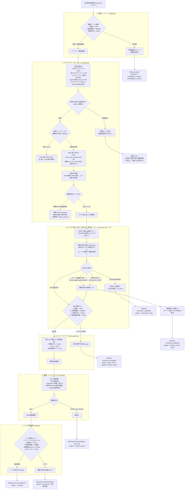

# データ源と用途の対応表（2026-08-08 現在）

「どのデータを、どこから取り、どの関門で何に使っているか」を1枚にしたもの。
EW移行の判断材料として作成し、移行完了（2026-08-08）に合わせて現状に更新した。

`docs/design/DATA_SOURCES.md`（各ソースの制約・実測レート）と重複させない。
こちらは**用途の対応**だけを持つ。

---

## 0. まず用語

この系には「関門」が6つあり、順に通す。以下の表の「用途」列はこれを指す。

| # | 関門 | 何をするか | どこ |
| --- | --- | --- | --- |
| 1 | **銘柄トリアージ** | 会社そのものが投資対象たりうるか。ダメな会社はコンセンサスの事前登録すらしない | `hawkeye/scout/triage.py` |
| 2 | **サプライズ・スクリーン** | サプライズ率で足切りし、スコア順に並べる（15枠に絞るのはここではなく関門4のループ） | `hawkeye/scout/earnings.py` |
| 3 | **決算の質の判定** | EPS・売上・ガイダンスの3本柱で「良い決算だったか」を判定 | `hawkeye/scout/quality.py` |
| 4 | **エントリーゲート** | 硬い関門4つ（1つでも落ちたら即死）＋軟らかい関門3つ（審理が重みを判断） | `hawkeye/gates/entry_gates.py` |
| 5 | **審理（トリビューナル）** | Bull（強気の主張だけを作る役）／Adversary（書かれた論旨だけに反論する役）／Judge（記録だけで裁定する役） | `hawkeye/tribunal/` |
| 6 | **リスク拒否権** | 期待値・リワードリスク・ストップ距離・保有数で、BUYを機械的に覆す | `hawkeye/risk/sizing.py` |

---

### 全体パイプライン・フローチャート

⚠️ **落選記録（`screened_candidates`）の段階は5つです**
（`hawkeye/contracts/models.py::ScreenedCandidateStage`）。

| 段階 | 意味 | ドロップ候補レビューで数えるか |
| --- | --- | --- |
| `actual_pending` | 決算の数値がまだ届かず、**まだ何も判定していない**。走査ごとに1行積む | ❌ 数えない（判断していないため。1決算が何行にもなるため二重計上にもなる） |
| `actual_timeout` | 待機期限（48時間）を過ぎて打ち切った | ✅ 数える（「データが来ずに落とした」は実測） |
| `enrichment_cap` | 一度も評価していない（スコア順で詳細取得の枠外） | ✅ 数える |
| `gate_reject` | 評価してエントリーゲートで落ちた | ✅ 数える |
| `ranking_cutoff` | ゲートは通ったが審理の枠外 | ✅ 数える |

この区別が**「見ていない」と「見て落とした」と「まだ見られていない」を分ける**ので、
ドロップ候補レビューの入力として決定的です。
`screened` や `quality_assessed` や `gated` という段階は**存在しません**。

⚠️ **`actual_pending` だけが重複除去の例外です**（`Ledger.seen_events()`）。
保留行を「既に見た決算」と数えると、その決算は一度だけ保留として記録されて
二度と読まれません。

---

### 各関門の評価クライテリア・離脱条件・DB書き込み挙動一覧

| # | 関門 | 主な評価内容と具体的しきい値 | 離脱（Drop / Exclude）条件 | DB操作型 | 記録先（SQLiteテーブル と 変更/追加される内容） |
| --- | --- | --- | --- | --- | --- |
| 1 | **銘柄トリアージ** `triage.py` | 会社自体の構造ゲート3項目: ・`min_price`: **$5.0 USD** ・`min_market_cap`: **$3億 USD** ($300M) ・`min_avg_dollar_volume`: **$1,000万 USD** ($10M, 20日平均) | 構造ゲート3項目のうち**1つでも不合格**（※データ取れず未検証の場合は保留で通過） | **UPSERT / UPDATE** | **`stocks` テーブル** ・操作: 新規銘柄は `INSERT`、既存銘柄は `UPDATE`（ON CONFLICT） ・変更点: `payload` (JSON) 内の以下のプロパティを更新   - `investigation_target`: `True` / `False`   - `investigation_checked_at`: 審査日時   - `triage_reason`: 不合格理由 (例: `'gate: min_price'`) |
| 2 | **サプライズ・スクリーン** `earnings.py` | サプライズ基準値: ・`scout_min_eps_surprise_pct`: **+5.0%** ・`scout_min_revenue_surprise_pct`: **+0.0%** ・`scout_min_abs_eps_estimate`: **$0.10 USD** (未満はuntrusted) ・`scout_max_trusted_revenue_surprise_pct`: **50.0%** (超えはuntrusted) ・スコアリング: EPS(最大50点) + 売上(最大20点) + ギャップ反応点 | ・EPSサプライズ < +5.0% ・売上サプライズ < 0.0% → **この2つで落ちた銘柄は記録に残りません**（落選記録の対象はスクリーンを通った候補だけ） ・過去の走査で記録済みの (銘柄, 決算日) は**重複として除外**。落選記録も作りません（同じ決算を二度数えると、選別基準を見直す根拠の件数が水増しされるため） | **新規 INSERT** (Append-Only) | **`scans` テーブル** ・操作: 走査1回につき新規1行を `INSERT` ・追加内容: 窓の範囲・走査件数・スクリーン通過件数・重複件数・ゲート通過件数 ※ここでは `screened_candidates` に書きません。落選記録が生まれるのは関門3以降です |
| 3 | **決算の質の判定** `quality.py` | 3本柱の質判定: ・EPSの柱: サプライズ > 0%（**1つの提供元の実績 ÷ 同じ提供元のコンセンサス**） ・売上の柱: サプライズ > 0% ・ガイダンスの柱: 会社発表新ガイダンス vs 発表前次期コンセンサス (`+1q`) | **離脱経路はありません。** 質の判定は落選させるのではなく**スコアを確定させる**処理です（未検証の柱は0点、下振れは減点）。この関門で候補が消えることはなく、順位が変わるだけです | **新規 INSERT** (Append-Only) | **`earnings_prints` & `consensus_snapshots` テーブル** ・操作: 評価結果を新規 `INSERT`（※トリガーによりUPDATE禁止） ・追加内容:   - `earnings_prints`: **1四半期につき有効な行は1つ**（`status = 'active'`）。既に有効な行がある四半期は書かない。実績が改訂されたときだけ、新しい行を `active` で追加し、古い行を `superseded` に落とす（`revise_print`）。行には出所 `source`（`finnhub` / `whispers`）が入る。**実績とコンセンサスは必ず同じ出所から取る**（`numbers.py`）   - `consensus_snapshots`: 決算前の事前登録が無ければ、事後再構成の行（`kind = 'reconstructed'`）を追加。事前登録と事後復元は決して混ぜません |
| 4 | **エントリーゲート** `entry_gates.py` | **硬い関門 (4つ)**: ・`min_price` >= $5.0 ・`min_market_cap` >= $300M ・`min_avg_dollar_volume` >= $10M ・`max_event_age_days`: **10日以内** (決算発表後経過日数) **軟らかい関門 (3つ・警告のみ)**: ・`max_gap_pct`: **25.0%以内** (当日の窓開け率) ・`max_atr_pct`: **8.0%以内** (14日ATR割合) ・`earnings_warning_days`: **次回決算まで7日以上** | 硬い関門4項目のうち**1つでも不合格**になった銘柄（未検証データ含む） | **新規 INSERT** | **`screened_candidates` テーブル** ・操作: 新規レコードを `INSERT` ・追加内容: `stage = 'gate_reject'` で追加（`payload` に `gate_report` の全通過/警告/失敗状況と、その時点で見えていたニュース・インサイダー動向・アナリスト格付けを記録） ※ `drop_reviews` は**この走査では書かれません**。後日 `hawkeye drops submit` / `drops revise`（別セッションの `/hawkeye-review`）が書きます |
| 5 | **審理 (トリビューナル)** `tribunal/` | LLMによる3者審理: ・Bull: 強気説・アップサイド分析 ・Adversary: 反論・軟らかい関門の警告事項・untrustedフラグの検証 ・Judge: 客観的判決 (スコアリング) | 審理結果が **`PASS`** (見送り) または **`NO_TRADE`** と判断された場合 | **新規 INSERT** | **`recommendations` & `journal` テーブル** ・操作: 新規レコードを `INSERT` ・追加内容:   - `recommendations`: 見送りは `status = 'system_pass'`、BUY提案は `status = 'proposed'` で新規追加（`payload` に `brief` / `verdict` / 3役のやり取りを記録）   - `journal`: 改ざん防止ハッシュ付きでログを新規1行追加 ※ `status` の取りうる値は `system_pass` / `proposed` / `declined` / `approved` / `open` / `closed` の6つだけです |
| 6 | **リスク拒否権** `sizing.py` | 資金管理・リスクルール判定: ・`min_reward_risk`: **2.0 以上** (リスクリワード比) ・`min_expected_value_pct`: **5.0% 以上** (加重平均期待値) ・`max_positions`: **最大8銘柄** (同時保有上限) ・`max_position_pct`: **NAVの10.0%** (1銘柄上限) ・`default_risk_pct`: **NAVの0.75%** (1取引の許容リスク) | リスクルールに**1項目でも違反**した場合（BUY判決を機械的に拒否） | **INSERT のみ**（拒否権は記録の**前**に効く） | **`recommendations` テーブル** ・操作: 関門5と同じ1回の `INSERT`。**あとから `payload` を書き換えることは絶対にありません** ・内容:   - 違反時: 裁定役のBUYが機械的に覆され、`status = 'system_pass'` として**最初から**記録される。拒否理由は記録済みの `payload` の中にある   - 合格時: `status = 'proposed'` として記録され、注文指示書（買い指値・ストップ・サイズ）も同じ `payload` に入る ・その後の `status` 変更（`proposed` → `declined` / `approved` / `open` / `closed`）は**射影列だけ**の更新で、`payload` には触れません |

---

**「yfinance」と「Yahoo」は別物として扱う必要がある。** この系は両方使っている:

- **Yahooの公開チャートAPI**（`query1.finance.yahoo.com/v8/finance/chart`）を
  httpxで直叩き — 株価の足。`hawkeye/marketdata/yahoo.py`
- **yfinanceライブラリ** — **2026-08-09 に依存ごと削除**。用途は2つあり、
  決算数値を読む `yahoo_earnings.py` が 2026-08-08 に、コンセンサスの事前登録を
  する `consensus.py` が 2026-08-09 に、それぞれEWへ移った

**EW移行で切ったのは yfinance 経由の決算数値だけで、株価の足は残っている。**
株価が無いと硬い関門が4つとも動かないので、ここを切る選択肢は無い。
コンセンサスの事前登録も yfinance のまま残っている（分布とアナリスト数を
出せるのがここだけのため）。

---

## 1. Yahoo公開チャートAPI（httpx直叩き・キー不要）

| 取得しているもの | 何に使うか | 関門 | EW移行後 |
| --- | --- | --- | --- |
| **日足OHLCV**（1〜2年） | 下記すべての計算元 | — | **残す** |
| ↳ 直近終値 | `min_price`（**硬い関門**）／トリアージ／現在値 | 1, 4 | 残す |
| ↳ 20日平均売買代金 | `min_avg_dollar_volume`（**硬い関門**）／トリアージ | 1, 4 | 残す |
| ↳ ATR14（変動率） | `volatility_sane`（軟らかい関門）／ストップ幅の妥当性 | 4, 6 | 残す |
| ↳ 決算日の窓開け率 | `event_gap_not_extreme`（軟らかい関門）／**質の判定の順位付け項** | 3, 4 | 残す |
| ↳ 決算日からの経過日数 | `catalyst_freshness_days`（**硬い関門**） | 4 | 残す |
| ↳ 決算後の騰落率 | 審理のブリーフ／ドロップ候補レビューの測定 | 5 | 残す |
| ↳ 52週高値・安値 | 審理のブリーフ | 5 | 残す |
| **ニュース**（検索API） | 審理のブリーフ。**Finnhubが空のときだけの最終手段**（期間指定ができないため） | 5 | 残す |

**このソースが死ぬと硬い関門が3つ（価格・出来高・鮮度）動かなくなり、
不変条件6により「未検証は硬い関門では不合格と同じ」なので、候補が全滅する。**

---

## 2. yfinanceライブラリ（決算数値からは撤退済み・事前登録は現役）

| 取得しているもの | 何に使うか | 関門 | 状態 |
| --- | --- | --- | --- |
| ~~`get_earnings_dates()` の**EPS実績／EPSコンセンサス**~~ | ~~決算の質の判定・サプライズ率~~ | — | 🗑️ **削除済み**（2026-08-08、`yahoo_earnings.py` ごと）。EWに置き換わった |
| `earnings_estimate`（当四半期の平均・上限・下限・アナリスト数） | コンセンサスの事前登録。**分布を出す唯一のソース**（Finnhubは1点だけ） | 3 | **現役** |
| `revenue_estimate`（当四半期） | 同上 | 3 | **現役** |
| `earnings_estimate` の**翌四半期平均** | **ガイダンスの物差し。** 会社の見通しを何と比べるか | 3 | **現役。** EWのサマリ文から読む案は未着手（タスク8.7） |
| `revenue_estimate` の翌四半期平均 | 同上（売上ガイダンス） | 3 | 同上 |

**アナリスト数（`eps_analysts`）はyfinanceにしか無い。** 薄いカバレッジの
関門（`thin_coverage`）はこれで判定しており、**この関門はEWでは代替できない
可能性が高い**（EWが返すのは平均・上下限で、人数は未確認）。要調査項目。

---

## 3. Finnhub（APIキー必須）

| 取得しているもの | 何に使うか | 関門 | EW移行後 |
| --- | --- | --- | --- |
| **決算カレンダー（期間指定）** `calendar/earnings` | **誰がいつ決算を出すかの一覧。** 走査対象の母集団そのもの | 全部の入口 | **残す（唯一の源）。** EWのカレンダーは過去日を引くと発表済みの会社が消えるため代替不可 |
| ↳ カレンダー行の `epsActual` / `revenueActual` | **EWが答えられない決算のフォールバック。** 1回目のスクリーンもこの値で回る | 2, 3 | **現役。** EWが当期のレコードと両脚のコンセンサスを返した決算だけEWに差し替わる |
| ↳ カレンダー行の `epsEstimate` / `revenueEstimate` | コンセンサスの事前登録（1点のみ）＋上記フォールバックの分母 | 3 | **現役。** EWが勝った決算では `eps_calendar` / `revenue_calendar` として記録に残る（判定には使わない） |
| ↳ カレンダー行の `year` / `quarter` | **四半期ラベル。** 本番DB実測で約95%の行がこれを使用 | 3 | 残す（EWのラベルが第1優先、これが第2優先） |
| **企業プロフィール** `stock/profile2` の時価総額 | `min_market_cap`（**硬い関門**）／トリアージ | 1, 4 | 残す |
| ↳ 社名・業種 | 審理のブリーフ | 5 | 残す |
| **次回決算日** `calendar/earnings`（銘柄指定・120日先まで） | `earnings_proximity`（軟らかい関門）。エントリー窓の中に次の決算が来ていないか | 4 | 残す |
| **ニュース** `company-news`（決算日を基準に期間指定） | 審理のブリーフ。**期間を指定できる唯一のソース** | 5 | 残す |
| **インサイダー取引** `insider-transactions` | 審理のブリーフ（純買い越し／売り越し） | 5 | 残す |
| **アナリスト推奨の推移** `recommendation-trends` | 審理のブリーフ | 5 | 残す |

**Finnhubは「第一の数値の源」から降りただけで、系から消えていない。**
母集団の決定・時価総額・審理の材料は今後もFinnhub頼みで、加えて
**EWが答えられない決算では実績もコンセンサスもFinnhubに戻る**（実測で50件中8件）。

---

## 4. EarningsWhispers（キー不要・非公式）

| 取得しているもの | 何に使うか | 関門 | 状態 |
| --- | --- | --- | --- |
| `GET /api/epsdetails/{TICKER}` の**EPS実績** | 決算の質の判定・EPSの柱 | 2, 3 | ✅ **配線済み**（2026-08-08） |
| ↳ **EPSコンセンサス**（平均・上限・下限） | サプライズ率の分母。**実績と必ず同じ提供元** | 2, 3 | ✅ 配線済み |
| ↳ **売上実績・売上コンセンサス** | 売上の柱。単位は百万ドル→ドルに換算済み | 2, 3 | ✅ 配線済み。**EPSと揃わなければ両方ともEWを使わない** |
| ↳ **Whisper number** | **審査には使わない。記録のみ。** 「Whisperが高い銘柄のその後」をユーザーが自分で分析するため | — | 実装済み（**永続化は未実装**） |
| ↳ EW自身のサプライズ率と、その物差し（`vendor_surprise_basis`） | **物差しが `consensus` のときだけ採用する**（`numbers.py`）。表示上の丸めた予想から計算すると値がずれるため。物差しが `whisper`（EW独自の予想）のときは**破棄して自分で計算し直す** — AMDはEW公表値 −1.78%、コンセンサス比 +2.47% で判定が逆転する | 2, 3 | ✅ 配線済み |
| ↳ **四半期末・年度末**（`q1Ref`） | **四半期ラベルの第1優先。** 非12月決算も会社自身の暦で正しく出る | 3 | 実装済み |
| ↳ **発表時刻**（`announced_at`） | 決算行の `reported_at` として記録。⚠️ **48時間の保留の起点ではない**（下記§7を参照 — 保留中はEWが前期のレコードを返しているので、この時刻は前四半期のもの） | 3 | ✅ 配線済み |
| ↳ **サマリ文からのガイダンス抽出** | ガイダンスの柱。**無料でこれが取れる唯一のソース** | 3 | ✅ 配線済み（数値の取得と同じ応答から読む） |
| ↳ サマリ文の将来コンセンサス | 通期ガイダンスの物差し（実測47件中9件が救える） | 3 | **未実装** |
| `GET /api/caldata/{YYYYMMDD}` （日別カレンダー） | コンセンサスの事前登録 | 3 | **未実装（読み取りコードが無い）** |

**制約:** 実績の反映が約1日遅れる（8/5朝に発表した16社は16社とも前期のレコードを
返した）。過去日のカレンダーは引けない（発表済みの会社が消える）。
IPO直後の銘柄は記録が無い（SPCX）。

---

## 5. EDGAR（SEC・キー不要）

| 取得しているもの | 何に使うか | 関門 | EW移行後 |
| --- | --- | --- | --- |
| `company_tickers.json` の**CIK（登録番号）** | **銘柄マスタの主キー。** 銘柄コードは上場廃止後に再利用されるため主キーにできない | 全部 | 残す |
| ↳ 正式社名 | マスタ・レポート | 5 | 残す |
| ~~`companyconcept` の**XBRL提出値（GAAP希薄化後EPS）**~~ | ~~発表文の読み取り結果の検証~~ | ~~3~~ | **2026-08-07 廃止。** 唯一の用途だった発表文の読み取りごと撤去したため、検証する対象が無い。取得コードも削除済み（`hawkeye/marketdata/edgar_facts.py`） |

⚠️ **EDGARから今も取っているのはCIK（登録番号）と社名だけです。** 数値は1つも
取っていません。この系から**一次資料による検算は完全に消えました**（User決定）。
XBRLはGAAP基準の提出値、街のコンセンサスは調整後基準が基本なので、そもそも
サプライズ率の検算器としては誤報が多く、銀行・保険・REITなど26%にはXBRL自体が
存在しませんでした。

---

## 6. 関門ごとの逆引き（どのデータが欠けると何が止まるか）

| 関門 | 使う値 | 出所 | 欠けたときの挙動 |
| --- | --- | --- | --- |
| **硬** `min_price` | 直近終値 | Yahooチャート | 未検証＝**不合格扱い**（不変条件6） |
| **硬** `min_market_cap` | 時価総額 | Finnhub profile2 | 同上 |
| **硬** `min_avg_dollar_volume` | 20日平均売買代金 | Yahooチャート | 同上 |
| **硬** `catalyst_freshness_days` | 決算日からの経過日数 | Yahooチャート＋カレンダー | 同上 |
| 軟 `event_gap_not_extreme` | 決算日の窓開け率 | Yahooチャート | 未検証フラグのみ。止めない |
| 軟 `volatility_sane` | ATR14 | Yahooチャート | 同上 |
| 軟 `earnings_proximity` | 次回決算日 | Finnhub（銘柄指定） | 同上 |
| **トリアージ** | 価格・時価総額・出来高の3つだけ | Yahoo＋Finnhub | **判断しない**（＝対象のまま）。未検証を除外に変えるのは静かな不合格の裏返し |
| **スクリーン** | EPS実績÷EPSコンセンサス（**必ず同じ提供元の対**） | EW、取れなければFinnhubカレンダー | 実績が無ければ**そもそも順位に載らない**（保留中の銘柄が15枠に入らないのはこれ） |
| **質・EPSの柱** | 実績・コンセンサス・アナリスト数 | 同上 | `unverified`。**上振れとしても下振れとしても数えない** |
| **質・売上の柱** | 同上 | 同上 | 同上 |
| **質・ガイダンスの柱** | 会社の見通し＋翌四半期コンセンサス | 発表文／EWサマリ＋yfinance | `ABSENT`。**減点しない**（無料枠に出所が無いので、不在を罰すると会社ではなくデータの穴を罰することになる） |
| **審理** | ニュース・インサイダー・アナリスト推移 | Finnhub（Yahooは予備） | 欄が空のまま渡る。**ゼロを埋めない** |
| **リスク拒否権** | 現在値・ATR／エントリー・ストップ・目標 | Yahooチャート／審理が出す数値 | 期待値・リワードリスク・ストップ距離・保有数のどれかが基準割れならBUYを覆す |

---

## 7. EWが取れなかったときの代用値

**原則: 数値の代用は一切しない。** 実績もコンセンサスもガイダンスも、取れなければ
`unverified` か `absent` として先へ渡り、上振れとしても下振れとしても数えない
（不変条件6）。「他所から似た数字を持ってきて埋める」経路はコード上に存在しない。

代用があるのは**メタデータ**（いつ発表されたか、どの四半期か、どの期間の見通しか）
だけ。数値の意味を変えずに処理を進めるためのもので、代用したことは必ず記録に残る。

### 7.1 代用する（メタデータ）

| 欠けたもの | 代用値 | 根拠 | 記録 |
| --- | --- | --- | --- |
| ~~**発表時刻**~~ | ~~Finnhubカレンダーの `hour`~~ | 🗑️ **廃案（2026-08-08）。** 代用そのものが不要になった — **48時間の起点はFinnhubカレンダーの決算予定日**で、発表時刻はどちらの提供元のものも使わない。保留中はEWが前期のレコードを返しているので、そこにある時刻は前四半期のもの。使えば全ての保留が初回の確認で打ち切られる（`waiting.py`） | 保留は `screened_candidates` に `stage="actual_pending"` の行として**1走査につき1行**積まれる。`checks` というテーブルは存在しない |
| **四半期ラベル** | ①EWの四半期末＋年度末 → ②Finnhubカレンダーの `year`/`quarter` → ③四半期末の日付から → ④**ラベルを付けずに保留** | ラベルは決算行の一意キーとコンセンサスの引き当ての両方の鍵。推測で埋めると同じ決算が2行入り、事前登録した予想が使われなくなる | ③が使われたことをフラグに残す（**未実装。所見2の修正で入れる**） |
| **ガイダンスの対象期間**（EWのサマリに期間が書かれていない） | **翌四半期とみなす** | 期間ラベルを持たない記録は仕様が入る前から存在し、それらを一律に捨てると過去の読み取りが全部無効になる。**期間が書かれていて翌四半期でない場合は代用せず捨てる**（通期ガイダンスを翌四半期コンセンサスと比べてADMで+347.9%の偽の上振れが出た） | `guidance_period_not_comparable` ＋ `guided_{期間}` | 

### 7.2 代用しない（数値）

| 欠けたもの | 挙動 | なぜ代用しないか |
| --- | --- | --- |
| **EWが前期のレコードを返す** | **保留。** 今日の15枠に入れず次回再読、決算予定日から48時間で打ち切り。打ち切り後も数値は埋めない | 前期の数値を当期として使うと、ある四半期の実績を別の四半期のコンセンサスと比べることになる。たいてい巨大な偽のサプライズになり、**順位付けは大きいサプライズを上に置く** |
| **EWに記録が無い（204）／実績かコンセンサスが欠ける／より新しい決算を返す** | **保留にしない。決算まるごとFinnhubカレンダーの数値に切り替える** | どれも待っても変わらない。コンセンサスは決算後に増えないし、記録が無い会社が翌日に載ることもない。より新しい決算が返るのはカレンダーの日付が誤っているケースで、待つほど遠ざかる |
| **売上実績** | 同上。売上の柱が `unverified` | 同上 |
| **EPS／売上コンセンサス** | 事前登録が無ければ決算後にEWから事後再構成（弱い証拠として記録）。それも無ければ**サプライズが計算できない＝順位に載らない** | コンセンサスに一次資料は存在しないので、どこから持ってきても「別のベンダーの意見」でしかない。混ぜると分子と分母の基準が変わる |
| **ガイダンス** | `ABSENT`。**減点しない** | 無料枠に構造化された出所が無い以上、不在を罰すると会社ではなくデータの穴を罰することになる |
| **Whisper number / EW自身のサプライズ** | 空欄のまま記録 | もともと審査に使っていない（物差しがWhisper比とコンセンサス比で混在するため）。欠けても判定は何も変わらない |
| **EWに繋がらない**（接続失敗＝`WhispersUnavailable(transient=True)`） | **保留。** 2回まで再試行してから諦める | 何も返ってきていないので、会社について何も分かっていない。「この会社に記録が無い」は会社についての事実、「通信できなかった」は接続についての事実で、前者だけが判断材料になりうる（`CalendarUnavailable` と同じ設計） |
| **EWがHTTP 500を返す**（`WhispersUnavailable(transient=False)`） | **保留にしない。Finnhubカレンダーの数値に切り替える。** 1回だけ再試行して「一時的ではない」ことを確定させる | ⚠️ **実測で分かった（2026-08-08）**: この500は**銘柄ごとに決定論的**で、INOD・UMAC・GAINは何度叩いても同じ96,272バイトのHTMLエラーページを返す。保留にすると48時間ぶん毎回同じ拒否を買って打ち切るだけになる |

### 7.3 EW以外の欠損（参考）

| 欠けたもの | 挙動 |
| --- | --- |
| **時価総額**（Finnhub） | 硬い関門なので `unverified` ＝**不合格扱い**。ただしトリアージは「判断しない」（＝対象のまま）。一度の欠測で会社を永久除外しないため |
| **株価の日足**（Yahoo） | 例外。ブリーフが作れないので候補として成立しない |
| **次回決算日**（Finnhub） | 軟らかい関門なので `unverified` フラグのみ。止めない |
| **ニュース／インサイダー／アナリスト推奨**（Finnhub） | 欄が空のまま審理へ。**ゼロを埋めない** |
| **アナリスト数**（現状 yfinance のみ） | 薄いカバレッジの関門が判定できない。代用値なし。**EWに人数があるかは未確認**（下記） |

> **廃案の注記（2026-08-08）**: 発表時刻の代用に使う `hour`（寄り前／引け後）は、
> 配線されないまま**設計ごと取り下げました**。48時間の起点は決算予定日（日付）に
> 決まったので、時刻の代用値そのものが要りません。「未実装」ではなく「不要」です。

---

## 8. EW移行で構造的に失うもの（未解決）

1. **アナリスト数** — 薄いカバレッジの関門（`thin_coverage`）の判定材料。
   yfinanceにしか無い。EWが人数を返すかは未確認
   → **【決定 2026-08-06】失うことを受け入れる。** `thin_coverage` は判定できず
   `unverified` のまま。軟らかい関門なので候補は止まらない
2. **コンセンサスの分布（上限・下限）** — EWも上下限は返すが、
   yfinanceと同じ意味かは未確認
   → **【決定 2026-08-06】失うことを受け入れる**
3. **翌四半期コンセンサス** — ガイダンスの物差し
   → **【決定 2026-08-06】失わない。EWの決算要約文から取れる。詳細は §8.1**
4. **2ソース照合そのもの** — 「両方が一致して初めて上振れ」という規則
   → **【決定 2026-08-08】撤去しました。** 凍結ではありません。
   比べていた2つの数字は同じものを測っていませんでした（EWのコンセンサスは
   調整後ベース、カレンダーの実績はGAAPかもしれない）。したがって小さい方を
   選んでも「厳しい読み」にはならず、**意味の無い数字を2つ作って小さい方を
   選んでいただけ**です。いまは1決算1提供元で、実績もコンセンサスも同じ
   ところから取ります。設定キー `earnings_single_source_consensus_blocks` /
   `earnings_consensus_dispute_pct` / `earnings_actual_dispute_blocks` は削除。
   もう一方の提供元の実績は記録に残り、材料差があれば
   `vendors_report_different_actuals` として反論役に届きます（判定はしない）
5. **IPO直後の銘柄** — EWに記録が無い
   → **【決定 2026-08-06】自動フォールバックはしない。代わりに §8.2 の
   「取得できなかった銘柄の告知」を必須の手順として入れる**

---

### 8.1 翌四半期コンセンサスは事前に読めている必要があるか — ある。EWで取れる

**結論（2026-08-06 実測により確定）: 事前の値であることは必要。そして
それはEWのサマリ文から取れる。Yahooは不要。**

> **訂正**: 同日に一度「EWでは代替できないのでYahooを翌四半期コンセンサス専用に
> 残す」と提案したが、EWのサマリ本文を見落としていた。実測で撤回。以下、必要性の
> 議論は有効なまま、代替可否の結論だけが変わっている。

ガイダンスの柱が測っているのは「会社の見通しが、**その時点で街が期待していた水準**を
上回ったか」。ところがガイダンスは決算発表と同時に公表され、**アナリストは公表された
ガイダンスに向けて翌四半期の予想を即座に修正する**。決算の数日後に翌四半期
コンセンサスを読むと、それは既にガイダンスに寄せた後の数字で、
「ガイダンスがコンセンサスを上回った」という差はほぼゼロに潰れる。

つまり事後に読むと**測っているものが変わる**。しかも潰れる方向（＝上振れを
見逃す方向）なので、偽陽性は出ないが**本物の信号が静かに消える**。落選記録にも
「ガイダンスで拾えたはずの銘柄」として残らないので、後から気づく手段が無い。

現状のコードは既にこの非対称を抱えている:

| 経路 | 翌四半期コンセンサスの取得時点 | 汚染 |
| --- | --- | --- |
| 事前登録がある銘柄（`prereg.py`） | **決算前**にYahooから取得 | なし |
| 事前登録が無い銘柄（`shift_after_print`） | **決算後**にYahooから取得 | あり |

**【2026-08-09 解消】** この表は経路が2つあることを前提にしていたが、経路が1つに
なった。翌四半期コンセンサスも通期コンセンサスも、**その決算の要約文そのもの**から
読む（`read_consensus`）。会社のガイダンスと同じ1文から読むので、両者の取得時点が
ずれることが原理的に起きない。`shift_after_print` は削除。

**EWのサマリ文がこれを持っている。** EWのカレンダーが返すのは「これから出る決算」の
コンセンサスだけだが、**サマリ本文**には次の期のコンセンサスが書かれている。
DUOL 2026-08-05 の例:

> The company said it expects third quarter revenue of approximately $302.0
> million. **The current consensus revenue estimate is $305.89 million for the
> quarter ending September 30, 2026.**

そしてこの文は**汚染されていない**。EWは発表の数分後（DUOLは16:02 ET）にサマリを
書き、**以後書き換えない**——確定した決算6件を翌日に引き直して5件が完全一致
（`docs/knowledge/MEASUREMENTS.ja.md` 2026-08-06）。文中の数字は
アナリストがガイダンスに反応して修正する前の値のまま凍る。

出現率（fixture 47銘柄）: ガイダンスを載せている20銘柄のうち**11銘柄**に
翌四半期の物差しが同居。さらに通期の物差しが17件あるので、いま
`guidance_period_not_comparable` で捨てている通期ガイダンスも救える見込み。

**したがってYahooは残さない。** 実装は「未着手項目3: ガイダンス物差しのEW化」に
統合する。

#### 残る限界（明記して進む）

- 会社のガイダンスとコンセンサスの基準（GAAP／調整後）が揃っている保証は無い。
  これはYahooを使っても同じで、ガイダンスの柱に固有の弱さとして残る
- 翌四半期の物差しが無い銘柄（20件中9件）は、通期の物差しで通期ガイダンスを
  測るか、それも無ければ `ABSENT`（減点なし）

---

### 8.2 取得できなかった銘柄の告知（【決定 2026-08-06】必須手順）

IPO直後などでEWから決算数値が取れない銘柄について、**自動で他ソースに
フォールバックはしない**（物差しの混在とガイダンス欠落のため。
`docs/knowledge/REJECTED.ja.md` 参照）。代わりに**人に渡す**。

#### 手順

1. **順位を確定させる前に**、走査レポートに「決算数値が取れなかった銘柄」の節を
   必ず出す。空でも「該当なし」と明示する（黙って0件なのか節ごと無いのかを
   読み分けられなくしない）
2. その節に載せるもの:
   - ティッカーと発表予定日
   - **取れなかった理由**（`whispers_no_record` ＝EWがこの会社を知らない／
     `whispers_previous_quarter` ＝前期のまま／`whispers_eps_incomplete` ＝
     当期だが実績かコンセンサスが空／`whispers_unreachable` ＝接続失敗／
     `whispers_server_error` ＝その銘柄で常に500。落選記録の `actual_pending`
     行に1走査1件ずつ理由が積まれているので、そこから機械的に出す）
   - 保留の経過時間と打ち切りまでの残り
   - **その時点の暫定順位**（数値が取れた銘柄だけで作った順位）
3. ユーザーが必要と判断した銘柄について、会社の発表文を自分で調べ、
   **人が数値を投入する経路**でシステムに渡す
4. 次回走査がそれを拾い、出所が「人の投入」と分かる形で取り込む

#### ⚠️ 【2026-08-07 更新】この手順の「既存の経路」は無くなった

> **決定（人が数値を投入できるようにする）は生きています。しかし当初あてにしていた
> 受け皿は削除されました。**
>
> もとの計画は、既にあった「決算発表文の読み取り」経路
> （`hawkeye/scout/release.py` ＋ `release_requests` テーブル ＋
> `var/releases/{TICKER}_{YYYY-MM-DD}.json` の受け渡し ＋ 日本語レポートの
> 「読み取り待ち」節）に、発火条件を1つ足すだけで済ませるというものでした。
> その経路は2026-08-07に**まるごと撤去**されています（発火条件「2ソースの実績が
> 食い違ったとき」が、1銘柄1ソースでは構造的に成立しないため）。
>
> したがってこの機能は「既存経路への1行追加」ではなく、**新規実装**です。
> 実装するときに決めることが2つあります:
>
> - **受け皿をどう作るか。** ファイル置き場を復活させるのか、CLIサブコマンドで
>   1銘柄ずつ入れるのか。前者を選ぶなら「書類は用意されるが誰も読まない」という
>   2026-08-03(b) の失敗（重複排除が拾い上げを止める）を再発させないこと
> - **`source` の値。** 現在は「必ずデータ提供元であり、審理の結論は決して
>   書き込まない」という制約を置いています。人の投入はデータ提供元ではないので、
>   3つ目の値を足すのか、別の列で表すのかを決める必要があります
>
> **EDGARの提出値との照合は、以下の箇条書きにありますが、もう使えません**
> （XBRL取得コードごと削除済み）。人の投入に機械的な検算をかける手段は、
> 現時点でこの系に存在しません。

#### この流れが不変条件を壊さないための条件

人が順位を見た**後で**数値を足す流れなので、放置すると「望ましい結果が出るまで
やり直す」ループそのものになる。以下は仕様として固定する:

- **渡してよいのは発表文にある生の数値だけ**（EPS・売上・ガイダンス）。
  判断や評価は渡さない。既存の読み取り経路と同じ
- ~~**EDGARの提出値との照合を通す。**~~ 🗑️ **もう使えません**（XBRL取得コードごと
  削除済み）。人が投入した数値に機械的な検算をかける手段は、現時点でこの系に
  存在しません。この経路を作るなら、検算の代わりを先に決める必要があります
- **突き合わせるコンセンサスは事前登録されたもの**を使う。いま取り直さない
- **出所は `release` として記録**し、自動で届いた行と区別できるようにする
- **告知には「この銘柄を埋めれば何位になる」を書かない。** 数値が無い以上
  計算もできないが、仕様として禁止する。埋める動機を順位で作らない
- **選択バイアスを測れるようにする。** ユーザーが救った銘柄だけが後から入るので、
  ドロップ候補レビューが「人が埋めた」「自動で届いた」を区別できる必要がある
