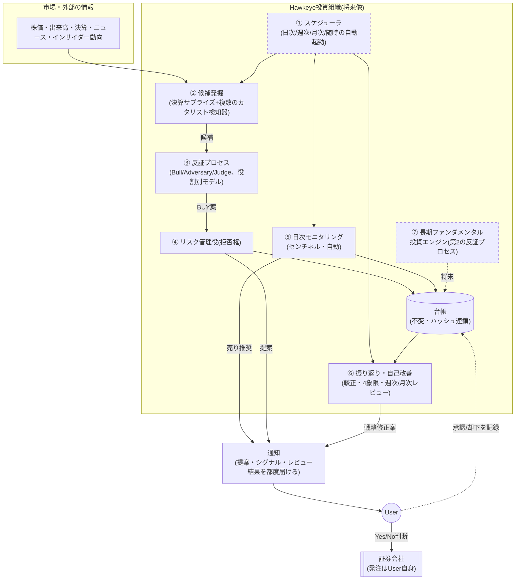
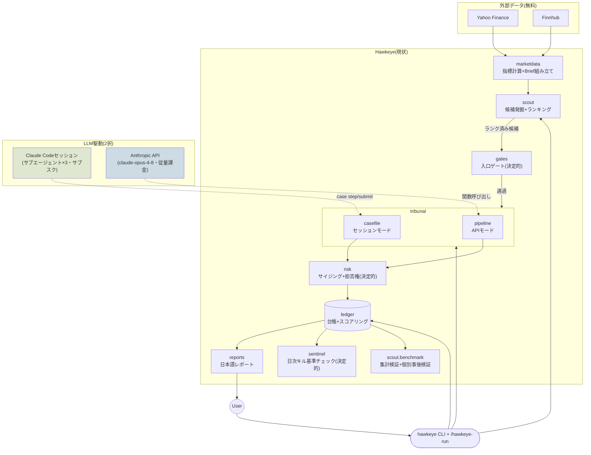
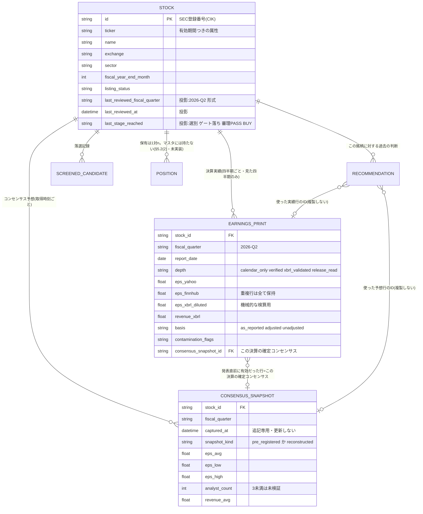
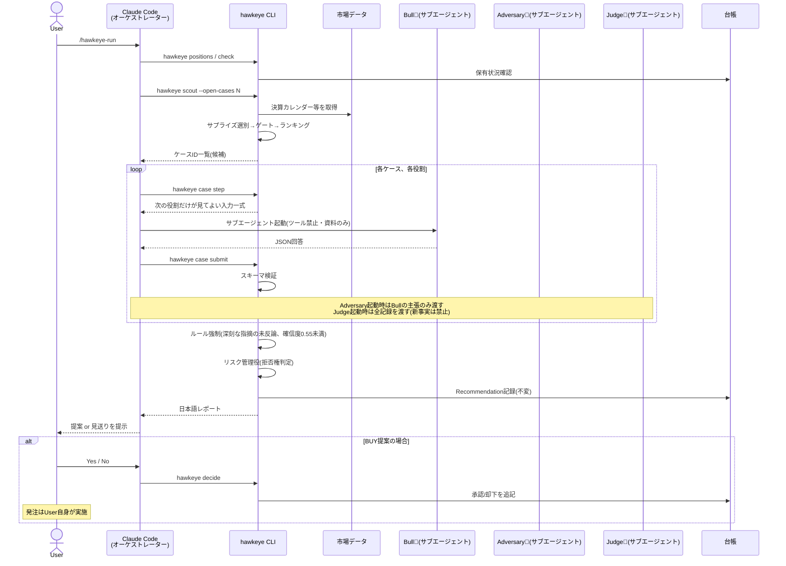
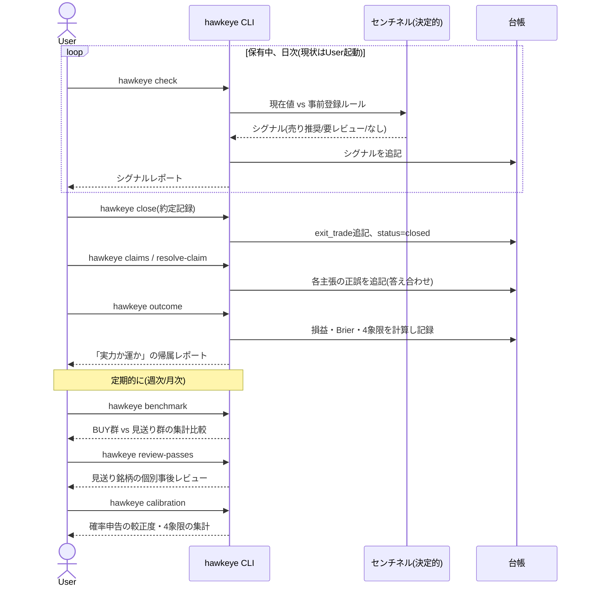

# Hawkeye 全体設計書 — To-Be / As-Is ギャップ分析

作成日: 2026-07-14
対象: プロジェクトオーナー向け(意思決定・監督用の全体像資料)

---

## 0. この文書の位置づけ

ここまでの開発は、要件を受け取るたびに機能を一つずつ積み上げる形で進めてきました。
その結果、個々の機能(スカウト、セッションモード、事後検証コマンドなど)は動くものの、
**「全体として何を目指し、いまどこまで来ていて、何が投資成績を上げる根拠なのか」**
を一枚にまとめて提示することを怠っていました。これは進め方の不備であり、まずその点を
明確にお詫びします。

本文書は、その空白を埋めるための唯一の参照点です。以後、新しい設計判断を行う際は、
実装より先にこの文書を更新して提示し、承認を得てから着手する運用に改めます
(詳細は末尾「9. 今後の進め方」)。

システム内部のドキュメント(`docs/ARCHITECTURE.md` など)は英語で書く方針ですが、
本文書は意思決定者であるあなた自身が読むためのものなので、日本語で書いています。
コードの詳細に立ち入る箇所では、まず「何のための処理か」を平易な日本語で説明し、
参照用に関数名・ファイル名を括弧で添えるという書き方を徹底しています。

---

## 1. 出発点:何を目指しているのか(要件の再確認)

最初にいただいた要件書の骨子を、自分の言葉で要約し直します。認識のズレがあれば
ここで指摘してください。

- **最終目標**: 年平均50%のリターンを出す投資システムを作ること。
- **中心仮説**: 人間特有の「保有している銘柄への思い入れ」「都合の良い理由付け」を
  機構的に排除し、投資アイデアに徹底的な反証を仕掛けるプロセスを回せば、人間の
  投資チームより質の高い判断ができるはずだ、という仮説。**この仮説が正しいかどうか
  を検証すること自体が、このプロジェクトの目的**である。
- **記録の価値**: たとえ50%に届かなくても、何を根拠にどう判断し、それが実力による
  ものか運によるものかを厳密に記録し積み上げること自体が資産である。
- **Userの理想的な関わり方**: 領域選定・アイデア出し・候補探し・銘柄推奨・損益検証・
  改善点抽出はAgent組織が行い、Userは**「実行するか否か」の最終判断だけ**を行う。
  実際の発注もUser自身が行い、システムは勝手に売買しない。
- **運用リズム(目指す姿)**: 日次(保有チェック+新規候補探索)、候補発見時(反証
  プロセスへ)、週次(損益・プロセスの調子の把握)、月次(全保有の確信度見直し)、
  随時(重要イベント発生時の即時再評価)。
- **現時点での実際の関わり方**: Userが銘柄を1つ指定して検証プロセスを手動で1回回す、
  という単位。将来的にはこの起動部分が自動化される。
- **2本柱の投資エンジン**: 保有数週間の短期・カタリスト駆動(現在Phase 0で構築中)と、
  保有数年の長期・ファンダメンタル駆動(未着手)。短期でサイクルを大量に回して
  システム・組織を鍛える。
- **前提条件**: 米国株、無料データソースのみ、疎結合なマイクロサービス的設計、
  内部ドキュメントは英語・User向けは日本語。

---

## 2. なぜこの設計で投資成績が上がるのか(原則の説明)

先に率直に言います。**「この設計をすれば年率50%を必ず達成できる」と断言すること
自体が、投資の世界では警戒すべきサインです。** 「確実に儲かる」と言い切る手法は、
詐欺かリスクの過小評価のどちらかであることがほとんどです。本当に信頼できる投資
システムが持つべきものは、確約ではなく次の3点セットです。

1. **エッジ(優位性)がどこから来るかの理屈**
2. **そのエッジを取りこぼさず、かつ壊さないための規律**
3. **その理屈が本当に機能しているかを継続的に測定するフィードバック機構**

Hawkeyeの設計原則は、この3点セットをコードとして実装することに集中しています。
以下、それぞれ説明します。

### 原則1: 判断者を分離し、人間特有の行動バイアスを構造的に排除する

人間の投資判断が劣化する典型的な原因は、頭の良し悪しではなく心理的な癖です。

- **保有バイアス(確証バイアス)**: 一度ポジションを持つと、無意識にそれを正当化する
  理由ばかり探してしまう。
- **サンクコスト・バイアス**: 含み損が出た資産に対し「もう少し待てば戻る」と判断を
  歪める。
- **後付けの正当化**: うまくいかなかったとき、「そもそもこういうつもりだった」と
  後から主張を書き換えてしまう。

Hawkeyeはこれを、**推進役(Bull)・反証役(Adversary)・裁定役(Judge)を完全に
独立させ、互いの情報を遮断する**ことで防ぎます(`hawkeye/tribunal/prompts.py` の
役割別プロンプト、`hawkeye/tribunal/casefile.py` の `write_package()` が
「次の役割が見てよい情報だけ」を機械的に切り出す仕組み)。反証役は自分がその後
そのポジションを持つ責任を一切負わないため、忖度なく殺しにいけます。そして
判断の記録は**追記専用でハッシュ連鎖された台帳**(`hawkeye/ledger/store.py`)に
残るため、後から「そういうつもりだった」という書き換えが技術的に不可能です。
(セッションモードでのこの分離の性質については第4章の「既知の制約」を参照)

### 原則2: 損小利大を「感情ゼロで」強制執行する

プロのトレーダーが口を揃えて言う原則は「損は小さく、利益は大きく」ですが、これを
実際に守り続けられる個人投資家はほとんどいません。損切りは痛みを伴い、利益確定は
「もっと伸びるかも」という欲に負けるからです。

Hawkeyeでは、エントリー前に損切りライン・利益目標・保有期限の上限を**必ず数値で
事前登録**させ(`Thesis.kill_criteria`)、日次チェック(`hawkeye/sentinel/monitor.py`)
がそれを機械的に照合します。感情の入る余地がありません。

### 原則3:「良い話」と「数学的に割に合う話」を分離する

説得力のある文章と、儲かる確率が高い取引は別物です。Hawkeyeでは、推進役(Bull)
自身が書いたシナリオ(弱気・中立・強気とその確率)から計算される**期待値が
基準を下回れば、どれだけ説得力のある文章でも機械的に却下**されます
(`hawkeye/risk/sizing.py` の `build_position_plan` が算出するリワード/リスク比・
期待値のハードルと拒否権)。「論破されなかったから買う」のではなく「損益分岐を
数字で超えたから買う」という順序を強制しています。

### 原則4: 銘柄選びに"好み"を持ち込まない

人間が銘柄を選ぶと、知っている会社・話題になっている会社に無意識に引き寄せられます
(利用可能性ヒューリスティック)。Hawkeyeの候補発掘(`hawkeye/scout/`)は、決算
サプライズという定量指標だけで全銘柄をふるいにかけるため、銘柄への"好み"が入り
込む余地がありません。

### 原則5(最も重要): 自己採点による複利的な学習ループ

ここがHawkeyeの本当の狙いです。ほとんどの個人投資家・小規模ファンドは、自分の
予測がどれだけ当たったかを厳密に記録・検証しません。儲かれば「自分の実力」、
損すれば「運が悪かった」と都合よく解釈してしまいます(自己奉仕バイアス)。

Hawkeyeは全ての予測(`Claim`)に確率と期限を事前登録させ、期限が来たら機械的に
正誤判定し、**申告した確率がどれだけ当たっていたか**をBrierスコアで採点します
(`hawkeye/ledger/scoring.py`)。さらに、勝ち負けを「仮説が正しかったか×儲かったか」
の4象限に分類し、**「仮説が外れたのに儲かった(運による勝ち)」を警報として扱い
ます**(祝わない、という設計)。

これにより、個々の判断の精度そのものよりも、**「間違いを検出し、修正できる仕組みを
持っていること」自体が優位性になります**。これは著名なクオンツファンドが実践して
いる哲学(シグナル単体の精度よりも、プロセスの自己修正能力が長期成績を決める)と
同じ発想です。

### 原則6: 誠実な期待値設計 — 50%はゴールであって前提ではない

`strategy/INVESTMENT_DOCTRINE.md` に既に書いた通り、年率50%は月率換算で約+3.4%、
最大8ポジションで4週間保有だと仮定すると、ポジション・月あたり約+1.7%のネット
リターンが必要という、かなり高いハードルです。損小利大の数学(リワード/リスク比
2以上を「最低ライン」として強制)だけでこの水準に届く保証はありません。実際に
届くには、利益目標到達後も機械的に手放さず**利益を伸ばす判断ができること**
(現状、目標到達は「レビュー」シグナルであり自動売却ではありません — 再度仮説を
検証した上で保有継続も選べる設計)や、複数ポジションを並行運用することによる
複利効果が必要です。

だからこそ、**「達成できる」と断言するのではなく、Phase 0〜3という検証ゲートを
設け、実測データで「較正されたプラスの期待値プロセス」であることを確認してから
自動化・資金拡大に進む**、というのが唯一誠実なアプローチです(詳細は
`strategy/ROADMAP.md` およびこの後の「4. As-Is」章)。50%未達でも較正されたプロセスは
継続投資に値し、逆に運による50%達成は継続投資に値しない——これがこのプロジェクト
の存在意義そのものです。

---

## 3. To-Be アーキテクチャ(最終形の絵姿)

要件書が描いていた最終形を、実装の言葉で具体化するとこうなります。



破線の枠(⑦長期投資エンジン、①完全自動スケジューラ)は、要件書が描く最終形の
うち**まだ着手していない部分**です。次章でどこまで実装済みかを整理します。

---

## 4. As-Is(現時点で実装できている範囲)

現在は上図の②〜⑥の**中核ロジックはすべて実装済み**ですが、①のスケジューラは
「Userが `/hawkeye-run` を手動で起動する」形に置き換わっており、通知は「都度User
から見にいく」プル型です。⑦長期投資エンジンは未着手です。



### 実装済みの機能一覧(モジュール単位)

| モジュール | 何をする処理か | 主なファイル |
|---|---|---|
| 契約(データモデル) | 全モジュール間で唯一やり取りされるデータ形式を定義。ここを介さない直接連携は存在しない | `hawkeye/contracts/models.py` |
| 市場データ取得 | 株価・出来高・時価総額・決算日・インサイダー動向・アナリスト格付けを無料ソースから取得し、指標(ATR・平均売買代金など)を計算 | `hawkeye/marketdata/` |
| 候補発掘(スカウト) | 決算サプライズを機械的にスキャンし、ゲートで絞り込み、反応の質でランキングする | `hawkeye/scout/scout.py`, `earnings.py` |
| 入口ゲート | 流動性・時価総額・カタリストの鮮度など、LLMを使わず機械的に足切りする一次審査 | `hawkeye/gates/entry_gates.py` |
| 反証プロセス(審理) | 推進役・反証役・裁定役の3エージェントによる検証。APIモードとセッションモードの2エンジンを用意 | `hawkeye/tribunal/` |
| リスク管理役 | ポジションサイズの計算と、経済的に割に合わない場合の拒否権発動 | `hawkeye/risk/sizing.py` |
| 台帳 | 追記専用・ハッシュ連鎖された記録。改ざん検知可能 | `hawkeye/ledger/store.py` |
| 較正・帰属分析 | 申告確率の的中率(Brierスコア)と、実力/運の4象限判定 | `hawkeye/ledger/scoring.py` |
| センチネル | 保有ポジションの日次キル基準チェック(決定的) | `hawkeye/sentinel/monitor.py` |
| レポート | User向け日本語レポートの生成(唯一のUser向け出力面) | `hawkeye/reports/render_ja.py` |
| 事後検証 | BUY/見送り群の集計比較(benchmark)と、個別銘柄の事後レビュー(review-passes) | `hawkeye/scout/benchmark.py` |
| 見逃し記録(MVP) | scout実行のたびに肉付け上限落ち・入口ゲート落ち・ランキング下位候補を記録(§5.1) | `hawkeye/scout/scout.py::build_screened_candidates`, `hawkeye/ledger/store.py::record_screened_candidates` |
| 銘柄マスタ・決算実績・コンセンサス予想(2026-08-02) | 銘柄をSEC登録番号(CIK)で束ね、四半期ごとの決算実績と、その決算の直前に有効だった予想を記録。予想と実績の行は**SQLiteのトリガーで更新・削除を拒否**(判断がID参照でこれらを指すため。§6.1) | `hawkeye/contracts/stocks.py`, `hawkeye/ledger/stocks.py` |
| コンセンサスの事前登録(2026-08-02) | 翌2営業日以内に決算予定の銘柄について、Yahooの平均・上下限・アナリスト人数とFinnhubの点推定を決算**前**に記録(`hawkeye consensus capture`)。値が動いていなければ行を作らない | `hawkeye/scout/prereg.py`, `hawkeye/marketdata/consensus.py` |
| 決算の3本柱判定(2026-08-02) | EPS・売上・ガイダンスをそれぞれ2ソースのコンセンサスと突き合わせ、**両ソースが揃って上振れと言った場合のみビート**とする。食い違い・アナリスト不足・分母過小はすべて未検証(0点)。EDGARのXBRLで実績と発表文の読み取りを検算 | `hawkeye/scout/quality.py`, `hawkeye/marketdata/edgar_facts.py`, `hawkeye/reports/quality_ja.py` |
| 決算発表文による決着(2026-08-03) | 2ソースの**実績値**が食い違った銘柄(実測21%)についてのみ、会社自身の決算発表文の読み取りを取り込む。読み取ったGAAP EPSがEDGARの提出値と一致しなければ**抽出をまるごと棄却**。Non-GAAPは会社が公表した値を読むだけで、こちらでは計算しない。会社が何も開示していなければ食い違いは**未解決のまま**(XBRLだけで決着させない — 提出値がどれかは分かっても、コンセンサスがどの基準かは分からないため) | `hawkeye/scout/release.py`, `hawkeye/config.py::scout_max_release_reads` |
| 発表文待ちの決算を次回に引き継ぐ(2026-08-03b) | 発表文の読み取りを依頼した決算を「書類待ち」として台帳に記録し(`release_requests`)、次回以降の走査で**走査期間の外にあっても名指しでカレンダーに問い合わせて**再評価する。重複排除を止めるのはこの1件だけで、待ち時間はエントリーの鮮度基準(`max_event_age_days` 営業日)を超えたら打ち切り。再評価された銘柄は見逃し記録に**二重計上しない** | `hawkeye/ledger/store.py::request_release_reads`, `hawkeye/scout/scout.py` |
| 四半期履歴の穴埋め(2026-08-03) | 選別を通った銘柄と、既にマスタにある銘柄は、その後どこで落ちても四半期の行を残す(§6.1(C))。追加のAPI呼び出しはゼロ。深い読みを浅い行で上書きしない | `hawkeye/scout/scout.py::_record_cheap_history` |
| 銘柄を指定した決算審査(2026-08-03) | `hawkeye case open TICKER --from-earnings` — 人が名指しした銘柄について、**発見用の5%選別を通さずに**直近の決算を3本柱で判定し、その読みをそのまま審理の争点(catalyst)にする。照合・両ソース一致ルール・コンセンサスの固定・四半期の記録はファネルと同一の経路 | `hawkeye/scout/single.py` |
| CLI | 上記すべてをつなぐコマンド群 | `hawkeye/cli.py` |
| セッション駆動 | Claude Codeセッションが3エージェントをオーケストレーションする手順書 | `.claude/skills/hawkeye-run/SKILL.md` |

**【2026-08-03(b) 修正済み】決算発表文の読み取りは、2回目の走査に届いて
いませんでした。** 発表文の読み取りはこのプロセスの外(担当者またはエージェント)
で行うため、走査は「読んでほしい決算の名前」を出し、次回の走査が
`var/releases/` に置かれた抽出結果を拾う——という2パス構成になっています。
ところが**2回目が成立していませんでした**。すでに一度でも記録した決算は
(ticker, 決算日)で重複排除される仕組み(`Ledger.seen_events()`)があり、
実績値が食い違って未検証のまま落ちた銘柄はまさに「見逃し候補として記録された
銘柄」なので、次回の走査から除外されていたためです。加えて走査期間は前回実行日
基準で前に進むので、数日空くとその決算はカレンダーの問い合わせ範囲からも外れて
いました。**書類は用意されるが誰も読まない**状態です。修正では、読み取りを
依頼した決算を「書類待ち」として台帳に記録し(`release_requests` テーブル)、
その1件に限り重複排除を免除したうえで、走査期間外なら**カレンダーに名指しで
問い合わせ直します**(1回の走査につき追加1コール)。待ちはエントリーの鮮度基準
(`max_event_age_days` = 10営業日 ≒ 14日)で打ち切ります——それを過ぎた決算は
仮にEPSが決着してもゲートが建玉を許さないためです。再評価された銘柄を見逃し
記録に**二重計上しない**のも同じ理由です(20件で1つの原因、が選別基準を見直す
根拠の単位なので、行きがかりで戻った1銘柄が2票になってはいけない)。

**【2026-07-28 修正済み】反証プロセスのルール強制に、機能していないバグが
ありました。** 裁定役(Judge)がBUYと判定した際、「反証役(Adversary)が指摘した
深刻な問題(severity4以上)にきちんと応答したか」をコードで機械的にチェックする
仕組み(`_judge_rule_check`)がありますが、実装は「指摘文の最初の60文字が、
裁定役の応答にそのまま部分文字列として含まれているか」を見ているだけでした。
裁定役への指示は指摘を一言一句そのまま引用しろとは求めていないため、**裁定役が
自分の言葉で言い換えて的確に反論しても機械チェックに引っかかり、BUYが強制的に
PASSに書き換えられていました**。2026-07-14の「3/3件がすべて裁定役ルール強制で
PASSになった」という記録は、審理が正しく機能した結果ではなく、このバグの結果
だった可能性があります。修正では、反証役の指摘に安定したID(内容のハッシュ値)を
付与し、裁定役はそのIDを引用する形に変更、機械チェックも文字列一致からID一致に
変更しました。詳細は`CLAUDE.md`のセッション引き継ぎログ(2026-07-28)を参照して
ください。

**【2026-07-28 既知の制約(意図的に対応しない):セッションモードの情報遮断は
コード+運用規律の組み合わせ】** 上の「原則1」で述べた情報遮断は、APIモード
(`hawkeye/tribunal/pipeline.py` の `run_tribunal()`)では文字通り正確です——3つの
LLM呼び出しは互いに完全に独立したステートレスな関数呼び出しで、一方の応答が
他方に一切混入しません。

一方、セッションモード(`/hawkeye-run`、`hawkeye case ...`)では性質が異なります。
各ロールへの入力ファイルの生成自体はコードで機械的に担保されています
(`casefile.write_package()` が「次の役割が見てよい情報だけ」を切り出す)。しかし、
**その処理を実行しているオーケストレーター(Claude Codeセッションそのもの)は、
ケースディレクトリ内の全ロールのファイルに生のファイルシステムアクセス権を
持っています**。オーケストレーターが自分の判断で他ロールのファイルを先に読む
ことを技術的に禁止する仕組みは無く、実際の分離は
`.claude/skills/hawkeye-run/SKILL.md` の指示(「オーケストレーターはロールの
JSONを絶対に自分で書いたり編集したりしない」)という**運用規律**に依存して
います。

2026-07-28のレビューでこの点が指摘されましたが、Claude Codeのサブエージェントは
常にそれを起動した親セッションから生成される以上、技術的に完全な隔離を現行
アーキテクチャ内で実現するのは非現実的と判断し(ユーザー承認済み)、「対応する」
のではなく「正直に開示する」ことを選びました。厳密な技術的分離が必須の場面では
APIモードを使う、という使い分けが現実的な運用です。

**【2026-07-28 既知の制約(意図的に対応しない):ポジション上限は推奨作成時点の
スナップショットでのみ判定】** リスク管理役(`hawkeye/risk/sizing.py` の
`build_position_plan()`)は、ポジション件数が上限(`config.max_positions`)を
超えていないかを拒否権の一つとしてチェックしますが、この判定に使う「現在の
建玉数」は評価を開始した瞬間の台帳スナップショットです。複数の評価が並行して
進行し、その間に他のポジションがエントリー記録されても、実際にエントリーを
記録する時点(`hawkeye record-entry`)では再チェックされません。理論上は、
複数の評価がそれぞれ「あと1枠」を見て両方ともBUYを出し、両方が承認されると
合計で上限を超え得ます。2026-07-28のレビューでこの点が指摘され、ユーザーは
「発注は必ずUserが手動で実行する」という不変条件(No.5)がある以上、実行前に
`hawkeye positions` で現在の建玉数を目視確認すれば実務上十分と判断し、機械的な
再チェックは追加しないことを選びました。

**【2026-08-01 修正済み:候補の並び順を決めていた「サプライズ率」が壊れて
いました】** 候補発掘(スカウト)は、決算の実績値がコンセンサス予想を何%上回った
かという**サプライズ率**で候補を並べ、上位15件だけを詳細調査していました。つまり
**「そもそも調べてもらえる15社」をこの数値が決めていた**わけですが、この数値が
3つの理由で壊れていました。

1. **決算カレンダーが同じ決算に対して複数の行を返す。** BJRIの2026-07-30の決算は、
   予想$0.9085の行(サプライズ+3.5%)と予想$0.1282の行(**+633.2%**)の2行で
   返ってきました。並び順がサプライズ率の降順だったため、**予想値が壊れている行ほど
   必ず上位に来ます**。さらに悪いことに、正しい方の+3.5%は最低ライン(5%)に届かず
   足切りされ、生き残ったのは壊れた方だけでした。
2. **実績と予想の集計基準が食い違う。** ABRの売上は、実績が総収益(2億3086万ドル)、
   予想が純収益ベース(5070万ドル)で、**+355.3%の大サプライズ**として通っていました。
   分子と分母が別物です。
3. **予想値がほぼゼロだと率が発散する。** REITは会計上の一株利益がゼロ近辺のため
   (実質の収益力はFFOで見る)、コンセンサスが$0.01〜$0.06になり率が青天井に跳ねます。
   実際、記録済みの落選候補の上位はCORT +6958%、SONO +5194%、LXP +3459% と、
   ほぼREITで占められていました。**まともなサプライズを出した銘柄が、この見かけ倍率に
   押し出されて毎回消えていた**ことになります。

修正は3点です。(A) 同じ決算を指す複数行は1件にまとめ、**保守的な方**を採用したうえで
「カレンダーが矛盾していた」事実を候補資料に明記します。(B)(C) 分母が小さすぎる場合
(`scout_min_abs_eps_estimate`)と、実績・予想の乖離が異常な場合
(`scout_max_trusted_revenue_surprise_pct`)は、その数値を**未検証**として扱い、
**採点に使いません**。未検証は「黙って捨てる」でも「ビートとして通す」でもなく、
「順位を買えない」という意味です(不変条件6と同じ考え方)。候補記録には測定値と
**それをどこまで信用したか**の両方が残るので、後日の落選候補レビューが
「+6958%を見逃した」と誤読することもありません。

なお、未検証と判定した数値は**審理役に渡す構造化データからも外します**。推進役・
反証役への指示は「散文よりも構造化されたサプライズ数値を信用せよ」となっており、
信用していない数値をそこに置くことは事実の捏造に等しいためです(カタリスト説明文には
「何を測ってなぜ信用していないか」が残ります)。

**【2026-08-01 修正済み:主張IDが解析のたびに変わっていました】** 推進役が書く
個別の予測(**主張**=確率と期限つきの反証可能な予測。後で的中判定してブライア
スコアに使う会計単位)には、内部管理用のIDが振られます。このIDが**ランダム生成**
だったため、セッションモードで反証役用の資料・裁定役用の資料・台帳記録の3回、
同じ論述を解析するたびに**別々のIDが振られていました**。結果として反証役が引用した
IDは裁定役の手元に存在せず、どちらも台帳の記録とも一致しませんでした。反証役の指摘
(Attack)については2026-07-28に内容ハッシュ方式へ修正済みでしたが、主張側が
取り残されていた形です。同じ方式に揃えました。現時点の実害は限定的でしたが、
**判定ルールがID照合を使い始めた瞬間に静かに壊れる**構造で、これは2026-07-28に
正しいBUYを黙って却下していたバグと同じ型です。

**【2026-08-01 追加:APIの生レスポンスを目で確かめる画面】** 上の2件は、どちらも
**CLIの表示からは見えない**欠陥でした。スクリーニングは畳んで正規化してから表示するため、
数値がレポートに届く頃には「元データが食い違っていた」という事実そのものが消えています。
そこで、1銘柄について**APIから返ってきた生の応答と、本番コードがそれをどう読んだかを
並べて表示する**ローカル画面を追加しました(`debug/`)。

```bash
.venv/Scripts/python.exe debug/server.py    # → http://127.0.0.1:8765/
```

設計上の要点は2つだけです。(1) **生データは取り直さず、記録する。** 本番のプロバイダを
継承して唯一のHTTP通過点で応答を控えるので、画面に出るのは「Hawkeyeが実際に受け取った
応答そのもの」です(2回投げ直すと別の結果が返りうるため)。(2) **解釈は本番コードにさせる。**
サプライズ率・重複行の畳み込み・信用フラグ・スクリーン判定・スコアは、すべて
`hawkeye.scout.earnings` と `hawkeye.marketdata.snapshot` の関数を呼んで出しています。
**説明対象からずれた説明画面は、無いより悪い**ためです。この2点は
`tests/test_debug_probe.py` でオフライン検証しています。APIキーがブラウザに渡らないよう
ローカルサーバ経由とし、リクエスト記録からもトークンを除いています。

この画面で新たに1つ判明しています。**銘柄を指定した場合、決算カレンダーは `from` を
どれだけ過去に置いても「直近1回の決算+今後の予定日」しか返しません**(2026-08-01実測)。
したがって1銘柄の過去数四半期を並べて突き合わせる用途には、このエンドポイントは使えません。

**【2026-08-02 実装済み:数値の出どころを分けました(発見=Finnhub / 数値=Yahoo)】**
上の生データ画面で見えたのは「カレンダーの数値が信用できない」という事実そのものでした。
2026-08-01に企業の1次情報(決算プレスリリース)と突き合わせたところ、決算カレンダーは
AAPLの行に$1.91を載せており(企業が発表した希薄化後EPSは$2.02)、BJRIについては
1つの決算に**矛盾する2つのコンセンサス**を返していました。同じ3銘柄でyfinance
(Yahoo Financeの非公式ライブラリ)は**3/3で企業発表と一致**しました。

> **【2026-08-02(b) この診断は誤りでした——原因が違います】** 当時これを「カレンダーが
> **前四半期の**EPSを載せている」と読みましたが、$1.91はAppleの過去8四半期のどこにも
> 存在しない数値です。Apple自身の決算発表文に「希薄化後EPSは$2.02、**うち$0.11は
> 関税還付による一時的な押し上げ**」と明記されており、$2.02 − $0.11 = **$1.91ちょうど**
> ——カレンダー側は一時要因を除いた実力ベースの数値を返していたのであって、古い数値を
> 貼っていたのではありません。つまり**どちらのソースが正しいかという問題ではなく、
> 両者が別の会計基準で同じ四半期を語っていた**というのが事実でした。この誤診を出発点に
> 50銘柄の実測を行い、数値ソースの設計を作り直しています(→ **§5.3**)。ここから導かれる
> 実務上の帰結は重い方向です。一時要因を除いたAAPLの本当の上振れは**約+1%**で、
> 選別の下限(5%)に届きません。

そこで役割を分けました。**「どの企業がいつ決算を出したか」の発見はFinnhubのまま**です。
これは無料で「特定の日に決算を出した企業の一覧」を返せる唯一のソースであり、この問い
こそが**銘柄選びに人の好みを持ち込ませない仕組みそのもの**だからです(原則4)。一方で
**「いくらだったか」はYahooから取り直します**(`hawkeye/marketdata/yahoo_earnings.py`)。
移すのはEPSだけです。Yahooの決算履歴には売上が無いため、売上サプライズは引き続き
カレンダーの値を既存の信用バンドで扱います。

置き場所が設計の核心です。照合は**ランキングの前**に走ります(`hawkeye/scout/verify.py`)。
2026-08-01の教訓は「壊れていた数値が、そもそも誰を調べるかを決めていた」ことなので、
ランキング後に照合しても**元の欠陥はそのまま残る**からです。したがって選別は2回走ります。
1回目は暫定(どの銘柄に照合コストを払うかを決めるだけ)、2回目が本番(第2のソースが
裏付けた数値で順位を決める)です。

照合対象は2階建てです。**(1) 暫定選別を通った全銘柄**(枠を取り得る銘柄なので、誤った
数値がそのまま審理席を買ってしまう)。**(2) 選別で落ちたが、カレンダーが矛盾した行を
返していた銘柄**。2階部分がなければ**偽陰性(見落とし)だけが永久に見えないまま**に
なります — BJRIの実際の+3.5%は保守的な畳み込みの結果5%の足切りに届かず、**正しい方の
読みが消えていました**。落選候補は記録に残りますが、そもそも選別に上がらなかった銘柄は
どこにも痕跡が残りません。実際、AAPLの例は照合によって**「6.9%の未達」から
「+6.74%のビート」へ**復元されます(`tests/test_earnings_verification.py`)。

コードで固定した規則が1つあります。**公表されたサプライズ率を使い、絶対に再計算しない。**
Yahooは表示する予想値を小数2桁に丸める一方、サプライズ率は丸める前の精度で計算して
います。BJRIは「予想0.90・実績0.94」と表示されますが公表値は**+4.95%**であり、表示された
2つの数から計算すると+4.44%になります(真の予想は約0.8957)。この優先順位は呼び出し側の
心がけではなく `EarningsEvent` 側で強制しています。

照合の上限は1スキャンあたり60件です(`scout_max_verify`)。これは制限ではなく**所要時間**の
予算で、2026-08-02に120回の連続呼び出しを実測したところ**62回/分・レート制限なし**、
1件あたり約1秒でした。上限を超えた銘柄はカレンダーの数値のまま進み、**捨てられません**。
記録には `eps_source`(`calendar` か `yahoo`)と、Yahooが置き換えた場合の
**カレンダー側の読み**の両方が残ります。「照合して一致した」と「そもそも照合していない」が
同じに見えてはいけないためで、レポートにも照合件数・不一致件数・上限到達の有無を出します。

なお、yfinanceは**Yahooのサイトを非公式に読み取るライブラリ**であり、サイト側の変更で
壊れ得ます。取得失敗はすべて「未検証」に落ち、カレンダーの数値がそのまま使われます
(不変条件6:欠測は黙って通さない)。`lxml` が無いと決算履歴の取得が例外になるため、
`yfinance` とともに依存関係に明記しました。

**【2026-08-02(b) 実測で判明した、現状の限界(設計は §5.3・未実装)】** 上の
「発見=Finnhub / 数値=Yahoo」は**実績値の食い違い**への対処でしたが、50銘柄を
無作為に選んで実測したところ、**問題の重心はそこではありませんでした**。候補の
足切りと並び順を決めているサプライズ率は、「実績値 ÷ コンセンサス予想 − 1」です。
このうち**実績値は企業の提出書類で検証できますが、コンセンサス予想を検証できる
1次情報はこの世に存在しません**(各社が独自に集計したアナリスト予想の平均値であり、
発表元が「正解」を公表する性質のものではない)。実測の要点は3つです。

1. **実績EPSが2ソース間で食い違う銘柄が25%(12/48)**、**どちらを信じるかで5%選別の
   合否が入れ替わる銘柄が19%(9/47)**。
2. しかし**入れ替わった9件のうち6件は実績値が完全に一致**しており、原因は
   **コンセンサス側**でした。うち4件(TBBK/PCAR/CARR/TRS)は予想値が1〜2%違うだけで
   5%の境界線をまたいでおり、**実績値をどれだけ正確にしてもこの4件は救えません**。
3. 一時要因(one-off)は**営業利益の外にあるとは限りません**。AAPLの$0.11は売上総利益の
   中にあり、提出書類の「営業外損益」の欄を見ても**何も見つかりません**。「営業外が
   小さいから一時要因は無い」は誤った検査手順です。

あわせて、**「良い決算」の判定が現状はEPSと売上の2本だけで、ガイダンス(会社自身が
出す次期以降の業績見通し)を一切見ていない**こと、**銘柄そのものを表すマスタが
存在せず**、銘柄コードが判断記録の各テーブルに素の文字列として散らばっているため
**1銘柄の決算履歴を時系列で追えない**ことも、この検討で確認しました。対応設計は
**§5.3** にまとめてあり、**実装はまだ始めていません**。

### 現時点で「記録に残っていないもの」(重要な盲点)

候補探索は下表の5段階で候補を絞り込みます。しかし**現在、台帳に個別の銘柄名として
残るのは最後の2段階だけ**です。途中で落とした候補は画面に表示されて終わり、実行が
終われば消えます。つまり**「落としたあの銘柄は、その後どうなったのか」を後から
検証する手段が存在しません**。

| # | 絞り込み段階 | 何をしているか | 落選件数の目安<br>(2026-07-22の実行) | 現在の記録 |
|---|---|---|---|---|
| 1 | サプライズ選別 | 決算実績が事前予想をどれだけ上回ったかで足切り(手元の計算のみ、外部問い合わせなし) | 数百件 | 件数のみ |
| 2 | 肉付け上限 | 株価等の実データ取得は1銘柄ずつ外部APIを叩くため、サプライズが大きい順に上位15件で打ち切り | **13件**(28件通過→15件のみ取得) | **件数のみ。銘柄名すら残らない** |
| 3 | 入口ゲート | 流動性・時価総額・カタリストの鮮度などで機械的に足切り | 実行ごとに変動 | **残らない** |
| 4 | ランキング下位 | ゲートは通ったが、スコア上位N件(通常3件)しか審理に送らない | 実行ごとに変動 | **残らない** |
| 5 | 審理で見送り | 3役の審理の結果PASS | 全件 | 推奨recordとして完全に記録 |
| — | 審理でBUY | 採用 | 現在0件 | 推奨recordとして完全に記録 |

この状態が問題である理由は、`strategy/ROADMAP.md` に定めたPhase 0のキル基準
——**「BUY群のリターンが、見送り群のリターンに勝てなければプロジェクトを畳む」**
——を、**そもそも測定できない**からです。「見送り群」の大部分(上表の#2〜#4)が
記録されていないため、比較対象が欠けています。事後検証コマンド
(`hawkeye benchmark` / `hawkeye review-passes`)は実装済みですが、比較すべきデータ
が入力されていないため、現状では#5の審理落ちしか見ていません。

さらに投資判断として重要なのは、**見逃し(機会損失)のほうが、悪い買いよりも高く
つく**という点です。悪い買いは損切りルールで損失が有限に抑えられますが、勝ち銘柄
の見逃しに上限はなく、しかも**気づくことすらできません**。上表の#2〜#4は、まさに
その「気づけない損失」が発生している場所です。

**【2026-07-28 修正済み】既存の測定ツール自体に2つのバグを発見・修正しました。**
上記の「見逃し検知機構」(下記§5.1)を設計するにあたりコードを読み直したところ、
**まだ実装していない新機能の話ではなく、既に動いている`hawkeye benchmark`
(BUY群・審理落ち群・ゲート落ち群の比較)自体に、§5.1が警告している欠陥と全く
同じものが2つ混入していた**ことが判明しました。

1. 手動選定(`hawkeye evaluate`)で調べた銘柄が、システム検証用の統計に混ざって
   いた。`strategy/ROADMAP.md`は「手動選定は別コホートとして扱い、システム検証統計
   には混ぜない」と明記していましたが、実装では`catalyst.source`(手動かスカウト
   経由か)を一切見ていませんでした。
2. 株価取得に失敗した銘柄(上場廃止・銘柄コード変更・買収・API障害)が、無言で
   集計から除外されていた。取得に失敗する銘柄は往々にして最悪の結果を出した
   銘柄なので、これは各群の平均リターンを実態より良く見せる方向に働きます
   (生存者バイアス)。

どちらも、Phase 0のキル基準(「BUY群が見送り群に勝てなければプロジェクトを畳む」)
を判定する土台そのものに影響する欠陥でした。`hawkeye benchmark`はデフォルトで
手動選定銘柄を除外するようになり(`--source scout`)、株価取得失敗は無言のスキップ
ではなくコホートごとの「打ち切り件数」として表示され、生存者バイアスの可能性を
明示する警告文が出るようになりました。詳細は`CLAUDE.md`のセッション引き継ぎログ
(2026-07-28)を参照してください。

**【2026-07-31 追加で判明した記録の欠落】** 落選候補レビューの設計にあたり実データと
コードを確認したところ、上表以外にも記録の欠落が4つ見つかりました。対応設計は
§5.2 にあり、**1と2は 2026-07-31 に修正済み、3と4は未修正**です。

| # | 欠落 | 何が起きるか |
|---|---|---|
| 1 | ~~**ゲート落ち候補のニュース等を、取得した後で捨てている**~~ **【2026-07-31 修正済み】** | 候補情報の組み立ては成功していてニュース・インサイダー・アナリスト情報が手元にあるのに、ゲート不合格ならゲート結果だけを記録していた。落選レビューで「判断時点で見えていた情報」を確定させる際、**実際には見えていたものを「見えなかった」と誤分類**する状態だった。→ 落選候補の記録(`ScreenedCandidate`)にニュース・インサイダー・アナリスト情報を保存するようにした(追加のAPI呼び出しはゼロ)。肉付け前に落ちた候補は空のまま——**「取得したが何も無かった」ではなく「そもそも見ていない」**であり、段階(`stage`)で区別できる(§5.2(5)) |
| 2 | ~~**ニュース取得の窓の起点が「今日」で、決算日ではない**~~ **【2026-07-31 修正済み】** | 直近14日の先頭10件しか取らないため、決算から日が経った候補では**決算そのものの報道が渡らないまま審理が始まり得た**。→ 窓の起点を決算日の3日前に変更し、取得件数を25件に増やし、**上限を超えた場合は決算日に近い記事を優先して残す**ようにした(単に新しい順で切ると、新しい無関係な記事に決算報道が押し出される)(§5.2(5)) |
| 3 | **売却の記録に数量が無く、部分売却ができない** | 1回売れば無条件に決済済みになるため、部分利確すると損益計算が壊れる。売却理由も自由記述で集計不能(§5.2(2)) |
| 4 | **手数料の概念がシステム全体に存在しない** | 損益がすべて手数料ゼロ前提。1件の想定利益が資産の1.5%程度、Phase 0のキル基準は数%差を見る比較なので、結論が反転しうる粒度(§5.2(2)) |

あわせて、**推奨を組み立てた時点の株価と実際の約定価格の乖離**も記録していません。
ストップ価格・目標価格・リワード比・期待値・発注株数のすべてがこの1つの株価から
派生しているため、乖離が大きいと**事前登録した計画が約定の瞬間に成立していない**
状態になります(§5.2(2))。

---

## 5. To-Be / As-Is ギャップ表

要件書が描く最終形と現状の差分を、領域ごとに整理します。**「未着手」は悪いことでは
なく、Phase 0(検証段階)ではまだ着手すべきでない項目**です(理由は各行に記載)。

| 領域 | To-Beでの姿(要件書) | As-Is(現状) | 差分・未着手事項 | 未着手である理由 / 対応フェーズ |
|---|---|---|---|---|
| 候補発掘 | 市場で起きた出来事から日次で自動的に候補を探す | 決算サプライズのみを機械スキャン。起動はUserが `/hawkeye-run` または `hawkeye scout` を実行。**並び順は上限で頭打ちしたスコア順(2026-08-01変更)** | インサイダー買い集中、ニュース速報など他のカタリスト検知器が未実装。決算閑散期は候補ゼロで正常停止 | 検知器を増やす前に、いまの検知器だけでBUY群がPASS群に勝てるか(Phase 0のキル基準)を確認すべきため。Phase 2 |
| **サプライズ率の信頼性** | 候補の並び順は、意味のある指標で決まる | **未検証判定を導入済み(2026-08-01)**。分母が小さすぎる/実績と予想の基準が食い違う数値は採点に使わず、候補資料と日本語レポートに⚠として表示。決算カレンダーの矛盾行は保守側に寄せて1件に集約 | 率そのものを株価正規化サプライズ((実績−予想)÷株価)へ置き換える案は**未着手**。順位付け前に全候補の株価が必要になり、無料枠の消費が増えるため | いまの「未検証は採点しない」方式で歪みが実際にどれだけ残るかを、記録済みの信頼度フラグ付きデータで観測してから判断するのが正しい順序。Phase 1 |
| **決算数値のソース** | 判断の土台になる数値は、企業の1次情報と一致している | **発見=Finnhub / EPS数値=Yahoo に分離済み(2026-08-02)**。ランキングの**前**に第2ソースで取り直し、公表サプライズ率をそのまま採用(再計算しない)。照合上限60件/回、`eps_source` とカレンダー側の読みを両方記録 | **2ソース一致を要件とする方式を実装済み(2026-08-02)**。実績値が2%超かつ$0.01超で食い違えば**未検証**として採点対象外(発表文で決着させるまでビートとは呼ばない)、コンセンサスが5%超食い違えば `consensus_disputed` を立てて**保守的な読みで順位付け**。Finnhubが同じ決算に矛盾する実績を返した場合、その実績は**使用不能**(Yahooと一致する行を選ぶことは絶対にしない)。売上実績はEDGARのXBRLで検算。過去に記録済みの候補には遡って適用できない | 実績値の食い違いは25%、うち選別の合否が入れ替わるのは19%。**入れ替わりの2/3はコンセンサス側が原因**で、実績値の精度を上げても解けない。§5.3の実装(a)〜(d)で順に対応 |
| **「良い決算」の定義** | 決算をきっかけに買う以上、その決算が良いことが審査の柱になる | **EPS・売上・ガイダンスの3本柱で判定済み(2026-08-02実装、`hawkeye/scout/quality.py`)**。ビートは**2ソースが揃って上振れと言った場合のみ**。ガイダンスは**ゲートにせず**、上振れ時のみ小さな加点、**不在は0点で減点なし**。EPSレンジを出さない会社(AMZN等)は**売上レンジの中央値**で判定 | 残るのは発表文の自動抽出。現在はガイダンスと公表Non-GAAP EPSを**外部から与える**形(`scripts/dry_run_earnings_quality.py --guidance`)で、`hawkeye scout` の中では自動で読まない | ガイダンスには無料の構造化ソースが存在せず、決算発表文からのLLM抽出が唯一の道。全銘柄に対して読むとトークン費用が見合わないため、**絞り込みの最終段(10〜15件)でのみ読む**設計とした |
| **コンセンサスの取得時点** | 事前予想は「決算前に確定していた予想」である | **事前登録の仕組みを実装済み(2026-08-02、`hawkeye consensus capture`)**。翌2営業日以内に決算予定の銘柄について、Yahooの平均・上下限・アナリスト人数とFinnhubの点推定を1行に記録。**最新行と同じ値なら行を作らない**ので、2行目は予想が実際に動いたときにだけ生まれる。決算実績を記録した四半期は取得を止める | **運用が要件**: 実行しなかった日の予想は永久に復元できない。事前登録が無い決算は、審査時に**事後復元**として記録され(`snapshot_kind=reconstructed`)、売上は「コンセンサスのソースが1つだけ=未検証」として扱われる | **時間的に取り返しがつかない項目**。予想のスナップショットは決算前にしか取れず、実行しなかった日のぶんは永久に復元できないため、§5.3の実装順序で最優先に置いた |
| **銘柄マスタ(記録の構造)** | 1銘柄について「過去に何回検討し、決算がどうだったか、いま保有しているか」を追える | **3テーブルを追加済み(2026-08-02、`hawkeye/ledger/stocks.py`)**。`hawkeye stocks show <銘柄>` で決算履歴・確定コンセンサス・過去の判断が1回の読み出しで出る。`consensus_snapshots` と `earnings_prints` は**SQLiteのトリガーでUPDATE/DELETEを拒否**(APIに更新メソッドが無いだけでは慣習に過ぎないため)。四半期は**深さごとに行を追加**して深くなる(上書きしない) | 既存テーブルへの `stock_id` 後埋めは**未実施**(Userの指示により既存記録は書き換えない)。したがって過去の判断との突き合わせは現在も銘柄コード経由で、上場廃止後に再利用された銘柄コードは区別できない。**主キーは銘柄コードではなくSEC登録番号(CIK)**。**最後に審査した会計四半期(`2026-Q2` 形式)**は**台帳から再計算できる投影**として持つ。**保有は1対nなのでマスタに置かず** `positions`(§5.2(2)・未実装)側の担当とし、株価などの時点観測値も置かない | 銘柄コードは上場廃止後に再利用され、社名変更でも変わるため、これを鍵にすると**別会社の履歴が静かに1本に混ざり**、2026-07-28に直した生存者バイアスの分析が再び壊れる |
| **審理枠の繰り上がり** | 機械的に失格でない候補から順に、埋められる限りの審理枠が埋まる | **未実装(2026-08-02にUser指摘で確認)**。肉付けは「スコア上位15件」の固定スライスで、その中の14件が入口ゲートで落ちても**16位以下は繰り上がらず、審理は1件だけになる** | 「上限=試行回数」ではなく「上限=通過してほしい件数(ただし試行回数にも天井)」へ変える改修が必要 | 未着手。無料枠の消費が増えるため、上限の二重化(目標件数と試行上限)の設計を決めてから着手する |
| **見逃し(機会損失)の計測** | 落とした候補がその後どう動いたかを追跡し、絞り込みロジック自体の誤りを検知できる | **記録機構(MVP)は実装済み(2026-07-29)**。`hawkeye scout` 実行のたびに肉付け上限落ち・入口ゲート落ち・ランキング下位を自動記録(`hawkeye screened list`) | その後の株価の定点観測・見逃し銘柄の事後分析・β/α分解によるベンチマーク改良は未実装(設計は§5.1、回し方と分担は**§5.2(3)(4)**) | 分析ループはデータが貯まってから着手するのが正しい順序。ただし記録側の欠落(ゲート落ち候補のニュース未保存・ニュース取得窓の誤り)は測定精度に直結するため先に修正する(§5.2(5)) |
| 反証プロセス | — | 3役分離+ルール機械強制、実装済み。ただし3役とも同一モデル(Claude)が演じている | 役割別に異なるモデルを使う独立性強化が未着手 | 現行構成の弱点(判定の相関)が実データで観察されてから着手すべきため。Phase 2 |
| 日次モニタリング | 保有中の銘柄を毎日自動チェックし、シグナルがあれば通知 | ロジックは実装済み(`hawkeye check`)だが、**起動はUserが手動で行う**(プル型) | 無人の自動実行(cron等)には常時稼働する「頭脳」が必要=従量課金APIキーが必須になり、サブスク運用と両立しない | Phase 1。まず手動で価値を検証してから、課金してでも自動化する価値があるか判断 |
| 週次/月次レビュー | 損益・プロセスの調子の定期把握、月次の全保有再検討 | `benchmark`/`review-passes`/`calibration` は実装済みだが、**定期実行の自動化はなく、Userが都度コマンドを叩く必要がある** | 月次「保有バイアス抜きの再評価(ブラインド再検証)」は未実装 | Phase 1 |
| 通知 | シグナル・提案がUserに届く(プッシュ) | Userが `/hawkeye-run` を開いた時だけレポートが表示される(プル) | メール/Slack等へのプッシュ通知は未実装 | Phase 1(自動実行と同時に着手するのが自然) |
| 長期ファンダメンタル投資エンジン | 保有数年の長期投資判断の仕組み(第2の柱) | **まったくの未着手**(意図的) | 別のゲート・base rate・保有ルールを持つ第2の反証プロセスが必要 | 要件書の指示通り、短期エンジンの検証が済むまで着手しない。Phase 4 |
| 組織としての自己改善 | 判断や気づきを記録し、次回に活かす | 台帳への記録、`hawkeye calibration`、セッション引き継ぎログ(`CLAUDE.md`)は実装済み | 「較正結果に基づき自動でドクトリンを見直す」までは未実装(人間が見て手動で `hawkeye/config.py` を改訂) | 意図的。ルール変更は必ず人間の承認とコミット履歴を通すべきため、当面は現状維持が正しい設計 |
| バックテスト | (要件書に明記なし、実務上必要) | 未実装。現状は前向き(フォワード)検証のみ | 過去の決算カタリストを再生してゲート・判定を検証する仕組みがない | Phase 2 |
| 発注の自動化 | **要件書で明確に禁止**(Userが必ず実行) | 発注コードは一切存在しない(意図的) | なし(差分ゼロ) | 恒久的に対象外 |

---

### 5.1 見逃し検知フィードバック機構

**【2026-07-29 記録機構(MVP)実装済み】** 下記設計のうち「何を、どこまで
記録するか」節の3段階(#2肉付け上限落ち・#3入口ゲート落ち・#4ランキング
下位)を記録する仕組みを実装しました。`hawkeye/contracts/models.py` の
`ScreenedCandidate`、`hawkeye/ledger/store.py` の
`record_screened_candidates()`(台帳の`screened_candidates`テーブル+
バッチ単位でのハッシュ連鎖アンカー)、`hawkeye/scout/scout.py` の
`build_screened_candidates()`。`hawkeye scout` を実行するたびに自動で
記録され、`hawkeye screened list` で確認できます。あわせて、落選候補の
スコアが計算されていなかったバグ(下記「記録する項目」表のスコア欄参照)
も修正しました。

**まだ実装していないのは「定点観測から改善までのループ」節の[2]〜[5]
(数ヶ月後のリターン追跡・β/α分解によるベンチマーク改良・過剰最適化の
歯止め運用)です。** これらはデータが貯まってから着手するのが正しい順序
のため(比較対象が0件の状態でループを組んでも検証できない)、意図的に
後回しにしています。データが貯まった段階で改めて設計判断が必要です。

#### 狙い

現状、システムの出力は毎回「見送り(PASS)」で終わり、**その判断が正しかったのか
誤りだったのかを確かめる方法がありません**。この機構の目的は、落とした候補を全て
記録し、数週間〜数ヶ月後に**「この銘柄は上がった。我々はどの段階で、正確に何を
理由に落としたのか」**を銘柄単位で答えられるようにすることです。それができて初めて、
絞り込みロジック自体を「当たった/外れた」で採点し、改善できるようになります。

これは第2章の**原則5(自己採点による複利的な学習ループ)を、買った銘柄だけでなく
「買わなかった銘柄」にも拡張する**ものだと位置づけてください。現在の自己採点は
保有した銘柄の予測精度しか見ておらず、**選定の網から漏れたものは採点対象ですら
ありません**。

#### 何を、どこまで記録するか

第4章の表の#2〜#4を記録対象とし、**取得コストに応じて記録の深さを変えます**。

| 対象 | 記録の深さ | 追加の外部問い合わせ |
|---|---|---|
| #2 肉付け上限落ち | **最小限** — 銘柄名・その時点の価格・その価格の基準日時・サプライズ率・落選理由 | **1銘柄あたり1回**(日足履歴のみ。完全な肉付けは3〜5回必要なので約1/3〜1/5) |
| #3 入口ゲート落ち | **全項目** | **ゼロ**(既に取得済みのデータを捨てているだけ) |
| #4 ランキング下位 | **全項目** | **ゼロ**(同上) |
| #1 サプライズ選別落ち | **記録しない** | — |

#1を対象外とする理由は2つです。1回の実行で数百件に達し記録が肥大化すること、
そして**「カタリスト(株価が動く材料)が無い銘柄は取引しない」というのが戦略の前提
そのもの**であり、ここを疑い始めると戦略の定義自体が変わってしまうためです
(将来、他の材料検知器を追加する段階で再検討する余地はあります)。

**なぜ、後から株価を取り直すのではなく、落とした時点の価格を記録するのか。**
過去の株価は後からでも取得できるため、一見この記録は不要に見えます。しかし後から
取り直す方式には**生存者バイアス**が入ります——上場廃止・銘柄コード変更・買収に
よって消えた銘柄は後から引けず、分析から自動的に脱落します。そして消えた銘柄は
往々にして最悪の結果を出したものです。結果として「後から引ける銘柄だけ」を見て
「落選群の成績は悪くなかった」と誤った結論を出しかねません。判断時点の価格を
その場で残せば、記録が自己完結し、後日のデータ遡及修正にも影響されません。

#### 記録する項目

| 項目 | 内容 | なぜ必要か |
|---|---|---|
| 記録日時 | このレコードを作った日時(=判断した日時) | いつの判断かが分からない記録は検証できない |
| スキャン実行ID | どの実行で発生した落選か | 実行単位の集計と紐付けるため |
| 銘柄コード / 決算日 | — | 追跡の主キー |
| EPSサプライズ率 / 売上サプライズ率 | 決算が予想をどれだけ上回ったか | 落選群と採用群の性質の違いを比較するため |
| スコア | ランキング用の点数 | **落選候補についても必ず計算する**(現在は通過した候補にしか計算していない)。スコアの高低とその後のリターンに相関があるか——つまりスコア式が機能しているか——を検証できるようにするため |
| 価格 / 価格の基準日時 | 判断時点の株価と、その株価がいつ時点のものか | 上記の通り、2つは別の情報。両方無いと後日のリターン計算ができない |
| 順位 / 打ち切り件数 | 「7位だったが上位3件しか審理しなかった」 | これが無いと#4の落選理由を再現できない |
| ゲート通過可否 | — | 落選段階の判別 |
| **ゲート不合格の詳細** | 不合格になったゲート名・実測値・閾値・注記を**構造化して**保存 | 「最低株価の基準に0.02ドル足りなかった」のか「4.50ドル足りなかった」のかで、閾値が厳しすぎるかどうかの判断が正反対になる。カテゴリ名だけの記録では後から判断できない |
| 審理送付の有無 / ケースID | 審理した場合の参照先 | 記録同士を繋ぐため |

#### 定点観測から改善までのループ

```
[1] 落選候補を記録(スキャン実行のたびに自動)
        │
        ▼
[2] 1ヶ月後・2ヶ月後の株価を機械的に追跡し、群ごとの平均リターンを比較
    (採用群 / 審理落ち群 / ランキング下位群 / ゲート落ち群 / 肉付け上限落ち群)
        │
        ▼
[3] 落選群が採用群を上回っていたら「絞り込みロジックが誤っている」という仮説が立つ
    ── どの群が上回ったかで、疑うべき箇所が変わる ──
        ├─ 肉付け上限落ち群が強い → 上限15件が低すぎる、または
        │                            「サプライズが大きい順」という優先順位付け自体が誤り
        ├─ ゲート落ち群が強い     → 特定ゲートの閾値が厳しすぎる
        │                            (どのゲートで落ちたかを集計すれば犯人が特定できる)
        └─ ランキング下位群が強い → スコア式が誤り(順位と実リターンが逆相関)
        │
        ▼
[4] 成績が良かった落選銘柄について、決算内容・会計情報を人+Claude Codeで精査
    「我々の絞り込みには何が見えていなかったのか」を特定する
        │
        ▼
[5] 改訂案(数値なら `hawkeye/config.py`、判断基準ならプロンプト)を提示 → User承認 → 実装
```

[2]と[3]は機械的な集計処理として実装します。

**【2026-07-31 方針変更】** 当初この節では「**[4]は自動化しない**——ここは定型処理
ではなく調査であり、人間の判断が入るべき場所だから」としていましたが、Userの指示に
より **[4]の調査と[5]の改訂案の起草までをAgentが自動で行い、人間はその内容をレビュー
して採否を判断する** 分担に変更します。人間を調査そのものから外す代わりに、**後知恵
による作話を構造的に防ぐ仕掛け**(調査結果を固定の分類項目に落とし、根拠として
「判断時点の記録に実在するフィールド」の引用を必須とする)を入れることが前提です。
詳細は §5.2(3)(4) を参照してください。

#### 比較の基準をどこに置くか(アルファとベータの切り分け)

現在の群比較(`hawkeye/scout/benchmark.py`)は、BUY群・審理落ち群・ゲート落ち群の
**3つを互いに比べているだけ**で、**市場全体という基準がありません**。これは重大な
欠落です。極端な例を挙げると、相場全体が2ヶ月で+15%動いた局面で、BUY群が+8%、
見送り群が+3%だったとします。今の作りでは「BUY群の勝ち、絞り込みは機能している」と
表示されますが、実際には**何もせず指数を買っておくほうが良かった**わけです。

ここで切り分けるべきは次の2つです。

- **ベータ(β)** = 相場全体の動きに連動して自動的に得られた分。これは選定の巧拙とは
  無関係で、指数を買えば誰でも得られます。
- **アルファ(α)** = それを差し引いてなお残る超過リターン。**これだけが、Hawkeyeの
  絞り込みが生んだ価値**です。

注意すべきは、**単純に指数のリターンを引き算するだけでは切り分けにならない**点です。
候補が小型株や値動きの荒い銘柄に偏っていれば、上げ相場では選定が優れていなくても
指数を上回ります(単にベータが高いだけ)。逆に下げ相場では不当に悪く見えます。

そこで**2層の基準**を提案します。

**第1層:市場ベータ調整後の超過リターン。** 各銘柄の指数に対するベータを、既に取得
済みの日足履歴から計算し(**追加の外部問い合わせは不要**)、
`超過リターン = 実リターン − ベータ × 指数リターン` を求めます。これが本来の意味での
アルファであり、「この戦略は、同等のリスクを取って指数を持つより良いのか」に答えます。

**第2層:母集団ベースライン(同一スキャン内の全候補の等加重平均リターン)。**
これは §5.1 で全候補を記録するからこそ計算できるようになる基準です。「決算サプライズ
銘柄というグループ全体が今月たまたま良かった」のか「**その中から我々が選んだこと**が
良かった」のかを切り分けます。ゲートとランキングという**絞り込み機能そのものの評価**
には、第1層よりこちらのほうが直接的です。

**どの指数を基準にするかは、データが貯まってから決めます。** 適切な基準は候補群の
実態(時価総額の分布、セクターの偏り)に依存しますが、**それが今分からないのは、まさに
候補を記録していないからです**。したがって当面は広範な米国株指数をベータ算出の基準と
して置き、候補群の実像が見えた時点で、より適合する基準(小型株指数・セクター指数・
等加重指数など)への差し替えを検討します。

ただし**この差し替え自体を「過剰最適化への歯止め」の対象とします**。自分の成績が最も
良く見える基準を後から選ぶのは、運用の世界で最も典型的な自己欺瞞の手口です。差し替えは
「候補群の実態と適合するか」という事前の理屈のみを根拠とし、**差し替えによって成績が
どう見えるかを確認する前に決定する**こととします。

#### 過剰最適化への歯止め(この機構自体の危険性)

この仕組みには、**使い方を誤ると成績を悪化させる**という固有の危険があります。
「上がった落選銘柄」を後から眺めて閾値を調整する行為は、**後知恵による当てはめ**
そのものです。偶然の並びを法則と誤認し、過去にだけ都合よく当てはまる設定を作り
込んでしまう(いわゆる過剰最適化)と、実運用では以前より悪化します。

そのため、以下を運用ルールとして先に決めておくことを提案します。

1. **観測期間と判定基準を、記録を開始する前に決めて書き残す。** 「1ヶ月後と2ヶ月後
   の2点で比較する」等を後から都合よく選び直さない(後から期間を選べば、どんな
   データからでも望む結論が作れてしまいます)。
2. **最低サンプル数に達するまで閾値を動かさない。** 各群が何件貯まったら判断して
   よいかを事前に決めます(**件数は要決定**。数件の成功例で閾値を動かすのは、ほぼ
   確実に誤りです)。
3. **変更の効果は、変更後に新しく貯まったデータで測る。** 変更前のデータで成績が
   良くなったことは、当てはめただけなので根拠になりません。
4. 変更は必ず `hawkeye/config.py` への差分＋理由をコミットメッセージに残す
   (`CLAUDE.md` の既存ルール)。

これは `strategy/ROADMAP.md` のPhase 0の考え方——**実測で確かめるまで結論を出さない**
——と同じ精神です。

#### 実装順序(承認後)

1. 台帳に落選候補の記録テーブルを追加(`hawkeye/ledger/store.py`)。**推奨record
   とは別テーブル**にする。推奨recordは裁定役の判定を必ず持つ前提の構造であり、
   審理していない候補を無理に入れると「推奨recordは一度書いたら変更しない」という
   不変条件(`CLAUDE.md` #1)を壊すため。実行ごとの件数を記録している既存の
   `scans` テーブルと同じく、ハッシュ連鎖の対象外とする単純な追記とする。
2. 候補探索処理(`hawkeye/scout/scout.py`)で、落選候補にもスコアを計算し、順位と
   打ち切り件数を記録できるようにする。肉付け上限落ちの銘柄について、価格のみを
   取得する軽量経路を追加する。
3. 候補探索コマンド(`hawkeye/cli.py`)から、全ての落選候補を1件1行で書き込む。
4. 群別比較(`hawkeye/scout/benchmark.py`)に、ランキング下位群・肉付け上限落ち群を
   追加する。あわせて上記「比較の基準」の2層(市場ベータ調整後の超過リターン、
   同一スキャン内の母集団平均)を実装する。
   なお、既存の群判定にある「主張が無ければゲート落ち群」という分岐は**残す**。
   これは手動評価(`hawkeye evaluate`)でゲート不合格になった候補が、
   `gate_only_recommendation()` により裁定役の主張を持たない見送りrecordとして
   実際に作られるためで、不到達コードではない(候補探索経由のゲート落ちだけが
   この経路を通らず、新テーブルから供給される)。
5. 事後レビュー(`hawkeye review-passes`)を、**全ての落選段階を横断する見逃し分析**
   に拡張する。個別銘柄の「どこで落としたか・理由は何か」に加え、**理由の集計**
   (ゲート別・順位帯別・決め手となった反証の種類別)まで出す。集計こそが本命で、
   例えば「見逃した8銘柄のうち5銘柄が同じ流動性ゲートで落ちていた」と分かれば、
   そのゲートが構造的な穴だと特定できます。
6. オフラインテストを追加(既存の方針通り、外部通信なしで完結させる)。

---

### 5.2 実行サイクルと記録の設計(2026-07-31 設計メモ・実装前)

**位置づけ:** §5.1 は「落とした候補を記録する」ところまでを設計し、記録機構(MVP)は
2026-07-29 に実装済みです。本節はその**続き**——記録したものをどう回して戦略修正に
繋げるか、そしてそのために足りていない記録(保有・売却・ニュース)を埋める設計——を
定めます。本節の内容はいずれも**未実装**で、Userの承認後に着手します。

#### (1) 実行サイクルを「前回実行以降の決算」に変更する

現在の候補探索は**実行日から遡って固定7日分**の決算イベントを対象にしています
(`scout_days_back = 7`)。これを**「前回のスキャン以降に決算を発表した銘柄」だけを
対象とする**方式に変更します。

**当初この節は「固定1日(=日次実行)に変更する」と書いていましたが、2026-07-31 に
Userから運用実態の指摘があり修正しました。** 自動起動(cron / GitHub Actions)の
仕組みは現時点で存在せず(`.github/` 自体が無く、コード内にスケジューラもありません)、
実行は毎回Userの手動起動です。実際スキャン履歴(`scans` テーブル)の直近3回は
7/21・7/21・7/29 で、既に数日おきの実行になっています。**この状態で窓を固定1日に
狭めると、実行しなかった日の決算銘柄が窓から漏れて永久に候補になりません。**

**窓幅は固定値で持たず、前回スキャンからの経過日数から毎回自動的に決めます。**
`scans` テーブルには実行時刻(`ts` 列)が既に記録されているので、追加のデータ収集は
不要です。

| 決め方 | 内容 |
|---|---|
| 基本 | 前回スキャンの時刻から今回までの経過日数 + 1日の余裕 |
| 下限 | 1日(同日に二度実行しても最低1日分は見る) |
| 上限 | 7日(長期間空いた後に数百件を一度に抱え込まないための安全弁。上限に当たった実行はその旨を記録し、取りこぼした期間があることを可視化する) |
| 初回 | 前回スキャンの記録が無い場合は上限値を使う |

**この方式は、後で自動起動が入ったときに設定を書き換えずそのまま日次動作へ移行できます。**
毎日回れば経過日数が1になり、当初設計と同じ挙動に自然に落ち着きます。逆に手動運用が
続く間も取りこぼしが出ません。

窓が前回と重なっても同じ銘柄を二度審理にかけることはありません(後述の重複排除)。

| この変更で改善すること | 内容 |
|---|---|
| 銘柄間の比較が公平になる | 現在のスコア計算式(`score_candidate`)は決算からの経過日数を見ていないため、**決算翌日の銘柄と7日後の銘柄が同じ点数で並びます**。後者は値動きの大半が終わっている可能性があるのに同じ土俵で枠を争っており、これは式を触らずとも母集団の期間を詰めるだけで大幅に緩和します |
| 同一銘柄の重複評価が消える | 固定7日窓のまま実行間隔を詰めると、**同じ銘柄が何日も連続で候補に上がります** |
| 肉付け上限の圧迫が緩む | 母数が実行間隔に比例して減ります。ただし決算シーズンのピーク日は1日で数百社が発表するため、**緩和であって解決ではありません**(→(6)) |
| 落選レビューの比較基準が意味を持つ | §5.1の第3層「同一スキャン内の全候補の等加重平均」は、窓が広いほど異なる市況が母集団に混ざって鈍ります。期間を詰めるほど「近い時期に決算を出した銘柄群の中で、我々の選択が良かったか」という意図した比較に近づきます |
| Phase 0 の関門への到達が早まる | 審理済み50件(`strategy/ROADMAP.md`)まで現在9件。決算シーズン中に間隔を詰めて回せば数週間の水準です |

**窓の終端は「実行当日」ではなく「前営業日」とします。** スコアに含まれる
「決算当日の値動きが2〜15%なら加点」という項目は、その日の終値が確定して初めて
計算できます。米国株の決算発表は寄り前か引け後が大半なので、当日発表分まで含めると
値動きが未確定のまま並べることになります。当日分は次回の実行で拾われます。

**決算からの経過日数のゲート(`catalyst_freshness_days`、上限10日)は従来どおり
「古すぎる候補の足切り」として維持します。** 当初この節では、日次実行なら選別基準
としては不要になるので**役割を「運用事故の検知器」に読み替える**と書いていましたが、
実行間隔が数日空くことが正常な運用状態である以上、その読み替えは成立しないため撤回
します。上の窓幅の上限(7日)にゲートの上限(10日)が余裕を持って収まっているので、
**通常の運用でこのゲートが不合格を出すことはなく、出た場合は本当に異常**(決算カレンダー
の日付異常、長期の実行停止後の初回実行など)という関係は維持されます。

**重複排除を追加します。** 決算カレンダーは後から数値が修正・追記されることがあり、
同じ発表が2日連続で現れ得ます。**銘柄コードと決算日の組で既に記録済みならスキップ**
する処理を入れます(現在この処理はありません)。無いと落選候補の記録に同じものが
二重に積まれ、集計が狂います。

#### (2) 保有・売却の記録(現在の欠落を埋める)

現在、保有開始は記録できますが(`hawkeye record-entry`)、**売却側に3つの欠落**が
あります。売却株数を受け取らない、売却理由が自由記述、そして1回でも売れば無条件に
「決済済み」になる(部分利確ができない)——このため部分売却すると損益計算が壊れます。

| 追加するもの | 内容 |
|---|---|
| 売却株数 | 売却イベントに `shares` を追加。`current_shares` が0になって初めて決済済みとする |
| 構造化した売却理由 | 選択式(ストップ到達 / 目標到達 / 時間切れ / 仮説崩壊 / リスク管理 / 裁量)。集計するには自由記述では不可能なため |
| 手数料 | 保有開始・売却の両イベントに `fee`(片道の実費)を追加。省略時0で既存記録と互換 |
| 提示価格との乖離 | 保有開始時に `entry_drift_pct = (実約定単価 ÷ 提示価格 − 1) × 100` を自動計算。追加入力は不要 |

**手数料は取得単価に混ぜません。** 混ぜると事前登録したストップ価格・目標価格との
比較が壊れます。ストップは「**市場価格が**ここまで下がったら降りる」という市場価格の
話であり、監視処理(`hawkeye check`)は市場価格とストップを直接比較します。ここに
手数料込みの単価を持ち込むと、実際には触れていないストップに触れたと判定するズレが
出ます。したがって**記録は分離し、損益を確定する段階でのみ控除**します。

```
売却総額   = Σ(売却単価 × 売却株数)      ← 部分売却は複数回の合計
取得総額   = Σ(取得単価 × 取得株数)
手数料合計 = 取得時手数料 + Σ売却時手数料
pnl_pct   = (売却総額 − 取得総額 − 手数料合計) ÷ 取得総額 × 100
```

**往復手数料を期待値のハードルから事前に差し引くことは、当面しません。** 米国株の
手数料は多くのブローカーで実質ゼロ〜少額固定であり、想定ポジションサイズでは往復
コストが0.1%未満になることが多く、5%のハードルに対して事前控除する意味が薄い。
加えて**Userの実際の料率が分からないうちに `config.py` に数字を置くのは、投資原則を
推測で汚染する行為**です(不変条件7)。実費を毎回記録し、10件程度貯まった時点で
「往復コストの実測中央値」を見て織り込むかを判断します。

**なぜこの精度が要るか:** 1ポジションあたりリスク0.75%、リワード・リスク比2以上、
期待値5%以上という基準で判断しており、1件の想定利益は資産全体の1.5%程度です。さらに
Phase 0のキル基準は数パーセント差を見る比較なので、片側だけ手数料を落とすと結論が
反転しうる粒度です。

**`positions` 派生テーブル**を作ります。ただし**台帳(journal)からの投影**として
実装し、`hawkeye positions rebuild` で機械的に再構築可能にします。ハッシュ連鎖
(不変条件2)を迂回する書き込み先を作ると台帳の信頼性が崩れるため、「静かに食い違う
第2の台帳」にしないことが設計条件です。

**提示価格(`entry_ref_price`)とは何か:** 推奨を組み立てた時点の株価
(`brief.snapshot.price`、その時点で取得できた最新の日足終値)です。ストップ価格・
目標価格・リワード比・期待値・発注株数の**すべてがこの1つの数字から派生**している
ため、実際の約定単価がここから離れると、**事前登録した計画が約定の瞬間に成立して
いない**ことになります。例えば提示48.00ドル・ストップ45.00ドル(下落余地6.25%)で
組んだ計画を50.00ドルで約定すると、実質的な下落余地は10%となり、リワード・リスク比
2以上という前提を約定時点で割ります。乖離が「ストップまでの距離の1/3」を超えたら
警告を出します。

#### (3) 落選候補レビューの回し方(人とAgentの分担)

| 段階 | 担当 | 内容 |
|---|---|---|
| [1] 落選候補の記録 | **コード** | `hawkeye scout` 実行時に自動 — **実装済み** |
| [2] 追跡・抽出 | **コード** | T+5・T+10営業日でα(ベータ調整後の超過リターン)とz(ボラティリティ正規化値)を計算し `\|z\| ≥ 1.5` を抽出 — **2026-07-31 実装済み**(`hawkeye/scout/drop_review.py`、`hawkeye drops report --checkpoint t5\|t10`)。段階別・**ゲート別**の集計と、上振れ/下振れ両側の件数を表示する |
| [3] 個別調査 | **Agent(自動)** | 1銘柄ごとに「何が起きたか」を調査し、固定の分類項目に落とす — **2026-08-01 実装済み**(`hawkeye/scout/drop_case.py`、`hawkeye drops queue` / `drops submit`)。T+10の外れ値のみが対象(T+5は測定のみ。同一銘柄を2回調べると[4]の20件集計に二重計上されるため) |
| [4] 横断集計・改訂案起草 | **Agent(自動)** | 同じ分類が最低件数溜まったら、設定値差分またはプロンプト差分の案を起草 — **2026-08-01 実装済み**(`hawkeye/scout/drop_cycle.py`、`hawkeye drops revise`)。起草の起動は `/hawkeye-review` スキルが行い、保存先は `strategy/revisions/YYYY-MM-DD-<分類>.ja.md` |
| [5] 採否判断 | **人間** | 調査内容と改訂案をレビューして承認/却下 |
| [6] 適用 | **コード** | 承認された差分のみ適用(理由をコミットメッセージに残す) |

**判定基準(3段)** — 観測期間と基準は記録開始前に確定させ、後から選び直しません
(§5.1「過剰最適化への歯止め」1)。

- 第1段: `α = 実リターン − β × SPYの同期間リターン`(βは過去250営業日で回帰)
- 第2段: `z = α ÷ (ATR% × √営業日数)`、**`|z| ≥ 1.5` を対象**
- 第3段: 母集団ベースライン(同一スキャン内の全候補の等加重平均)
- 観測時点は **T+5営業日 → T+10営業日で確定、以降は再チェックしない**
- **下落側(z ≤ −1.5)も必ず記録する** — 上昇側だけを見て閾値を緩めると必ず成績が
  悪化します。両側を数えて初めてゲートの有効性を評価できます
- **最低サンプル20件(分類ごと)に達するまで閾値を動かさない** — 2026-08-01に
  数える単位を「段階ごと」から**「分類(`miss_category`)ごと」に確定**しました
  (`config.drop_review_min_samples_per_category`)。段階ごとに数えると原因の
  異なるものが同じ山に積まれ、20件たまっても「どの設定値を動かせばよいか」が
  決まらないためです。同じ原因が20件あって初めて、変えるべき対象が特定できます

**「予見不能」の分割(2026-08-01)** — 分類 `unforeseeable`(予見不能)は
**改訂案を起草しなくてよい唯一の分類**であり、そこに逃げ込めるようにしておくと
「調べるのが面倒な案件」がすべてそこへ流れ込みます。実際、**ニュース取得の窓が
狭い・情報源が1つしかない**といった**自分たちの収集ミス**が、この分類に隠れる
構造になっていました。しかもそれは最も直しやすい種類の欠陥です。

そこで分類を1つ増やし、**検証可能な事実**で二分しました。

- `collection_gap`(収集の欠陥) — 値動きを説明する情報が**判断日より前**に
  公開されていたのに、我々の記録に無かった。**改善可能**
- `unforeseeable`(予見不能) — 値動きを起こした情報が**判断日より後**に
  発生・公開された。改善不能

判定はAgentの自己申告に任せません。調査時に①**判断時点で我々が実際に持っていた
記録**と、②**決算日〜判断日までに公開されていた記事(今あらためて取得したもの)**
の両方を渡し、突き合わせさせます。**判断日より後に公開された記事はコード側で
機械的に除外**します(AIに「読むな」と指示するのではなく、そもそも渡さない —
審理の情報分離と同じ考え方)。さらに、**②にあって①に無い記事が存在するのに
`unforeseeable` と回答した場合は、コードが `collection_gap` に訂正**します
(不変条件3「コードがプロンプトの要求を強制する」)。**迷ったら
`collection_gap`** — 改善不能の分類は、証明を要する側に置きます。

**新テーブル `drop_reviews` を作ります。**(**2026-07-31 実装済み** — `DropReview` /
`MissCategory` / `ProposedChange` 契約モデル、`Ledger.record_drop_reviews()` /
`drop_reviews()`、`to_drop_review()` による測定結果からの変換。加えて
**同一候補・同一チェックポイントの二重記録をスキーマ側で拒否**します——観測時点は
確定済みで再チェックしないという設計を、コード側で機械的に担保するためです
(不変条件3)。分類 `other` は `notes` が空だと保存できません)落選候補の記録
(`screened_candidates`)は
「判断した瞬間の事実」であり、レビューは「後から起きた別の出来事」です。前者を後から
書き換えると、推奨レコードを書き換えないという不変条件1と同じ性質の信頼性が壊れます。
整合性の担保は `screened_candidates` と同方式(バッチ単位のハッシュを journal に刻み
`verify_chain()` で照合)を踏襲します。

記録項目:

| 区分 | 項目 |
|---|---|
| 同定 | `id` / `screened_candidate_id` / `scan_id` / `rec_id`(審理まで行った場合) / `ticker` |
| 時刻 | `reviewed_at` / `checkpoint`(t5 \| t10) / `checkpoint_date` / `decision_date` |
| **再現用の入力値** | `price_at_decision` / `price_at_checkpoint` / `benchmark_return_pct` / `beta` / `beta_window` / `atr_pct` |
| 判定結果 | `alpha_pct` / `z` / `direction`(up \| down) |
| 分析 | `what_happened` / `visible_evidence` / `miss_category` / `notes` / `evidence_urls` |
| 改訂案 | `proposed_change`(対象・方向・根拠) / `confidence` |
| 来歴 | `reviewer_model` / `schema_version` |

**再現用の入力値を必ず保存します。** βは過去250営業日の回帰で推定するため、3ヶ月後に
同じコマンドを流すと違う値が出ます。αとzの結果だけ保存しても、後から「この判定は
妥当だったのか」を検証できません。

**`miss_category`(見落としの分類)** — これは**集計のための結合キー**であり、自由
記述では山を作れません。

| 分類 | 意味 |
|---|---|
| `gate_threshold_too_strict` | ゲート閾値がわずかに厳しくて落とした |
| `score_formula_wrong` | スコアは低かったが実際は強かった(順位付け式の誤り) |
| `enrichment_cap` | 肉付け上限で、詳細を見る前に落ちた |
| `data_gap` | 判断に必要なデータが取れず未検証で落ちた(閾値の問題ではない) |
| `unforeseeable` | 判断時点に存在しなかった新情報で動いた。**改善不能** |
| `gate_correct` | 下落側。落として正解だった証拠 |
| `other` | 上記に当てはまらない。**`notes` 必須**。3件を超えたら分類そのものを見直す |

**`unforeseeable` と `gate_correct` を必ず数えることが、この仕組みが自壊しない唯一の
防波堤です。** これを数えないと「見落とし件数」だけが積み上がり、必ずゲートを緩める
方向に一方向のバイアスがかかります。

**分類だけでは振り返れません——実測値と対で使います。** 分類は「どの山を掘るか」を
決めるためのもので、改訂の根拠は落選候補の記録に既に入っている**ゲートごとの実測値と
閾値の対**(`gate_report` の `value` / `threshold`)から出ます。例:

- **パターンA(閾値が犯人)**: 8件が同じゲートで不合格、実測値が閾値のすぐ下に集中
  → 線の引き方が現実と合っていないという定量的証拠。**下落側が同じ帯域に居ないことを
  確認して初めて**、閾値変更の提案が根拠を持つ
- **パターンB(閾値は犯人でない)**: 同じ8件でも実測値が閾値の1/4〜1/2に散らばる
  → 少し緩めても1件も拾えない。設定値を触っても改善しない別の力学が働いている

同じ「8件・同じ分類」でも意味が正反対であり、**この判別が実測値なしでは絶対にできない**
ことが、両方を保存する理由です。

**限界を明記しておきます。** サンプル20件で分かるのは上記A/Bのような粗い誤りだけで、
閾値を細かく最適化できる精度はありません。**この機構は最適化のためではなく、大きく
間違っていることの検知のため**のものです。

#### (4) 「判断時点で見えていたもの」を機械的に確定させる

事後分析の最大の危険は、**結果を知ったうえで原因を探すと、どんな値動きにも説明が
ついてしまう**ことです。これは §5.1 が警告する後知恵バイアスそのもので、自動化すると
人力より速く大量に生産される分むしろ危険が増します。

そこで**「判断時点で何が見えていたか」をAgentの意見ではなく記録との照合で確定させます。**
落選した段階ごとに、見えていた情報は完全に確定します。

| 落選段階 | 判断時点で見えていた情報 = |
|---|---|
| 審理まで到達 | ケース本体JSONから再生成した、各役への入力そのもの |
| ゲート落ち / ランキング落ち | `screened_candidates` の1行(サプライズ率・スコア・価格・ゲート7項目の実測値と閾値・順位・却下理由)**＋(5)で追加するニュース等** |
| 肉付け上限落ち | サプライズ率と価格のみ(設計上そもそも詳細を取得していない) |

したがって「見えていたか」は**Agentの判定項目から外します**。代わりにAgentには、
上昇の原因を突き止めたうえで「**その原因はこの情報一式のどのフィールドから導けたか**」
を**フィールド名で引用させます**。引用が無い、または引用されたフィールドが情報一式に
実在しない場合、**CLIが自動的に `unforeseeable` に確定させます**。後知恵の作話は
引用の照合で機械的に落ちます。この仕組みにより、**当初検討していた「第2のAgentに
反論させる敵対的検証」は不要になります**(見えていたかが意見でなくなるため)。

再生成のため `hawkeye case render <case_id> --role <role>` を追加します(候補情報と
ゲート結果はケース本体JSONに残っており、入力の組み立ては決定論的なため再現可能)。

**留保:** 「そのフィールドが記録されていた」ことと「そこから合理的に導けた」ことは
別です。存在照合はコードでできますが、導出の妥当性は依然として判断であり、そこが
[5]で人間が見る対象です。また、**ニュースについては「導けたはず」までは検証できても
「実際に判断に使われたか」は追跡できません**(→(5)末尾)。両者を混同すると「見えて
いたのに使わなかった」と「使ったが判断を誤った」を取り違えます。

#### (5) ニュース取得の欠陥修正(レビュー開始前に実施)

現在、ニュースは Finnhub の企業ニュースを **「今日から遡って14日」** の窓で取得し、
**返ってきた配列の先頭10件**を使っています(取得失敗時は Yahoo の検索APIに切替)。
保存しているのは見出し・発信元・URL・公開日時・要約のみで、本文は取得していません。

ここに2つの欠陥があります。

1. **窓の起点が「今日」であって「決算日」ではありません。** カタリスト鮮度のゲートは
   決算から10日以内まで許容するため、決算から日が経った候補では**決算当日の報道が
   14日窓の端に押しやられ、先頭10件に入らない可能性**があります。判断の中心である
   決算そのものの報道が渡されないまま審理が始まり得ます。
2. **大型株では10件がほぼ無作為抽出です。** 14日間で数百本のニュースが出る銘柄では、
   先頭10本は関連度で選ばれたものではありません。

→ **取得窓を決算日基準に変更し、件数を増やします。** これは実測を待つ話ではなく単純な
誤りです。しかも**落選レビューの測定精度に直結します**——ニュースが薄いまま回すと、
(4)の「判断時点で見えていた情報」の定義そのものが歪むためです。

**あわせて、ゲート落ち・ランキング落ちの候補にニュース等を保存します。** 現在、
ゲートで落ちた候補については**ニュースを実際に取得した後で捨てています**。候補情報
一式の組み立てが成功してニュース・インサイダー・アナリスト情報がメモリ上にある状態で
ゲート判定を行い、不合格ならゲート結果だけを記録に回しているためです。取得済みの
データを書くだけなので、追加のAPI呼び出しは発生しません。肉付け上限落ちは、そもそも
取得していないため対象外です。

**ニュース等が現在どこで使われているかの整理:**

| | ニュース | インサイダー | アナリスト |
|---|---|---|---|
| 入口ゲート / スコア計算 / リスク承認 / 裁定役の規則検査 | ❌ | ❌ | ❌ |
| 審理3役への入力 | ✅ | ✅ | ✅ |
| ユーザー向け日本語レポート | ❌ | ✅ | ✅ |

つまり**機械的な意思決定には一切使われておらず、LLM3役の判断材料としてのみ渡って
います**。ゲートがニュースを見ないこと自体は設計として正しいと考えます——ゲートの
役割は「そもそも扱える銘柄か」(流動性・規模・鮮度)の機械的な足切りであり、ニュースの
中身を解釈するのは反証プロセスの仕事です。ここに解釈をコードで書くと、反論を受けない
判断が1つ増えるだけです。

ニュースは「取得 → 3役に渡す → 主張・反論・裁定の散文に溶け込む」経路しか持たず、
**どのニュースがどの判断を動かしたかはどこにも記録されていません**。(4)の留保はこれを
指しています。

なお実測したところ、**インサイダー情報とアナリスト情報は9件中3件で完全に欠落**して
います(Finnhubの契約ティアと推測)。指示文には「空欄は未検証であって活動なしではない」
と明記されていますが、**それをLLMが守ったかを検査するコードはありません**。判断を
機械化せずに質だけを測る方法として、**インサイダー情報が欠落したまま審理を通過した
件数を集計対象に加えます**(サッカーテスト——売り手側こそ情報を持っていて我々がカモ
ではないかを検査する手続き——が根拠なしで通過した割合が測れます)。

#### (6) 既知の構造的欠陥:「誰を審理にかけるか」がニュースも価格も見ずに決まる

```
決算カレンダー全件
  → EPSサプライズ 5%以上で足切り
  → EPSサプライズの大きい順に 上位15件だけ詳細取得   ← ここ
  → 入口ゲート → スコア順に並べて審理へ
```

上位15件を選ぶ時点で**ニュースも株価も一切取得していません**。EPSサプライズ率という
数字1つだけで決まります。

これが構造的に良くない理由は、**決算サプライズは会計上の数字であって経済的な意味とは
別物**だからです。資産売却益・税制優遇・一過性項目でEPSが大きく上振れることは珍しく
ありません。これを検査する仕組みは**存在します**——反証側の攻撃分類にある
「決算の中身が一過性でないか(`data_integrity`)」がまさにそれです。ところが**審理に
到達しなければその検査は一度も走らず**、枠を決める基準がサプライズ率そのものなので、
**一過性要因で数字が大きく振れた銘柄ほど優先的に枠を食う**逆選択が構造的に起きます。
同じ理屈で、買収・合併の発表、決算と同時のガイダンス引き下げや増資も、この段階では
検知されません(値動きによる加点は上位15件に入った後にしか計算されません)。

**対応方針: 今は直さず、測ってから直します。** 上限を上げるのも並べ方を変えるのも、
根拠なしにやれば単なる勘の入れ替えです。落選候補の記録が貯まれば「肉付け上限落ち群が
採用群を上回っているか」という形で実測できます。**`scout_max_enrich`(15)とサプライズ
順という2つの設定は、データが貯まるまで動かしません。**

買収・合併発表を失格条件として機械化する案も検討しましたが、見出しの文字列一致では
誤検知と見逃しの両方が出るため見送ります。(5)でニュースを保存し始めれば「買収発表
銘柄が実際に何件混ざっていたか」が事後に数えられるので、**その実測を見てから判断**
します。

#### (7) 審理の中間ファイルの削除方針

審理を進めるための作業ファイル置き場(`cases/`)を実測したところ、全体1.4MBのうち
**役割別サブフォルダが1.1MB(79%)を占め、その中身は審理完了後には完全に不要**でした。

- 各役への指示文・入力・出力スキーマ → ケース本体JSONから決定論的に再生成される
- 各役の回答(`*.out.json`) → 提出処理が中身を丸ごとケース本体JSONにコピーしている

審理完了後にこのサブフォルダを読むコードは一箇所もありません(`hawkeye case list` は
ケース本体JSONのみ参照)。`.gitignore` 済みのためGitには残らず、ディスクにのみ蓄積
します。

**→ 台帳への書き込みが成功した後(`mark_complete()` の後)に役割別サブフォルダを
削除します。** 順序が重要で、台帳確定前に消すと書き込み失敗時に再試行できません
(2026-07-29に修正したM5と同じ失敗パターン)。既存分の掃除は初回に自動実行します。

**2026-07-31 実装済み** — `mark_complete()` が自身のケースの作業フォルダを削除し、
`sweep_role_workspaces()` が完了済みケースの取り残しを掃除します。掃除は
`hawkeye case list`(`/hawkeye-run` が冒頭で必ず叩くコマンド)で自動実行し、削除件数を
表示します(黙って消すと、掃除が動いていないことに誰も気づけないため)。**未完了の
ケースには触れません**——作業フォルダは再開地点だからです。既存9ケースに適用し、
`cases/` は 1.4MB → 340KB になりました。

**ケース本体JSONは残しますが、監査証跡ではありません(2026-08-01 格下げ)。**

ここには**LLMが正規化・クランプ前に返した生の値**が入っており、台帳の推奨レコードは
正規化後の値なので、「LLMが何を言い、システムが何に丸めたか」を突き合わせられる唯一の
材料ではあります。1ケース約37KBなので保持コストも無視できます。

しかし**これを監査証跡と呼ぶのはやめます。** 理由は、実態がその名に見合っていない
ためです。

- **突き合わせを行うコードが1行も存在しません。** 「いつか調べるかもしれない材料」
  であって、検査の仕組みではありません
- **消えても誰も気づきません。** 置き場所は `var/cases/`(Git管理外)で、
  ハッシュチェーンにも入っていないため、改ざんも消失も検知されません。
  実際 2026-08-01 に12件が原因不明で消失し、偶然気づくまで誰も分かりませんでした

**「重要だと書いてあるのに無防備」という状態が一番危険です。** 重要だと書いてあるので
誰も消してよいと思わない一方、消えても検知されないため、いざ検査したいときに初めて
「あるはずのものが無い」と分かります。そこで扱いを実態に合わせ、**デバッグ用の
便利な写し**として位置づけ直します。消えても再取得はできませんが、**判断の記録
(台帳)は完全に無傷**であり、失われるのはパーサーの抜き取り検査の可能性だけです。

もし将来この突き合わせを本当に行う必要が出たら、そのときは**生の値を台帳側に入れ
ハッシュチェーンで守る**べきです(Git管理外の作業ディレクトリに置いたまま重要視する
のは、上記のとおり最悪の組み合わせになります)。

退避用のフラグは設けません。作業フォルダの削除対象は「再生成可能」か「二重保存」の
いずれかしかなく、残す理由が原理的に存在しないためです。

#### (8) 人が触る入口と、Agent内部APIの分離

現在、CLIサブコマンドは20近くあり、本節の設計でさらに増えます。**これらを人間が
すべて覚える前提なら設計として失敗**です。層を分けます。

- **第1層(Agent内部API・覚える必要なし)**: `case open/step/submit/render`、
  `drops review/submit`、`screened list`、`benchmark`、`resolve-claim` など。
  セッションが手順どおり叩くためのもので、**数が増えても人間の負担にはなりません**
  (むしろ細かく分かれているほうが、各コマンドがパーサと規則検査を必ず通るため検証
  しやすい)。**この層は今後も増える前提で、拡張性に上限を設けません。**
- **第2層(人が使う入口・当面は2つ)**: `/hawkeye-run`(1サイクル。冒頭に進捗を自動
  表示)、`/hawkeye-review`(落選レビュー。Agentの分析結果のうち人間が判断すべき案件
  だけを提示)。加えて「買った/売った」は自然文で伝え、セッションが記録コマンドに
  翻訳して結果を読み返して確認します。**「2つ」は現時点の数であって上限ではありません。**

進捗表示コマンド(`hawkeye status` — 審理済み件数/50、保有件数、レビュー待ち件数、
較正用の解決済みクレーム件数)は追加しますが、`/hawkeye-run` の冒頭で自動表示される
ため**覚えて打つ必要はありません**。中間ファイルの掃除も同様に自動実行に含めます。

`docs/USER_GUIDE.ja.md` の構成を「**人が覚えるのはこれだけ**」から始まる形に改め、
残りを「Agent内部API(参考)」として後半に分離します。**現在は全コマンドが同列に
並んでおり、文書構成そのものが「全部覚えろ」と言っている状態**であることが、この
問題の実際の原因です。

#### 実装順序(承認後)

1. ~~**ニュース取得窓の修正**((5))~~ — **2026-07-31 実装済み**。窓の起点を決算日基準に、
   件数を25件に、超過時は決算日に近い記事を優先。あわせて落選候補にニュース・インサイダー・
   アナリスト情報を保存(追加API呼び出しゼロ)
2. **`hawkeye status`** — 現在地(審理済み9件/50)が毎回見えるようにする
3. ~~**探索窓を「前回実行以降」に変更**((1))~~ — **2026-07-31 実装済み**。前回スキャン時刻
   からの経過日数で窓幅を自動決定(前回実行日の1日前を起点、上限 `scout_days_back` = 7日)、
   窓の終端を前営業日に、銘柄コード+決算日での重複排除。上限に当たった実行は
   スキャン結果に警告を表示し `scans.params` にも記録する。`scout_days_back` は
   固定窓の設定から**上限値**の設定に意味が変わった(不変条件7、コミットメッセージ参照)
4. **中間ファイルの自動削除**((7)) — 独立した小さな変更
5. **保有・売却の記録拡張**((2)) — 売却株数・手数料・構造化理由・部分売却、
   `positions` 投影テーブル
6. **落選レビュー**((3)(4)) — `drop_reviews` テーブル、抽出処理、Agent向けパッケージ
   の書き出しと検証付き提出、集計
7. **`docs/USER_GUIDE.ja.md` の構成変更**((8))

各段階でオフラインテストを追加します(既存方針通り、外部通信なしで完結)。

---

### 5.3 「良い決算」の判定と数値ソースの設計(2026-08-02 設計 → **同日実装済み**。実装で判明した事実は (8))

**位置づけ:** この節は、Userの1つの問いから始まりました——**「AMZNはコンセンサス
$1.83に対して$5.75(+215%)と出た。中身が一時的な利益だった場合、システムはこれを
どう扱うのか」**。調べた結果、+215%は実態ではなく、しかも同じ種類の誤りが**逆方向にも**
起きていることが分かりました。本節は2026-08-02の実測に基づく設計で、**同日中に(1)〜(6)を
実装しました**((3)決定5のうち、既存テーブルへの銘柄ID後埋めだけは、既存記録を書き換えない
というUserの指示により未実施)。**実装して初めて分かった4件は (8) にあります**——特に
「決算後に取ったコンセンサスは1期ズレる」は、事前登録がなぜ必須かの、設計時より強い根拠です。

用語を先に置きます。**コンセンサス予想**は複数のアナリストの予想を集計した平均値で、
これを実績が上回ることを**ビート**と呼びます。**8-K**は決算発表そのものの届出(プレス
リリースが添付される)、**10-Q**は四半期報告書です。米国証券取引委員会(SEC)の公開
データベースを**EDGAR**、そこに機械可読なタグ付きで格納された財務数値を**XBRL**と
呼びます。**Non-GAAP EPS**は、会社が「一時的な要因を除いた実力値」として自主的に
公表する一株利益です。

#### (1) 実測でわかったこと(すべて2026-08-02の実データ)

**きっかけのAMZN。** カレンダー上は予想$1.83に対し実績$5.75(+215%)。この$5.75は
スクレイピングの誤りではなく、会社が提出した10-Qの希薄化後EPSそのものです。しかし
同じ10-Qを見ると、営業利益$274.6億に対して**営業外の利益が$533.9億**——本業の約2倍が
本業の外から来ていました。これを税率22.5%で機械的に除くとEPSは約$1.95、**上振れは
約+6.7%**になります(この数値は「異常の検知」には十分ですが、経常的な受取利息まで
削ってしまうため「正しい実力値」としては使えません)。

**それより重かったAAPL。** Yahooは実績$2.02(EDGARの提出書類と一致)、Finnhubは
$1.91。当初これを「Finnhubが古い数値を貼っている」と読みましたが、Apple自身の発表文に
**「希薄化後EPS $2.02、うち$0.11は関税還付による一時的な押し上げ」**とあり、
$2.02 − $0.11 = **$1.91ちょうど**でした。**どちらも間違っていません。基準が違うだけ**です。
そして重要なのは、この$0.11が**売上総利益の中**にあったことです。提出書類の営業外損益は
$5.72億しかなく、**営業外の欄だけを見ても一時要因は発見できません**。一時要因を除いた
AAPLの上振れは**約+1%**で、5%の選別に**落ちるべき銘柄**でした。

**無作為50銘柄の調査。** 2026-07-27〜31の決算カレンダー(983行・実績のある731銘柄)を
アルファベット順に14件ごとに抜き取りました。**検証したい選別条件そのものでは絞り込んで
いません**(絞り込むと、選別が拾った銘柄だけを見ることになり結論が循環するため)。

| 測定項目 | 結果 |
|---|---|
| 実績EPSが2ソースで食い違う | **12/48 = 25%**(1セント差の丸め2件を除くと21%)。食い違いは両方向 |
| どちらを信じるかで5%選別の合否が反転する | **9/47 = 19%** |
| うち**実績値は完全に一致**していたもの | **6/9**。原因はコンセンサス側。2件は予想がほぼゼロで既存の下限ガードが捕捉済み、**残り4件(TBBK/PCAR/CARR/TRS)は予想が1〜2%違うだけで5%の境界をまたいでおり、実績値をどう精密化しても救えません** |
| 翌日までにEDGARに10-Q/10-Kがある | **37/50 = 74%**。無い26%は銀行・保険・REIT・本決算期 |
| Finnhubの**売上**実績が提出書類と一致 | **22/22**(比較可能だったすべて)。売上の実績値は信頼できます |

**しきい値は発明せず、分布の切れ目から取りました。** コンセンサスの食い違い率は
0.28%〜3.50%に47件中34件が固まり、**次は5.18%まで飛びます**。実績値の食い違いも、
丸め(0.9%・1.1%)の次が2.9%で、間が空いています。この2つの谷が、後述する
**5%(予想)** と **2%(実績)** の根拠です。

**ガイダンスに構造化ソースは無いことを再確認しました。** Finnhubの
`stock/company-guidance` はHTTP 200を返しますが中身はHTMLのエラーページ、
`eps-estimate` / `revenue-estimate` / `price-target` はいずれも**403**です。
**このプランではアナリスト人数も予想レンジも取得できません**。

**設計を可能にした発見。** yfinance の `earnings_estimate` / `revenue_estimate` /
`eps_trend` は、**これから発表される四半期(0q)と次の四半期(+1q)**のコンセンサスを、
平均・下限・上限・**アナリスト人数**つきで返します。つまり**決算前にコンセンサスを
確定・保存できます**。これが、(a) 売上コンセンサスに第2のソースを与え、(b)
アナリスト3人以上という下限を実装可能にし(実際 INVH のEPSコンセンサスは**1人**でした)、
(c) 「見た時点の違い」問題を定義上消します——BIIBの予想は90日で
$3.98 → $2.15 と動いており、**ソース間の食い違いは集計方法の差ではなく取得時点の差で
説明がつく可能性が高い**からです。

**決算発表文を読む費用。** 実際の20件で測ると、全文が平均**約8,900トークン**。
機械的に切り出しても**31%しか減らず**(「一株利益」「non-GAAP」が財務諸表全体に
散在するため)、この案は弱いと判断しました。一方**ガイダンス部分だけなら約1,800
トークン**で、20件中18件で見出しが特定できました。したがって**削り方ではなく、
読む場所を絞り込みの最終段に置くこと**が費用対効果の鍵です。

**時間の制約は無い**ことも確認しました。AMZNの10-Qは8-Kの2時間後(同日夜)、AAPLは
翌朝6時(米国東部・寄り付き前)にはEDGARに載っていました。Hawkeyeは数週間保有し、
翌朝にスカウトを回す設計なので、数時間の遅れは制約になりません(日中の値動きを
取りにいく戦略なら制約になります)。

#### (2) この検討で覆した過去の記述(再び採用しないこと)

1. **「Finnhubが前四半期のEPSを貼っている」(2026-08-01)** — **値については誤り**。
   $1.91はAppleの過去8四半期に存在しません。ただし**同じ実績値が2つの異なる四半期の
   行に付いている**という別の欠陥は事実です。
2. **「Yahooが正しくFinnhubが誤り」** — 単純化しすぎです。BJRI(調整後0.94/GAAP 0.86)と
   CDNA(0.37/2.07)では**両ソースとも調整後の数値を返して一致**しました。両者が割れるのは
   **会社が調整後EPSを公表しておらず、GAAPに大きな一時要因がある場合**だけです。
   逆にINVHでは、Finnhubが**1つの行の中で**FFO基準の実績(0.37)とEPS基準の予想(0.1771)を
   比較して+108.9%を出しており、「Finnhubは常に実力ベース」という規則も成り立ちません。
3. **「構造化データだけで足り、発表文の読み取りは不要」(セッション中の私の主張)** —
   AAPLが反証しました。営業利益の中にある一時要因は**文章にしか書かれていません**。
4. **2026-08-01のテスト
   `test_verification_recovers_a_name_the_calendar_wrongly_screened_out`(AAPLを
   +6.74%として救い出す)は疑わしい**。一時要因を除けば約+1%であり、この「救出」は
   **一時要因で膨らんだ偽陽性を通していた**可能性があります。実装時に再検討します。

#### (3) 決定事項(Userの承認済み)

> **【2026-08-03(b) 決定1の一部を変更】実績値の食い違いは、もう柱を落としません。**
> 変更したのは1点だけです:2ソースの**実績値**が食い違ったとき(実測21%)、
> これまではEPSの柱を丸ごと**未検証**(0点・ビートと呼べない)にしていましたが、
> 今後は**保守的な読みで採点します**。設定は
> `config.earnings_actual_dispute_blocks`(`True`→`False`)で、戻すのは1行です。
>
> 理由は3つあります。(1) 判定はもともと二重に保守的で、**小さい方の実績値を
> 大きい方のコンセンサスと突き合わせて**います。つまり「上振れ」と出た時点で、
> どちらのベンダーの実績値・どちらのコンセンサスを採っても上振れです。
> (2) 隣の規則と矛盾していました——**実績値のソースが1つしか無い場合は通す**
> (`single_source_actual` は落とさない)のに、2つあって食い違う場合は落として
> いた。情報が増えたせいで評価が下がる規則でした。(3) 不変条件6が守っているのは
> **データが無い**場合の扱いであり、食い違いは「無い」ではありません。実績値が
> 1つも取れない `no_actual` は従来どおり未検証のままです。
>
> **黙って通すのではありません。** フラグは柱に残り、日本語レポートは
> 「実績値: Yahoo 2.02 / Finnhub 1.91(評価に使ったのは 1.91)」と両方の数字を
> 出し、審理役に渡す英語の資料にも「2社の実績値が食い違っている/小さい方で
> 評価している/基準は未決着で発表文を要求済み」と明記します。発表文の読み取り
> 要求も従来どおり出ます(決着させる価値は変わっていないため)。
>
> 変更の動機は実務側です。この規則だけで**5銘柄に1銘柄がEPSの柱を失って**おり、
> システムはまだ1件もBUYを出せていません。証拠の強さを落とさずに窓を広げられる
> のはここでした。

**決定1:EPSのビートは「2ソースの一致」で判定する。**
- **両方がビートと言った場合にのみビートとする。** 実測した週では4件(TBBK/PCAR/
   CARR/TRS)が通過を失いますが、これは意図した保守化です。
- **どちらか一方を「実績値の正」とはしません。** 一致(75%)そのものが答えであり、
   不一致は会社の提出書類に照会して決着させます。Finnhubの値は**記録はするが判断の
   根拠にはしない**という現行方針を維持します。
- **Finnhubが同じ決算に複数行を返し、実績値が互いに食い違う場合(AMZNの$1.88と
   $1.97)、その決算のFinnhub実績は使用不能とします。Yahooと一致する方の行を選ぶ、
   ということは絶対にしません**——一致は正しさの証拠ではなく、「もっともらしい方を
   選ぶ」という、まさに排すべき判断だからです。結果として読みが1つしか残らないので
   **未検証**扱いとし、必要なら提出書類へ escalate します。
- **Non-GAAP EPSは計算しません。読むだけです。** ①会社が公表していればそれを読む
   (米国の開示規則(Reg G)により、公表する場合はGAAPとの調整表の添付が義務)。
   ②公表が無くても一時要因の一株あたり金額が明記されていれば、その額だけを引く。
   ③どちらも無ければ **`unadjusted`(未調整)** と印を付け、**既知の不明点として
   審理にそのまま渡します**。③の割合は未測定です。

**決定2:売上は実績を提出書類で、予想を事前登録で押さえる。** 売上の実績値は
Finnhubが22/22で提出書類と一致しており信頼できます。XBRLが無い26%(銀行・保険・
REIT・本決算期)は決算発表文から読みます。**売上コンセンサスは、決算後には第2の
ソースが存在しません**(Yahooの決算履歴に売上が無く、EDGARに予想は無い)。
**決算前にスナップショットを取った場合にのみ**、2ソース照合が成立します。

**決定3:ガイダンスは場合分けで扱い、ゲートにはしない。** ガイダンスとその
コンセンサスが**両方ある場合のみ**判定材料に使います。無い場合は単に使いません。
配点は**ビート時に小さな加点、不在は0(減点しない)**。「ガイダンス無し」という事実は
審理に渡し、反証役がそれを攻撃するのは自由ですが、**機械的な不利は与えません**。
受け入れる帰結を明記します——**ガイダンスは審理の材料であって発見の手段ではありません**。
EPSが平凡でガイダンスだけが優れた銘柄は、今後も候補に上がりません。週700本の発表文を
全部読めば拾えますが、費用が見合いません。

**決定4:しきい値は測定した谷から取り、実績と予想で扱いを分ける。**

| 対象 | しきい値 | 検知したときの動作 |
|---|---|---|
| **実績値の食い違い** | 大きい方の絶対値に対して**2%超**、**かつ**差が**$0.01超** | **決算発表文に照会して決着させる**(丸めの2件を除外し、SSDの2.9%以上を捕捉。該当は10/48 = 21%) |
| **コンセンサスの食い違い** | 相対差**5%超** | **照会しない。`consensus_disputed` の印を付け、両方の値を記録し、保守的な(小さい方の)サプライズで順位を付ける** |

**扱いを分ける理由**は、解けるかどうかが違うからです。**実績値の不一致は文書で解けます**
(会社が何かを公表している)。**コンセンサスの不一致は何によっても解けません**——
コンセンサスの1次情報はこの世に存在しないからです。保守側に寄せるのは、2026-08-01に
Finnhubの重複行に対して既に適用した規則を**ソース間にも広げた**だけです。これにより
BIIBは+77%ではなく**+20%**として順位付けされます。

費用の見積もりは、最終段の10〜15件 × 不一致21% × XBRL不在26% ≒ **1回の実行あたり
発表文の照会1件**、ガイダンス抽出を合わせて**追加約20,000トークン**です。審理本体の
消費が既に支配的なので、この増分は許容範囲です。

**決定5:記録を銘柄中心の構造に移す。** 現在は銘柄コードが各テーブルに素の文字列で
入っているだけで、銘柄そのものを表すマスタがありません。**主キーはSEC登録番号(CIK)**
とし、銘柄コードは有効期間つきの属性に降格します(銘柄コードは上場廃止後に再利用され、
社名変更でも変わるため)。CIKはEDGAR照会に必要なので、いずれにせよ持つ値です。

**Userの明示的な指示:「ペイロードは新テーブルに重複してるものは今後吐き出さないように
してほしい。今既に記録されてるものは変更しないでいいよ。」** 新しい判断記録には、
新テーブルにある情報を**複製しません**。既存の記録は一切書き換えません。

これが不変条件1(**事前登録した推奨は二度と書き換えない**)と両立するための条件が
1つあります。**判断が参照したコンセンサス行は追記専用で、決して更新されないこと。**
そのうえで判断記録は「使った行のID」を持ちます。事前登録は**複製ではなく参照によって**
保たれる形になります。ここで一度でも更新するコードが書かれると、不変条件1が
**静かに**壊れます。したがって**更新できないことを保管層のAPIで担保します**(更新
メソッドを持たない挿入専用の設計)。慣習に頼ってはいけません。

**【2026-08-02 Userレビューで確定した3点】** ①テーブル名は `securities` ではなく
**`stocks`**(対象は米国株のみで、コード中の "security" は情報セキュリティの意味と
衝突するため)。②マスタは**「前回いつ審査したか(会計四半期)」だけを台帳からの
投影として持つ**。保有は1対nの関係なので `positions`(§5.2(2)・未実装)の担当とし、
株価などの時点観測値も持たない(判断時に知り得なかった値を後から読む経路を作らない
ため)。③コンセンサスは**上書きせず、取得のたびに1行**を
積み、「この決算の確定コンセンサス」は決算実績側からのID参照で表す。**構造と理由の
詳細は §6.1** にあります。

#### (4) 実装する設計(最終形)

取得のタイミングは2つです。

- **T−1(決算の前日)**: 数日以内に決算を出す全銘柄のコンセンサスを、時刻つきで
  `consensus_snapshots` に**事前登録**する。
- **T+0(決算発表後)**: 実績値を取得し、**食い違ったときだけ**決算発表文に照会する。

| 判定の柱 | 実績値 | コンセンサス予想 |
|---|---|---|
| **① EPS** | 2ソースが一致すればそれ(75%)。不一致なら発表文の公表Non-GAAP → 無ければGAAP − 明記された一時要因 → それも無ければ `unadjusted`。EDGARのXBRL希薄化後EPSを機械的な検算に使う。Finnhubは記録するが判断根拠にしない | 事前登録したYahoo(平均/下限/上限/人数)+ Finnhubの点推定。**両方がビートで初めてビート**。アナリスト3人未満は未検証。予想の絶対値が0.10未満は順位を買えない(既存ガード) |
| **② 売上** | EDGARのXBRL(Finnhubが22/22で一致)。XBRLが無い約26%は発表文から | 事前登録したYahoo `revenue_estimate` + Finnhub。**決算前に取った場合のみ2ソースになる**。売上サプライズの下限を0.0%から引き上げる |
| **③ ガイダンス** | 発表文のみ(約1,800トークン、最終段の10〜15件だけ)。**ゲートにしない・小さな加点・不在は中立** | 事前登録の +1q / 通期 |

#### (5) 発表文の読み取りが暴走しないための歯止め

「決算発表文は書式がばらばらで、前年同期の列を読んでしまうのではないか」という懸念への
回答です。

1. **抽出したGAAPのEPSがEDGARのXBRL値(`EarningsPerShareDiluted`)と一致しなければ、
   その抽出を丸ごと棄却します。** 前年同期の数値が当期のXBRL値と一致することはあり得ないので、
   **この失敗だけは機械的に、追加コストゼロで検出できます**。
2. 抽出した数値は、原文中に**そのままの文字列として存在すること**を要求します。
3. XBRLが無い26%の銘柄では、抽出結果は**未検証**のままにします。これは精度の主張では
   なく、**カバー範囲の限界の明示**です。

#### (6) 実装順序(承認後)

1. **(a) 銘柄マスタ + コンセンサスの事前登録 + 日次のスナップショット取得** —
   **最優先**。スナップショットは**まだ発表されていない決算に対してしか価値が無く、
   動かさなかった日のデータは永久に取り返せません**。
2. **(b) 食い違いの検知 + EDGAR XBRLによる検算** — 無料・決定的で、AMZN型の異常を止めます。
3. **(c) 決算発表文の抽出**(ガイダンス、および食い違い時の調整表)。
   → **2026-08-03 実装済み**(`hawkeye/scout/release.py`)。読み取り自体はこの
   プロセスの外(担当者またはエージェント)で行うため、走査は**必要な決算を名指しし**
   (`release_wanted`、作成すべきファイルパスまで表示)、次回の走査が
   `var/releases/<TICKER>_<発表日>.json` を拾う二段構えにしました。1回の走査で
   読む上限は3件(`scout_max_release_reads`。1件あたり約8,900トークン、
   食い違いの発生率は実測21%なので、通常の走査では1件程度)。
4. **(d) `earnings_prints` の追加と、既存テーブルへの銘柄IDの後埋め。**
   → テーブル追加は 2026-08-02 実装済み。**銘柄IDの後埋めは意図的に未実施**
   (記録済みの行は書き換えないというUser指示)。

各段階でオフラインテストを追加します(外部通信なしで完結、既存方針通り)。

#### (7) この設計でも解けないこと(正直な限界)

- **境界線上の4件(TBBK/PCAR/CARR/TRS)は救えません。** 予想が1〜2%違うだけで5%の
  線をまたいでおり、実績値の精度とは無関係です。
- **一時要因を会社が数値で開示していない場合(前記③)の割合は未測定**です。
- **ガイダンスは発見の手段になりません**(決定3の受け入れた帰結)。
- **既に記録済みの15件の推奨には遡及できません。** なお「記録済みの推奨のうち、
  ソースが食い違う数値の上に乗っているものはあるか」という点検は**設計しただけで
  未実行**です。19%という反転率からすると、15件中2〜3件が該当すると見込まれます。
- Userの立場を明記しておきます——**「完全な精度は出せないと思っているから、限りなく
  ロバストな設計になってればOK」**。この設計の成果物は**正しい比較ではなく、
  説明可能な比較**です。

#### (8) 実装して分かったこと(2026-08-02 実装セッション・すべて実装済み)

設計(1)〜(7)を実装し、AMZNの実データ(2026-07-30発表のQ2)で通しました。設計段階では
見えていなかった事実が4つ出たので、ここに残します。

**① Yahooの予想エンドポイントは「今日から見た四半期」を返す。決算後に取ると1期ズレる。**
AMZNのQ2発表から3日後に `earnings_estimate` を取ると `0q` は **1.956** でしたが、
この決算が実際に比較された予想は **1.83** です。同じ行の前年比成長率は **+0.3%** で、
242%成長したQ2ではなく**Q3の姿**でした。つまり決算後に取得した `0q` は
**発表済みの四半期ではなく、進行中の四半期**を指します。これを「発表された決算の
予想」として使うと、**別の四半期のコンセンサスと比較した数値**が出ます。
実装では `shift_after_print()` で明示的に読み替え、決算後の取得値は
**ガイダンスの比較対象としてのみ**使います(進行中の四半期こそガイダンスの対象期間
なので、用途としてはむしろ正しい)。**これは事前登録がなぜ必要かの、設計時より強い
根拠**です——決算後にはその四半期の予想はもうどこからも取れません。

**② 一時要因が「一株あたり」で開示されないケースが実在する(決定1の③、割合未測定だった箇所)。**
AMZNの発表文は一時要因を **$53.4B(税引前・全社)** としか書いておらず、一株あたりの
金額はどこにもありません。設計通り**計算はせず** `unadjusted` として審理に渡します。
AAPL(「$0.11の押し上げ」と明記)との差は、開示の書き方だけです。1件目の実測値として
記録します。

**③ 「下振れは減点しない」実装は、User定義の良い決算と矛盾していた。**
最初の実装では、売上が下振れても点が引かれず、AMZN(EPS +194%・売上 −3.5%)が
**上限いっぱいの50点**を取り、EPSも売上も上振れした銘柄(30点)を上回りました。
「①EPS②売上③ガイダンスのすべてで上回る決算が良い決算」という定義に反するので、
**下振れした柱は、同じ大きさの上振れが得るはずの点を引く**ように直しました
(新しい定数は導入せず、既存の上限をそのまま反転)。**未検証と不在は0点のまま**で、
「測れなかった」が「悪かった」に化けないようにしています。

**④ 保存した警告が画面に出ていなかった。** AMZNの `unadjusted`(一時要因が混じって
いる可能性)は記録されていたのに、日本語の判定表示に出ていませんでした。記録だけ
されて読まれない警告は無いのと同じなので、四半期レベルの注意書きを表示に追加しました。

**運用上の含意**: `hawkeye consensus capture` を**決算シーズン中は毎営業日**回して
ください。事前登録が無いと、売上は「コンセンサスのソースが1つだけ」として
**未検証**になり、3本柱のうち1本が実質使えません(AMZNの通しでも売上は未検証でした)。

---

## 6. データモデル(ER図)

Hawkeyeが扱うデータは大きく2系統あります。**①その場の判断を組み立てるための
「材料」**(候補銘柄の事実情報)と、**②判断が確定したあとに残る「記録」**
(推奨・裁定・その後の顛末)です。この2つを繋ぐのが `Recommendation`(推奨record)
という1つのオブジェクトです。

- `CandidateBrief` は「事実のみ」の資料で、意見や推奨を一切含みません
  (`hawkeye/contracts/models.py`)。株価などの定量スナップショット
  (`MarketSnapshot`)、カタリストの内容(`Catalyst`)、関連ニュース
  (`NewsItem`)、インサイダー売買動向(`InsiderActivity`)、アナリスト格付け
  推移(`AnalystTrend`)をまとめたものです。
- `GateReport` は入口ゲートの判定結果一式です。
- `Thesis`(推進役の主張)は、事前登録された「主張」(`Claim`)・「シナリオ」
  (`Scenario`)・「キル基準」(`KillCriterion`)を持ちます。
- `AttackReport`(反証役の指摘)は、複数の`Attack`(深刻度付きの攻撃)を持ちます。
- `Verdict`(裁定役の判定)は、深刻な指摘への応答(`AddressedAttack`)を持ちます。
- `PositionPlan`(リスク管理役の計画)は、BUY判定の場合のみ作成されます。
- これら全てを1つに束ねたものが `Recommendation` であり、これが台帳に**一度だけ
  書き込まれ、二度と書き換えられません**。
- `Outcome`(結果)は、ポジションをクローズし全ての主張を答え合わせした後に、
  `Recommendation` に紐づけて追加される評価結果です。
- セッションモード専用の `Case`(ファイルベースの一時状態)は、3役の回答が
  揃うまでの「作業中」の入れ物で、確定すると `Recommendation` に変換されます。

**タイムスタンプの規約(2026-07-31 変更)**: 記録日時は日本時間(JST)で保存し、
表示もJSTです。DBには `2026-07-31T23:45:12+09:00` のようにオフセット付きで
書かれるので、SQLiteを直接開いても読んだままの時刻になります。これに伴う注意点が
2つあります。

1. **並び順はSQLに任せられません**。この変更前の記録は `+00:00`(UTC)のままで、
   `ORDER BY created_at` は両者を単なる文字列として比較するため、境目で前後が
   入れ替わります(`00:30+09:00` は `23:00+00:00` より前の瞬間なのに、文字列
   としては後ろに並ぶ)。台帳の並べ替えは日時として解釈してから行います
   (`ledger/store.py::_instant`)。過去データは書き換えていません。
2. **成績測定の起点日はUTC日付のままです**(`contracts/models.py::utc_date`)。
   フォワードリターンは「判断した日から◯営業日後」で測るため、表示上の
   タイムゾーンを変えたことで起点が1日ずれると、過去との比較が静かに壊れます。
   表示のJST化と、測定の基準日は意図的に切り離してあります。

```mermaid
erDiagram
    RECOMMENDATION ||--|| CANDIDATE_BRIEF : "brief(事実資料)"
    RECOMMENDATION ||--|| GATE_REPORT : "gate_report(入口ゲート結果)"
    RECOMMENDATION |o--|| THESIS : "thesis(推進役の主張・ゲート通過時のみ)"
    RECOMMENDATION |o--|| ATTACK_REPORT : "attack_report(反証役の指摘)"
    RECOMMENDATION ||--|| VERDICT : "verdict(裁定役の判定)"
    RECOMMENDATION |o--|| POSITION_PLAN : "plan(BUY判定時のみ)"
    RECOMMENDATION ||--o| OUTCOME : "outcome(クローズ後に追加)"
    RECOMMENDATION ||--o{ JOURNAL_EVENT : "台帳イベント履歴"

    CANDIDATE_BRIEF ||--|| MARKET_SNAPSHOT : snapshot
    CANDIDATE_BRIEF ||--|| CATALYST : catalyst
    CANDIDATE_BRIEF ||--o{ NEWS_ITEM : news
    CANDIDATE_BRIEF |o--o| INSIDER_ACTIVITY : insider_activity
    CANDIDATE_BRIEF |o--o| ANALYST_TREND : analyst_trend

    GATE_REPORT ||--o{ GATE_RESULT : results

    THESIS ||--o{ CLAIM : "claims(検証対象の主張)"
    THESIS ||--o{ SCENARIO : scenarios
    THESIS ||--o{ KILL_CRITERION : kill_criteria

    ATTACK_REPORT ||--o{ ATTACK : attacks

    VERDICT ||--o{ ADDRESSED_ATTACK : addressed

    CASE ||--|| CANDIDATE_BRIEF : brief
    CASE ||--|| GATE_REPORT : gate_report
    CASE |o--|| RECOMMENDATION : "確定後にrecommendation_idで紐付け"

    RECOMMENDATION {
        string id PK
        datetime created_at
        string ticker
        string model "session or api、どちらの引擎が審理したか"
        string status "system_pass proposed declined approved open closed"
    }
    MARKET_SNAPSHOT {
        float price
        float market_cap
        float avg_dollar_volume_20d
        float atr_pct_14d
        float eps_surprise_pct "機械計算、コンセンサス比"
        float revenue_surprise_pct
        int days_since_event
        date next_earnings_date
    }
    CATALYST {
        string type
        string description
        date event_date
        string source "manual または scout"
    }
    INSIDER_ACTIVITY {
        int window_days
        float net_shares
        int buyers
        int sellers
    }
    ANALYST_TREND {
        date period
        int strong_buy
        int buy
        int hold
        int sell
        int strong_sell
    }
    CLAIM {
        string statement "反証可能な予測"
        float probability
        int horizon_days
        string verification
    }
    SCENARIO {
        string name "bear base bull"
        float probability
        float price_target
    }
    KILL_CRITERION {
        string kind "price_below price_above time_stop_days event"
        float level
        int days
    }
    ATTACK {
        string category
        int severity "1-5、5は致命的"
        string statement
        bool is_kill_shot
    }
    VERDICT {
        string decision "buy pass"
        float conviction
        float expected_value_pct
        float reward_risk
    }
    POSITION_PLAN {
        float entry_ref_price
        float stop_price
        float target_price
        int shares
        float position_pct_nav
        string vetoes "拒否理由、空なら承認"
    }
    OUTCOME {
        float pnl_pct
        int holding_days
        float thesis_accuracy "的中した主張の割合"
        float brier "確率申告の較正度"
        string quadrant "実力/運の4象限"
    }
    JOURNAL_EVENT {
        int seq PK
        string rec_id FK
        string kind "user_decision entry_trade exit_trade sentinel_signal claim_resolution outcome"
        string payload
        string prev_hash
        string hash
    }
```



台帳のSQLiteには、上記の他に**`recommendations`テーブル**(`Recommendation`を
JSONごと保存する箱、`status`は検索用の写し)と、**`scans`テーブル**(スカウトを
1回実行するたびの「何件スキャンし、何件通過したか」という監査ログ、個別の
`Recommendation` とは直接紐付かない独立した記録)があります。

**【未実装・承認待ち】** ここに3つ目として、**落選候補の記録テーブル**を追加する
提案をしています(設計は §5.1)。位置づけは以下の通りです。

- **推奨record(`Recommendation`)とは別テーブルにする。** 推奨recordは「裁定役の
  判定を必ず持つ」構造であり、審理していない候補を入れる場所がありません。無理に
  入れると「一度書いた推奨recordは二度と書き換えない」という不変条件が壊れます。
- **`scans` テーブルと同じ扱い**とする。つまり、改ざん検知のためのハッシュ連鎖
  (journal)の対象外で、単純な追記のみ。ハッシュ連鎖が守るべきは「Userに提示した
  判断の記録」であり、落選候補の観測ログはその対象ではないためです。
- `scans` テーブルとは実行IDで紐付き、審理まで進んだ候補についてはケースIDを介して
  `Recommendation` と繋がります(繋がらない候補=審理に到達しなかった候補、が
  この機構の主役です)。

### 6.1 銘柄マスタと決算データ(2026-08-02 決定・**実装済み**、設計は §5.3、実装で分かったことは §5.3(8))

現在のデータモデルは**「1回の判断」を軸に組まれており、「1つの銘柄」を軸にした
入れ物がありません**。銘柄コードは `recommendations` / `scans` /
`screened_candidates` / `drop_reviews` に素の文字列として散らばっているため、
「この会社を過去に何回検討し、決算がどうだったか」を知るには全判断記録を走査する
しかありません。以下の3テーブルを**追加のみ**で入れます(既存テーブルは
そのまま動き、テーブルを増やしてもハッシュ連鎖の検証 `verify_chain()` は影響を
受けません)。

**テーブル名は `stocks`(銘柄)とします(2026-08-02 Userレビューで変更)。** 当初は
`securities`(証券)としていましたが、①対象は米国株のみで債券やETFを扱う予定が無く、
広い語を使う必然性が無いこと、②**コード中の "security" は情報セキュリティの意味で
頻出する語**であり、`security_id` を検索すると秘密情報の取り扱いやレビュー体制の
記述と混ざって読みにくくなること、の2点によります。

| テーブル | 鍵 | 何を持つか |
|---|---|---|
| `stocks`(銘柄マスタ) | **SEC登録番号(CIK)**。取得できない場合は暫定ID | 銘柄コードとその有効期間、社名、取引所、セクター、決算期末月、上場状態 ＋ **台帳から再計算できる投影**(現在の保有・審査状況、最後に審査した会計四半期) |
| `earnings_prints`(決算実績) | 銘柄 × 会計四半期 | 発表日、Yahooの実績、Finnhubの実績(重複行を含む)、EDGAR XBRLの営業/営業外/純利益/EPS/売上、汚染フラグ、発表文から抽出した値とその出所、**記録の深さ(`depth`)**、**発表直前に有効だったコンセンサス行のID** |
| `consensus_snapshots`(コンセンサス予想) | 銘柄 × 会計四半期 × **取得時刻** | Yahooの平均/下限/上限/アナリスト人数、Finnhubの点推定、ガイダンス用の+1q、**`snapshot_kind`(事前登録 / 事後復元)**。**追記専用** |

まず全体に効く要点が3つあります。

1. **主キーを銘柄コードにしません。** 銘柄コードは上場廃止後に再利用され、社名変更でも
   変わります。これを鍵にすると**別会社の履歴が静かに1本に混ざり**、2026-07-28に修正した
   生存者バイアスの分析が再び壊れます。
2. **事前登録した予想と、後から復元した予想を混ぜません**(`snapshot_kind` で区別)。
   混ざった瞬間、「決算前に分かっていたこと」という主張が検証不能になります。
3. **判断記録は、新テーブルの内容を複製せず、使った行のIDだけを持ちます**(Userの指示)。
   これが不変条件1(事前登録した推奨は書き換えない)と両立するのは、**参照先の行が
   追記専用で決して更新されない場合に限ります**。したがって更新できないことを
   保管層のAPIで担保します——更新メソッドを持たない挿入専用の設計とし、慣習には
   頼りません。既に記録済みの内容は書き換えません。

#### (A) マスタに置くもの・置いてはいけないもの

**置くのは、ゆっくりしか変わらない属性だけ**です——CIK、銘柄コード(有効期間つき)、
社名、取引所、セクター・業種、決算期末月、上場状態。いずれも取得時点(`as_of`)を
添えます。

**置かないもの:株価・時価総額・出来高・値動きの大きさ(ATR)・インサイダー売買・
アナリスト格付。** これらは「その時点の観測値」であり、**判断記録の中に既に凍結されて
います**(`MarketSnapshot`。推奨recordは書き換えないので、判断時に見ていた値がそのまま
残る)。マスタに「現在の株価」を置くと、**後から分析するコードが、判断時には知り得な
かった今日の値を読んでしまう**経路ができます(先読みバイアス)。マスタは
「この会社は何者か」を答える場所であって、「今いくらか」を答える場所ではありません。

#### (B) 保有状況はマスタに置かない。最後の審査の要約だけを置く

**保有はマスタに持ちません(2026-08-02 Userレビューで変更)。** 保有は銘柄に対して
**1対n**の関係だからです——同じ銘柄を時期をまたいで何度も持ち得ますし、部分売却も
入ります。これをマスタのスカラー1列で表すと必ず破綻します。置き場所は §5.2(2) で
設計済みの **`positions` 投影テーブル**であり、**それはまだ実装していないので、今回の
マスタ設計はそこに依存させません**。「いま保有しているか」は現状どおり台帳から
答えます(`hawkeye positions`)。

マスタに持つのは**最後の審査に関する要約だけ**です。

| 列 | 内容 |
|---|---|
| `last_reviewed_fiscal_quarter` | **最後に審査した決算の会計四半期(`2026-Q2` 形式)** |
| `last_reviewed_at` | 最終審査の日時 |
| `last_stage_reached` | 到達段階(選別 / ゲート落ち / 審理PASS / BUY) |

この3つは**1対nの関係そのものではなく、最新1件の要約値**であり、参照元の
`recommendations` は既に存在するテーブルなので、未実装のものに依存しません。用途も
**「同じ決算を二度審理に送らない」という単一の判定**と、「この銘柄、前回はどうしたか」
の即答に限定します。過去の検討回数は `stock_id` が入れば数えれば出るので、列としては
持ちません。

ただしこれも**台帳から再計算できる投影(キャッシュ)**であり、**正本は常に台帳**です。
`hawkeye stocks rebuild` で作り直せることを要件とします。**投影が正本と食い違ったら、
無条件に台帳が正しい**という関係を崩さないためです。

#### (C) 「今回は審査したが、次回は候補に上がらない」銘柄の穴について

**穴は開きます。そしてそれが正しい状態です。** マスタは実体の台帳であって時系列では
なく、四半期ごとの事実は `earnings_prints` にしか存在しません。ある四半期に行が無い
ことは「その四半期は見ていない」という**事実の記録**です。

ただし、**「見ていない」と「見たが何も無かった」が同じに見えてはいけません**
(不変条件6、および §5.2(5) で候補記録に適用したのと同じ考え方)。そこで
`earnings_prints` に**記録の深さ**を持たせます。

| `depth` | 意味 | 追加コスト |
|---|---|---|
| `calendar_only` | 決算カレンダーに現れた。予想と実績の生値だけ | **ゼロ**(カレンダーの応答に既に含まれている) |
| `verified` | 2ソースで実績を照合済み | Yahoo呼び出し1回 |
| `xbrl_validated` | EDGARのXBRLで検算済み | EDGAR呼び出し |
| `release_read` | 決算発表文を読んだ(ガイダンス/調整表) | 約1,800〜8,900トークン |

**選別に上がった銘柄は、その後どこで落ちても `calendar_only` の行を残します**
(**2026-08-03 実装済み**: `hawkeye/scout/scout.py::_record_cheap_history`。
選別を通った銘柄に加え、**既にマスタにある銘柄**は5%の選別に落ちても四半期を残します。
逆に、マスタに無くかつ選別にも落ちた銘柄は記録しません——記録すると
マスタが決算カレンダーの複製になり「追っている銘柄」という意味が消えるためです。
肉付けの walk のあとに実行するので、深く読めた四半期を浅い行で塗り替えません)。
値はカレンダーの応答に既に入っており、追加の問い合わせは発生しません。これにより
**一度でも視野に入った銘柄は四半期が飛びません**。逆に、そもそも探索窓に入っていない
四半期は行が無く、それは `scans` テーブルに残る探索窓と突き合わせれば
「見ていない」と確定できます。さらにマスタの `last_reviewed_fiscal_quarter` があるので、
**「前回審査は 2026-Q2、今回の決算では候補に上がらなかった」が1行で読めます**。

#### (D) コンセンサスは「1四半期1行を更新」ではなく「取得のたびに1行」

**Userからの提案は「1銘柄1四半期1レコード、更新されたら上書き、審査後または次の
決算日を過ぎたら確定」でしたが、上書きは採用しません。** 理由は3つです。

1. **不変条件1が静かに壊れます。** 判断記録は数値を複製せず**行のIDだけ**を持つ設計
   (Userの指示)なので、参照先の行が書き換わると、**事前登録したはずの推奨が後から
   別の数値を指すようになります**。しかも記録上は何も起きていないように見えます。
2. **予想の動きそのものが情報です。** BIIBの予想は90日で $3.98 → $2.15 と動いており、
   「ソース間の食い違いは集計方法の差ではなく取得時点の差で説明できる」という §5.3 の
   結論は、この推移から出ています。上書きするとその根拠が消えます。
3. **事前登録と事後復元の区別がつかなくなります**(前記の要点2)。

**実質は1四半期あたり1行になります。** 取得するのは決算の直前だけで、しかも
**取得した値が最新行と完全に同じなら行を作りません**(情報が増えていないため)。予想は
日々動くものではないので、多くの銘柄では1行で終わります。**2行目が生まれるのは
「予想が実際に動いたとき」だけ**で、それはまさに残す価値のある情報です。90日ぶんの
推移が貯まるわけではありません。

**取得の対象は「翌営業日から2営業日以内に決算予定の銘柄」とします(2026-08-02
Userレビューで明確化)。** 「決算前日の銘柄だけを1回」とはしません。自動起動が無く
実行がUserの手動である以上、**1日でも回し損ねるとその決算のスナップショットが永久に
取れない**からです——§5.2(1) で探索窓を固定1日にしなかったのと同じ論点です。

なお**費用は行数ではなく呼び出し回数で決まります**(重複排除は行を減らしますが、
呼び出しは減りません)。実測で62回/分、決算ピーク時で1日150〜200銘柄なので、
2営業日ぶんで**1回の実行あたり5〜7分程度**です。この日数は設定値とし、費用が問題に
なれば縮められるようにします。

**Userの言う「確定」は、上書きではなく参照で実現します。** `earnings_prints` に
`consensus_snapshot_id`(**決算発表の直前に有効だったコンセンサス行**)を持たせ、
これを「この決算のコンセンサスはこれ」という確定点とします。以後どれだけ予想が
動いても、この指し先は動きません。

**取得を止める規則もご提案どおりです**: **四半期Qのスナップショットは、Qの決算実績を
記録した時点で終了**します。それ以降に取得できる予想は +1q、すなわち四半期Q+1の
ものであり、Q+1の行として積まれます。



---

## 7. 処理シーケンス(現状)

### 7.1 銘柄選定〜提案まで(`/hawkeye-run` セッションモード)



### 7.2 保有〜売却〜振り返り



---

## 8. Userの目線でのワークフロー(タスク別)

### 8.1 投資銘柄選定時

| ステップ | 誰が | 何をするか |
|---|---|---|
| 1 | User | Claude Codeで `/hawkeye-run` を実行(またはFinnhubキー未設定時は手動で `hawkeye evaluate` にティッカーを指定) |
| 2 | システム | 保有チェック→候補発掘→3役の審理→ルール強制→リスク判定を自動で実行 |
| 3 | システム | 日本語レポート(BUY提案 or 理由付き見送り)を提示。見送りの場合はここで終了、Userの判断は不要 |
| 4 | User | BUY提案が出た場合のみ、レポートを読んでYes/Noを判断 |
| 5 | User | Yesの場合、証券会社で自分自身が発注 |
| 6 | User | 約定後、`hawkeye record-entry` で約定内容を記録 |

### 8.2 銘柄保持時の動線

| ステップ | 誰が | 何をするか |
|---|---|---|
| 1 | User | 定期的に(理想は毎日) `hawkeye check` を実行(または `/hawkeye-run` に組み込む) |
| 2 | システム | 事前登録した損切りライン・目標・保有期限・主張の期限・決算接近を機械的に照合 |
| 3 | システム | 🔴売り推奨(損切りライン抵触・時間切れ)または🟡要レビュー(目標到達・決算接近・主張の期限到来)を提示 |
| 4 | User | 🔴が出たら、原則として降りる(保有継続には書面の理由が必要)。🟡が出たら再評価し、継続なら再度 `evaluate` で保有バイアス抜きの判定と比較することも可能 |

### 8.3 売却後の動線

| ステップ | 誰が | 何をするか |
|---|---|---|
| 1 | User | 売却の約定後、`hawkeye close` で記録 |
| 2 | User | `hawkeye claims` で当該銘柄の事前登録済み主張一覧を確認 |
| 3 | User | 各主張について実際の結果を調べ、`hawkeye resolve-claim` で正誤を記録(答え合わせ) |
| 4 | User | `hawkeye outcome` を実行 |
| 5 | システム | 損益・申告確率の的中度(Brierスコア)・「実力による勝ち/運による勝ち/不運な負け/プロセスの負け」の4象限判定を算出し記録 |

### 8.4 システムや投資戦略・組織の改善時

| ステップ | 誰が | 何をするか |
|---|---|---|
| 1 | User | `hawkeye calibration`(申告確率と実際の的中率のズレ)、`hawkeye benchmark`(BUY群 vs 見送り群の集計比較)、`hawkeye review-passes`(見送り銘柄の個別事後レビュー)を定期的に実行 |
| 2 | User | 結果を見て、ゲートが厳しすぎる/緩すぎる、反証役が機能していない、等の仮説を立てる |
| 3 | User + Claude Code | 対応する数値(`hawkeye/config.py`)やプロンプト(`hawkeye/tribunal/prompts.py`)の改訂案を、まず本文書または短い設計メモとして提示 |
| 4 | User | 改訂内容を確認・承認 |
| 5 | Claude Code | 承認後にコードを変更し、コミットメッセージに変更理由を明記(`CLAUDE.md` の運用ルール) |

**【未実装・承認待ち】** §5.1の見逃し検知機構が入ると、ここに「**落とした候補の
定点観測**」が加わります。月次で、落選した候補群のその後1〜2ヶ月のリターンを採用群
と比較し、落選群のほうが良ければ「絞り込みロジックが誤っている」という仮説を立てて
上記ステップ2に接続します。**成績の良かった落選銘柄について決算・会計情報を精査
する調査(ステップ2の前段)は自動化せず、Userとの共同作業とします。**
ただし §5.1「過剰最適化への歯止め」に記載の通り、**事前に決めた最低サンプル数に
達するまで閾値を動かさない**ことを前提とします。

### 8.5 投資結果の振り返り

| 頻度 | 誰が | 何をするか |
|---|---|---|
| 日次 | User | `hawkeye check` の結果を確認 |
| 週次 | User | `hawkeye list` で全体件数、`hawkeye benchmark` でコホート比較を確認し、反証プロセスが機能過多/過少になっていないか把握 |
| 月次 | User | 保有中の全ポジションについて `hawkeye show` で確信度を再確認。必要なら保有バイアス抜きで再度 `evaluate`(ブラインド再検証、現状は手動) |
| 都度 | Claude Code(セッション引き継ぎ) | セッション終了時に得られた気づきを `CLAUDE.md` の「セッション引き継ぎログ」に記録し、次回に引き継ぐ |

---

## 9. 今後の進め方について(独断で進めないためのお約束)

今回ご指摘いただいた「独断で進めているのが不安」という点に対する、具体的な運用
ルールの提案です。ご確認・修正をお願いします。

1. **新しい機能追加や設計変更を行う前に、まず本文書(第5章の差分表、または
   新しい設計メモ)を更新して提示し、承認を得てから実装に着手する。**
   （小さなバグ修正・ドキュメントの誤記訂正など、設計判断を伴わないものは除く)
2. **本文書は生きた文書として扱い**、新しい機能を実装するたびに第4章(As-Is)・
   第5章(差分表)を更新する。
3. コード変更のたびに `CLAUDE.md` のセッション引き継ぎログへ変更理由を記録する
   運用は継続する。

この運用ルール自体についても、ご意見があれば修正してください。

### 設計メモの一覧

- 本文書 **§5.3「『良い決算』の判定と数値ソースの設計」**(2026-08-02) — 決算の
  良し悪しをEPS・売上・ガイダンスの3本で判定する設計。2ソース一致でビートと認める
  方式、一時要因の扱い(計算せず読むだけ)、実績2%/予想5%という測定に基づくしきい値、
  決算前のコンセンサス事前登録、銘柄マスタ(CIK主キー)を含む3テーブルの追加
  (データモデルは **§6.1**)。**未実装・承認待ち。実装順序の(a)は時間的に
  取り返しがつかない**(予想のスナップショットは決算前にしか取れない)。
- 本文書 **§5.2「実行サイクルと記録の設計」**(2026-07-31) — 探索窓を「前回実行以降」に、
  保有・売却の記録(数量/手数料/部分売却/提示価格との乖離)、落選候補レビューの
  人とAgentの分担、「判断時点で見えていたもの」の機械的確定、ニュース取得の欠陥
  修正、選抜段階の既知の構造的欠陥、中間ファイルの削除方針、人が触る入口と
  Agent内部APIの分離。**未実装・承認待ち**。
- `strategy/STRATEGY_BACKLOG.ja.md`(2026-07-14) — 「50%必達」の観点での戦略・
  戦術レビューと、優先順位付きバックログ。試行回数・利益の伸ばし方・リスク量の
  拡大条件・ドローダウン管理・地合いフィルタ・セクター集中制御など、第2章の
  投資原則を補完する「まだ実装していない、しかし必要性が判明している」項目群。
